# Beast Encyclopedia — Anjay Hunter

> Capturable species that can become pets. Each entry is a complete design reference for that species.
> Stats follow GDD §6.3 tier base values. Evolution thresholds follow GDD §6.6.

## Symbol Guide

| Symbol | Meaning |
|---|---|
| ★ | Default skill — pre-equipped on capture |
| [D] | Dungeon-capturable only; not found in wild |
| T | Turns (duration of effect) |
| SP | Stamina cost |
| — | Not applicable (non-damage skill) |

---

## 001 · Dog `Common`

**Natural Affinity:** Neutral
**Stat Build:** Balanced
**Habitat:** Open fields and village outskirts — `zone_starter`, `zone_forest`
**Behaviour:** Passive. Non-aggressive unless cornered. After capture, follows player eagerly and responds well to commands.

> *"Found at the edge of every settlement in the voxel world, the Dog has walked beside hunters since the earliest days — loyal to a fault, fierce when it needs to be."*

**Evolution Chain:**
```
Dog  ──(Lv 20 + Evolution Shard)──►  Wolf  ──(Lv 100 + Evolution Crystal + Dire Fang)──►  Dire Wolf
```

| Stage | Name | Model Change | New Skill Unlocked |
|---|---|---|---|
| 1 | Dog | Small, blocky, wagging tail | — |
| 2 | Wolf | Larger, grey coat, amber eyes | Howl |
| 3 | Dire Wolf | Massive, dark fur, glowing red eyes | Pack Leader |

**Base Stats (Lv 1):**
| HP | Stamina | ATK | DEF | SPD |
|---|---|---|---|---|
| 100 | 50 | 15 | 10 | 10 |

**Growth / Lv:** +5 HP · +2 Sta · +2 ATK · +1 DEF · +1 SPD

**Skill Pool:**
| | Skill | Type | SP | Power | Effect |
|---|---|---|---|---|---|
| ★ | Bite | Physical | 10 | ×1.2 | Standard fang strike |
| ★ | Bark | Debuff | 8 | — | Target SPD −25%, 2T (40% chance) |
| | Growl | Debuff | 12 | — | Target ATK −30%, 2T |
| | Howl | Self-Buff | 15 | — | Own ATK & SPD +20%, 2T; unlocks at Stage 2 |
| | Fang Rush | Physical | 20 | ×1.8 | 25% chance: Bleed DOT (×0.8 per turn, 3T) |
| | Pack Leader | Self-Buff | 35 | — | Own all stats +30%, 3T; unlocks at Stage 3 |

**Lore Notes:**
- Common starting pet; recommended for new players
- Dire Fang drop location: Forest Cave dungeon boss (Goblin Warchief), 10% drop rate
- Strong PvP utility via SPD debuff chain (Bark → Fang Rush)

**Illustration:**


<br />


<br />


---

## 002 · Fox `Uncommon`

**Natural Affinity:** Dark-lean
**Stat Build:** Speed
**Habitat:** Dense forest edges and shadowy undergrowth — `zone_forest`, `zone_mountain`
**Behaviour:** Skittish. Flees on first contact; escape chance 60%. Requires patience or Iron Trap to capture reliably.

> *"The Fox does not fight with strength — it fights with the idea of itself. By the time you see it clearly, it has already won."*

**Evolution Chain:**
```
Fox  ──(Lv 30 + Evolution Shard)──►  Nine-Tail Fox  ──(Lv 150 + Evolution Crystal + Spirit Orb)──►  Celestial Fox
```

| Stage | Name | Model Change | New Skill Unlocked |
|---|---|---|---|
| 1 | Fox | Small, orange-red voxel coat, bushy tail | — |
| 2 | Nine-Tail Fox | Larger, silver-white coat, 3 visible tails, faint dark aura | Spirit Flame |
| 3 | Celestial Fox | Elegant gold and white, 9 glowing tails, ethereal particle trail | Fox God's Blessing |

**Base Stats (Lv 1):**
| HP | Stamina | ATK | DEF | SPD |
|---|---|---|---|---|
| 110 | 70 | 19 | 11 | 20 |

**Growth / Lv:** +7 HP · +3 Sta · +3 ATK · +2 DEF · +1 SPD

**Skill Pool:**
| | Skill | Type | SP | Power | Effect |
|---|---|---|---|---|---|
| ★ | Quick Bite | Physical | 10 | ×1.2 | Fast strike; goes before target if SPD tied |
| ★ | Illusion Dash | Self-Buff | 12 | — | Own SPD +30% & 20% dodge chance, 2T |
| | Shadow Step | Debuff | 15 | — | Target misses next attack (50% chance) |
| | Spirit Flame | Dark Elemental | 18 | ×1.8 | 30% Blind on target, 2T; unlocks at Stage 2 |
| | Tail Whip | Physical | 22 | ×2.5 | Hits 3× at ×0.8 each; can trigger Blind on each hit |
| | Fox God's Blessing | Self-Buff | 40 | — | Own ATK & SPD +50%, immune to debuffs, 2T; Stage 3 only |

**Lore Notes:**
- Spirit Orb drops from Mountain Ruins boss (Lich King), 8% drop rate
- Highest base SPD of all Uncommon tier at Stage 1
- Celestial Fox is a social prestige pet — its 9-tail particle effect is visible from a distance

**Illustration:**


<br />


<br />


---

## 003 · Tiger `Rare`

**Natural Affinity:** Neutral (Dark-lean at Stage 3)
**Stat Build:** Offensive
**Habitat:** Dense jungle undergrowth and rocky overhangs — `zone_mountain`, `zone_volcano`
**Behaviour:** Territorial. Ignores player until within 15 studs; then charges immediately. Does not flee.

> *"Tigers do not hunt — they simply arrive. Everything before that moment is just the world pretending it was safe."*

**Evolution Chain:**
```
Tiger  ──(Lv 50 + Evolution Shard)──►  White Tiger  ──(Lv 200 + Evolution Crystal + Shadow Claw)──►  Shadow Tiger
```

| Stage | Name | Model Change | New Skill Unlocked |
|---|---|---|---|
| 1 | Tiger | Orange-black striped voxel body, crouching stance | — |
| 2 | White Tiger | White fur, ice-blue eyes, faint frost breath particle | Ambush |
| 3 | Shadow Tiger | Black translucent body, glowing violet stripes, shadow particle trail | Shadow Fang |

**Base Stats (Lv 1):**
| HP | Stamina | ATK | DEF | SPD |
|---|---|---|---|---|
| 150 | 85 | 34 | 14 | 21 |

**Growth / Lv:** +10 HP · +4 Sta · +5 ATK · +2 DEF · +3 SPD

**Skill Pool:**
| | Skill | Type | SP | Power | Effect |
|---|---|---|---|---|---|
| ★ | Pounce | Physical | 15 | ×1.8 | Always acts first on the turn it is used, regardless of SPD |
| ★ | Claw Swipe | Physical | 10 | ×1.2 | 35% Armor Break on target (DEF −30%, 2T) |
| | Ambush | Physical | 28 | ×2.5 | +50% extra damage if used on turn 1 of battle; unlocks at Stage 2 |
| | Roar | Debuff | 15 | — | Target ATK & SPD −20%, 2T |
| | Hunter's Mark | Debuff | 20 | — | Target takes +25% damage from all sources, 3T |
| | Shadow Fang | Physical | 40 | ×3.5 | Ignores 50% of target DEF; Stage 3 only |

**Lore Notes:**
- Shadow Claw drops from Volcano Pit boss (Orc Overlord), 12% drop rate
- Highest single-turn burst damage among Rare tier via Pounce + Hunter's Mark combo
- Difficult to capture (Rare rarity modifier ×2.5); recommend Gold Trap at 1 HP remaining

**Illustration:**


<br />


<br />


---

## 004 · Griffin `Epic`

**Natural Affinity:** Wind-lean
**Stat Build:** Balanced
**Habitat:** Mountain cliff peaks and storm-lashed ridges — `zone_volcano`, `zone_abyss`
**Behaviour:** Territorial. Patrols a fixed aerial circuit; dives aggressively when territory is entered. Cannot be fled from once engaged.

> *"Half lion, half eagle, and entirely uninterested in compromise. The Griffin does not share its sky."*

**Evolution Chain:**
```
Griffin  ──(Lv 75 + Evolution Shard)──►  War Griffin  ──(Lv 300 + Evolution Crystal + Feather of Heaven)──►  Celestial Griffin
```

| Stage | Name | Model Change | New Skill Unlocked |
|---|---|---|---|
| 1 | Griffin | Brown voxel eagle-head, lion-body, folded wings | — |
| 2 | War Griffin | Armored shoulder plates, battle-scarred, wings spread wider | Dive Bomb |
| 3 | Celestial Griffin | White and gold plumage, radiant wing glow, cloud particle trail | Celestial Slash |

**Base Stats (Lv 1):**
| HP | Stamina | ATK | DEF | SPD |
|---|---|---|---|---|
| 220 | 110 | 36 | 26 | 22 |

**Growth / Lv:** +14 HP · +6 Sta · +6 ATK · +4 DEF · +2 SPD

**Skill Pool:**
| | Skill | Type | SP | Power | Effect |
|---|---|---|---|---|---|
| ★ | Talon Strike | Physical | 15 | ×1.8 | Powerful claw rake |
| ★ | Wind Gust | Wind Elemental | 12 | ×1.2 | 35% Shock on target (SPD −25%, 2T) |
| | Battle Cry | Debuff | 20 | — | Target ATK −25%, 2T; also lowers target DEF −15%, 1T |
| | Dive Bomb | Physical | 25 | ×2.5 | Ignores 30% of target DEF; unlocks at Stage 2 |
| | Feather Storm | Wind Elemental | 30 | ×1.8 | Hits 2× at ×1.8 each; 20% Shock each hit |
| | Celestial Slash | Wind Elemental | 42 | ×3.5 | 40% Shock + Blind simultaneously; Stage 3 only |

**Lore Notes:**
- Feather of Heaven drops from Abyss Rift boss (Abyssal Demon Lord), 15% drop rate
- Only obtainable in `zone_volcano` (rare spawn) and `zone_abyss` (uncommon spawn)
- Celestial Griffin is a high-tier PvP and social prestige pet; Feather Storm is its core PvP tool

**Illustration:**

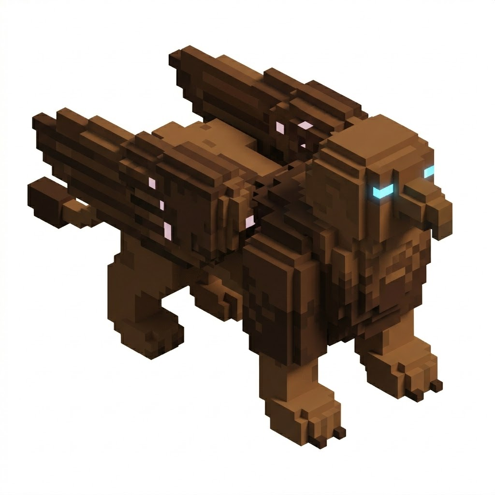

<br />

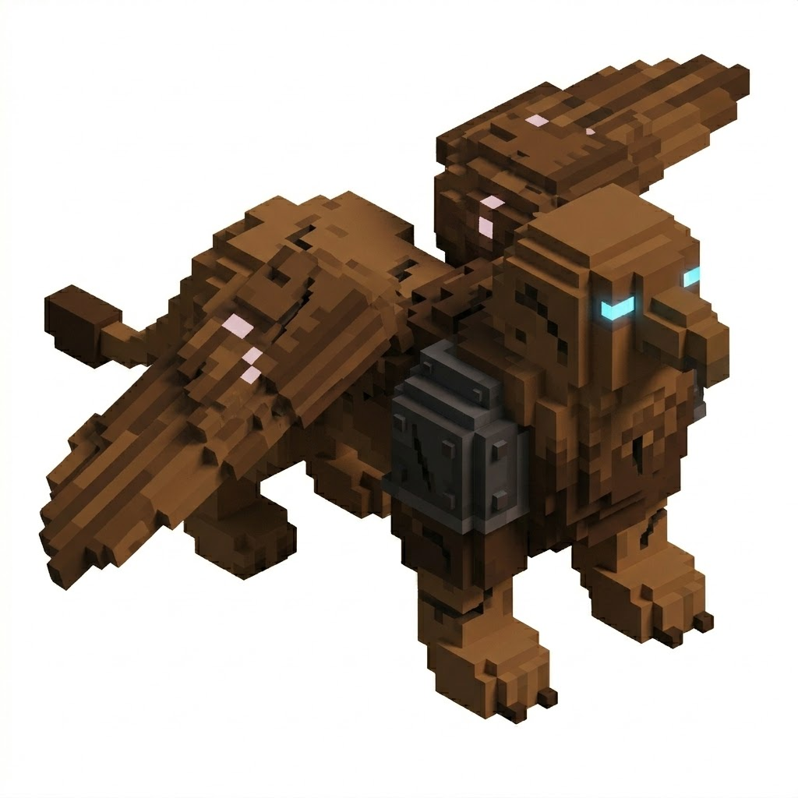

<br />

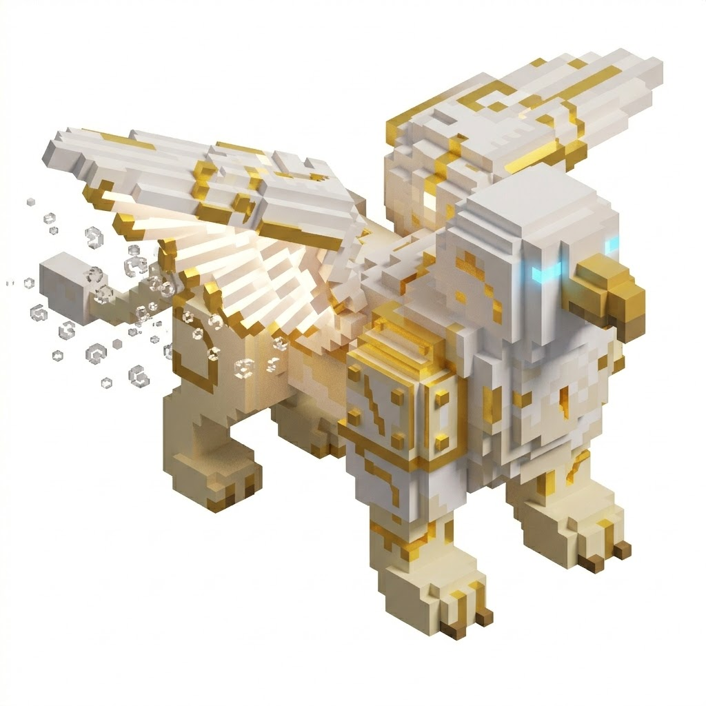

---

## 005 · Dragon `Legendary`

**Natural Affinity:** Fire-lean
**Stat Build:** Balanced
**Habitat:** Deep lava vents and ancient ruins in the Abyss — `zone_abyss` (rare spawn only)
**Behaviour:** Aggressive. Attacks all creatures in range on sight. Engages the player immediately and relentlessly. Cannot be fled from.

> *"The Dragon does not distinguish between hunter and prey. In its world, everything that moves is already a target — and everything that doesn't is next."*

**Evolution Chain:**
```
Whelp  ──(Lv 100 + Evolution Shard)──►  Drake  ──(Lv 500 + Evolution Crystal + Dragon Heart)──►  Elder Dragon
```

| Stage | Name | Model Change | New Skill Unlocked |
|---|---|---|---|
| 1 | Whelp | Small, clumsy voxel dragonling, tiny wings, no fire yet | — |
| 2 | Drake | Mid-size, defined scales, small flame jet from mouth, wing span doubled | Dragon Roar |
| 3 | Elder Dragon | Enormous, layered armored scales, full fire breath particle, lava glow eyes | Ancient Fury |

**Base Stats (Lv 1):**
| HP | Stamina | ATK | DEF | SPD |
|---|---|---|---|---|
| 300 | 150 | 50 | 36 | 30 |

**Growth / Lv:** +20 HP · +9 Sta · +9 ATK · +6 DEF · +3 SPD

**Skill Pool:**
| | Skill | Type | SP | Power | Effect |
|---|---|---|---|---|---|
| ★ | Dragon Bite | Physical | 15 | ×1.8 | Crushing jaw strike |
| ★ | Flame Breath | Fire Elemental | 12 | ×1.2 | 30% Burn on target (−5% max HP/turn, 3T) |
| | Scale Shield | Self-Buff | 20 | — | Own DEF +40%, 3T; also grants 15% Burn immunity |
| | Dragon Roar | Debuff | 25 | — | Target all stats −15%, 3T; unlocks at Stage 2 |
| | Inferno Dive | Fire Elemental | 32 | ×2.5 | 50% Burn; also deals 10% of target max HP as flat bonus damage |
| | Ancient Fury | Fire Elemental | 45 | ×3.5 | 100% Burn; bypasses elemental resistance; Stage 3 only |

**Lore Notes:**
- Dragon Heart drops exclusively from Elder Dragon (Stage 3 must be defeated in the wild or owned and sacrificed via a special NPC ritual — design TBD)
- Highest total stat ceiling in the game at Lv 1000 Stage 3
- Ancient Fury bypassing elemental resistance is the only skill in the game with this property — flag for balance review before ship
- Whelp spawn rate in `zone_abyss`: ~0.5% per wild encounter roll (extremely rare; most players obtain via Pet Shop during seasonal events)

**Illustration:**

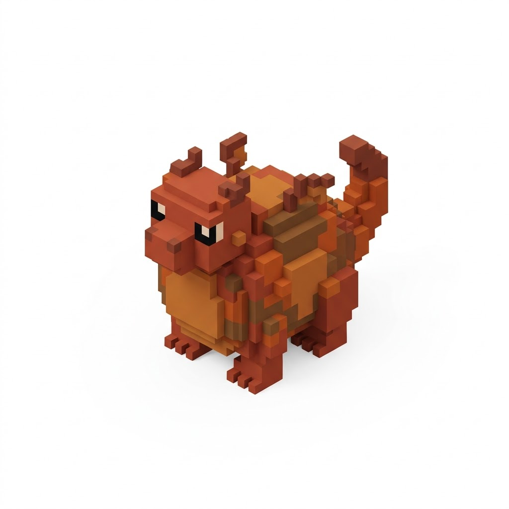

<br />

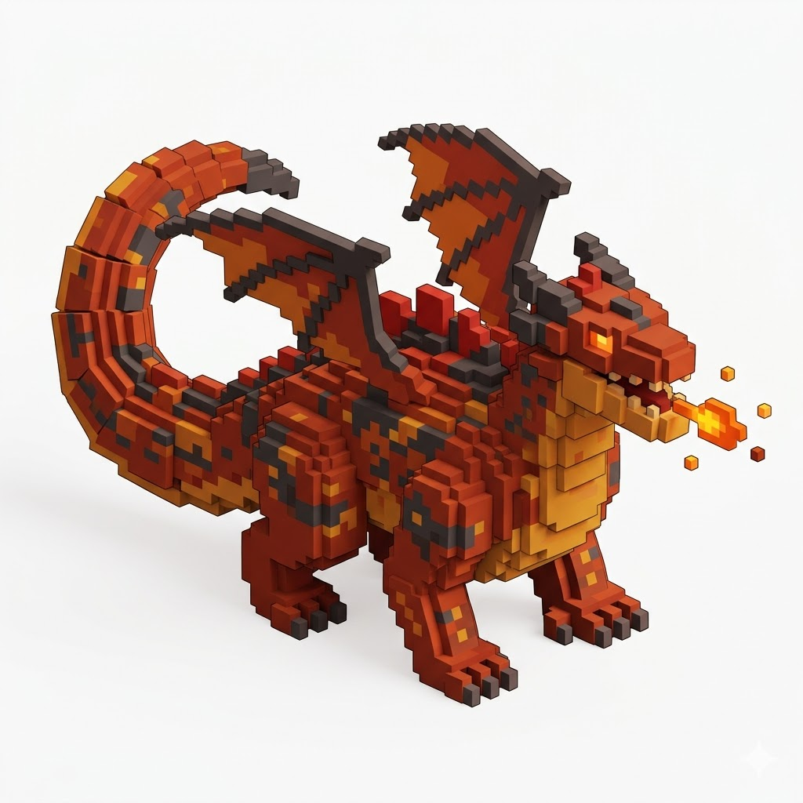

<br />

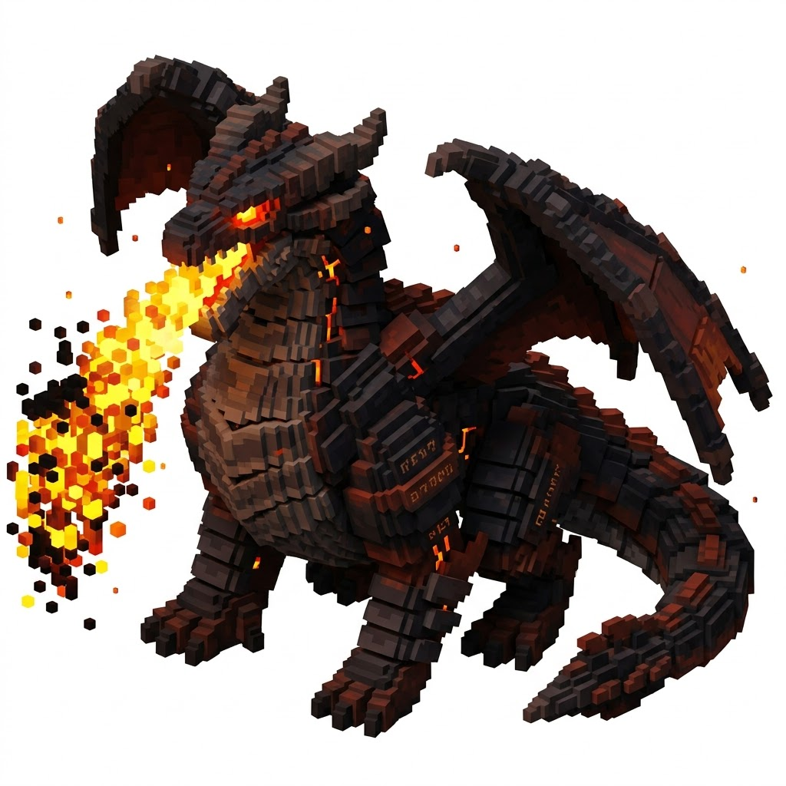

---

## 006 · Turtle `Common`

**Natural Affinity:** Earth-lean
**Stat Build:** Tank
**Habitat:** Shallow riverbanks and mossy stone patches — `zone_starter`, `zone_forest`
**Behaviour:** Passive. Ignores the player entirely until attacked. Once aggro'd, retreats into shell first (triggers DEF buff), then counter-attacks steadily.

> *"The Turtle has survived every age of the voxel world not by outrunning danger, but by outlasting it."*

**Evolution Chain:**
```
Turtle  ──(Lv 20 + Evolution Shard)──►  Armored Turtle  ──(Lv 100 + Evolution Crystal + Ancient Shell Fragment)──►  Stone Tortoise
```

| Stage | Name | Model Change | New Skill Unlocked |
|---|---|---|---|
| 1 | Turtle | Small green shell, stubby legs, gentle expression | — |
| 2 | Armored Turtle | Larger hexagonal shell plates, stone-grey tones, crack patterns | Stone Skin |
| 3 | Stone Tortoise | Massive, ancient-looking shell covered in moss and runes, earth particles | Seismic Shell |

**Base Stats (Lv 1):**
| HP | Stamina | ATK | DEF | SPD |
|---|---|---|---|---|
| 130 | 45 | 11 | 15 | 6 |

**Growth / Lv:** +5 HP · +2 Sta · +2 ATK · +1 DEF · +1 SPD

**Skill Pool:**
| | Skill | Type | SP | Power | Effect |
|---|---|---|---|---|---|
| ★ | Shell Slam | Physical | 12 | ×1.2 | Rams target with shell; 25% Armor Break (DEF −30%, 2T) |
| ★ | Withdraw | Self-Buff | 10 | — | Own DEF +50%, 1T; also reduces SPD −20% same turn |
| | Mud Toss | Earth Elemental | 14 | ×0.8 | 50% Shock on target (SPD −25%, 2T) |
| | Stone Skin | Self-Buff | 20 | — | Own DEF +40% & Regen +5% max HP/turn, 3T; unlocks at Stage 2 |
| | Crushing Shell | Physical | 28 | ×2.5 | Deals bonus damage equal to 5% of own max DEF as flat extra |
| | Seismic Shell | Earth Elemental | 38 | ×3.5 | Armor Break + 30% chance to skip target's next turn; Stage 3 only |

**Lore Notes:**
- Best natural DEF-to-HP ratio among all Common beasts
- Ancient Shell Fragment drops from Mountain Ruins boss (Lich King), 10% drop rate
- Stone Tortoise's `Seismic Shell` is the only Common-line skill that can inflict a turn skip — balance-check at Epic/Legendary PvP tiers

**Illustration:**

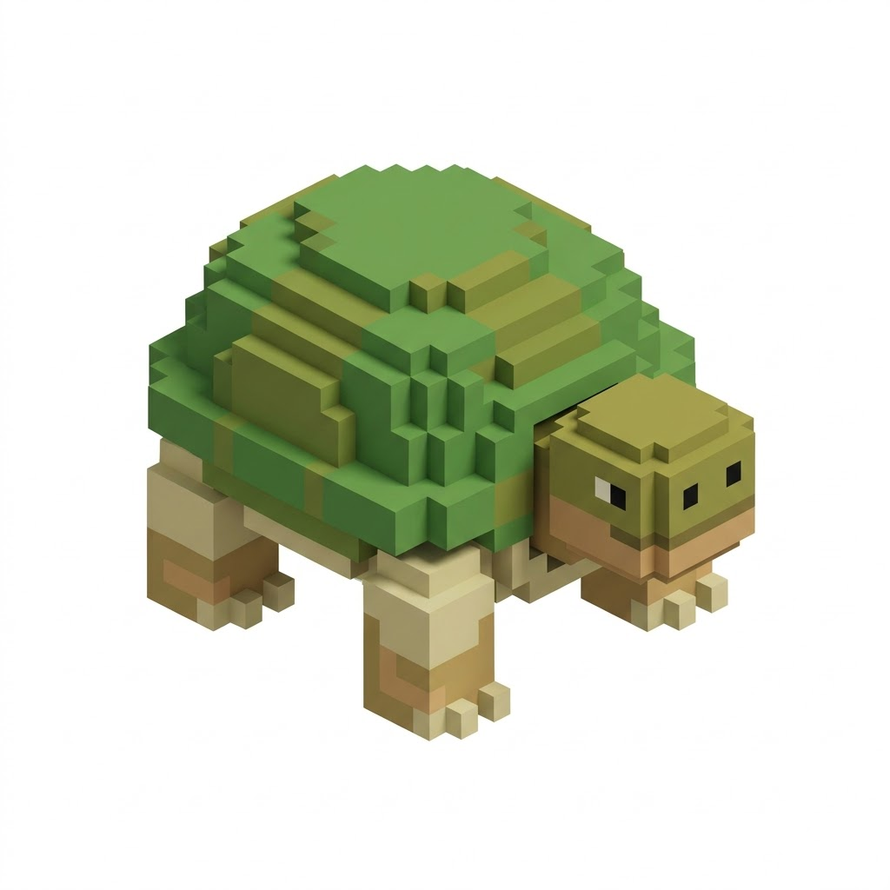

<br />

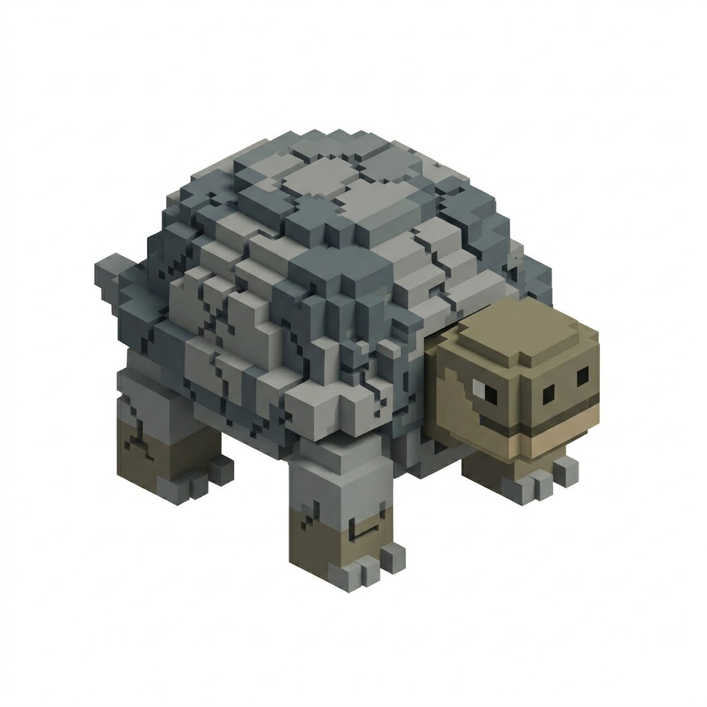

<br />

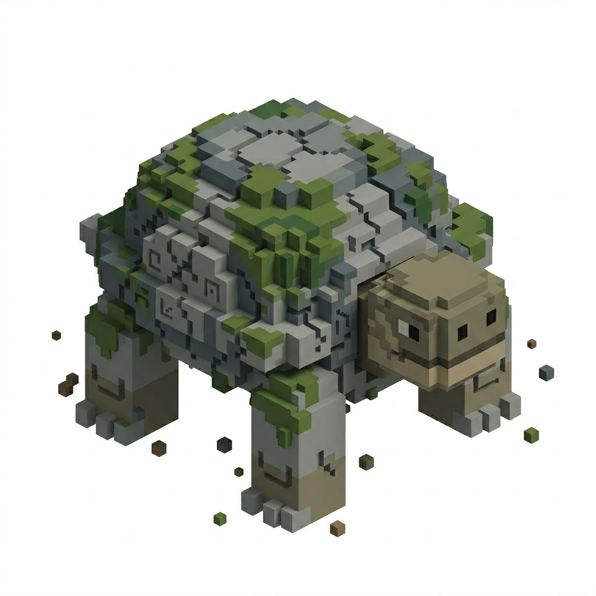

---

## 007 · Bee `Common`

**Natural Affinity:** Fire-lean
**Stat Build:** Offensive
**Habitat:** Flower meadows and hollow logs — `zone_starter`, `zone_forest`
**Behaviour:** Territorial. Passive until within 8 studs of spawn point (hive zone). If player steps inside, entire hive aggros at once — single Bee encounter, but with +20% ATK modifier (swarm context).

> *"Small enough to ignore. Numerous enough to be a problem. Brave enough to sting something ten thousand times its size."*

**Evolution Chain:**
```
Bee  ──(Lv 20 + Evolution Shard)──►  Queen Bee  ──(Lv 100 + Evolution Crystal + Royal Jelly Vial)──►  Hive Lord
```

| Stage | Name | Model Change | New Skill Unlocked |
|---|---|---|---|
| 1 | Bee | Tiny yellow-black striped voxel, buzzing wing particles | — |
| 2 | Queen Bee | Larger, crown-like head crest, golden tone, trailing pollen particles | Nectar Burst |
| 3 | Hive Lord | Imposing armored thorax, glowing amber eyes, swarm particle cloud around body | Royal Decree |

**Base Stats (Lv 1):**
| HP | Stamina | ATK | DEF | SPD |
|---|---|---|---|---|
| 90 | 50 | 18 | 8 | 12 |

**Growth / Lv:** +5 HP · +2 Sta · +2 ATK · +1 DEF · +1 SPD

**Skill Pool:**
| | Skill | Type | SP | Power | Effect |
|---|---|---|---|---|---|
| ★ | Sting | Physical | 8 | ×1.2 | 40% Poison on target (−3% max HP/turn, 5T) |
| ★ | Swarm | DOT | 15 | — | Inflicts Swarm: −4% max HP/turn for 4T; does not stack with Poison |
| | Pollen Cloud | Debuff | 12 | — | Target ATK −20% & 30% Blind, 2T |
| | Nectar Burst | Heal | 18 | — | Restores 25% of own max HP; unlocks at Stage 2 |
| | Stinger Barrage | Physical | 25 | ×1.8 | Hits 4× at ×0.5 each; each hit independently rolls 25% Poison |
| | Royal Decree | Self-Buff | 38 | — | Own ATK +60%, Poison proc chance on all skills +20%, 3T; Stage 3 only |

**Lore Notes:**
- Royal Jelly Vial drops from Forest Cave boss (Goblin Warchief), 8% drop rate
- Stinger Barrage + Royal Decree is the strongest multi-Poison setup in Common tier; monitor in PvP
- Hive Lord's swarm particle cloud is a distinct visual from all other Common-tier Stage 3 models

**Illustration:**

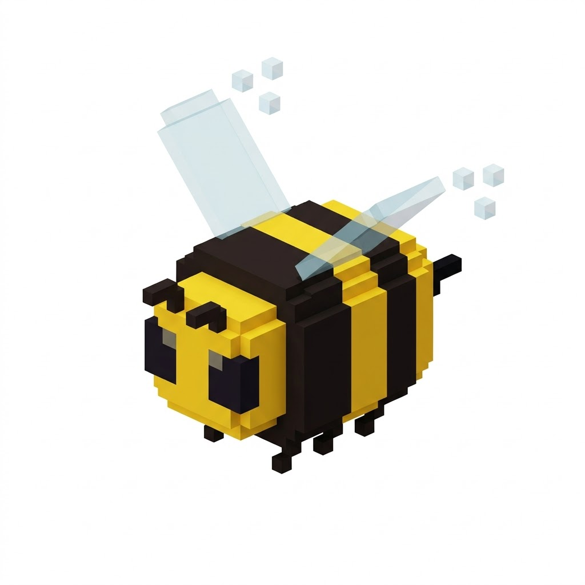

<br />

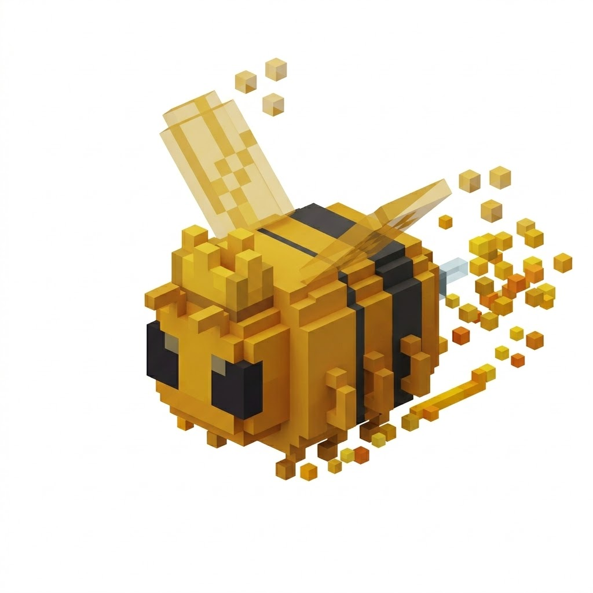

<br />

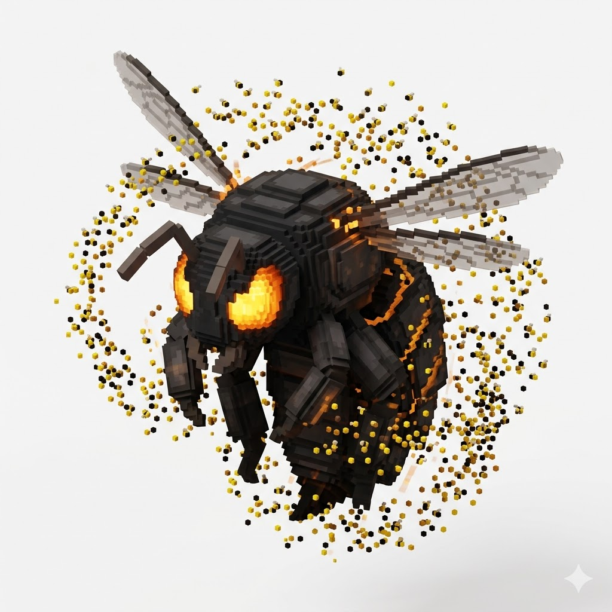

---

## 008 · Slime `Common`

**Natural Affinity:** Neutral (adapts to imbued element — lore: Slime takes on the colour of its element)
**Stat Build:** Defensive
**Habitat:** Damp cave floors and underground pools — `zone_starter`, `zone_forest` (cave areas)
**Behaviour:** Passive. Bounces curiously toward the player. Never initiates combat. If attacked, it wobbles and splits visual but does not flee.

> *"The Slime has no ambition, no territory, and no enemies. It is simply there — and somehow, always fine."*

**Evolution Chain:**
```
Slime  ──(Lv 20 + Evolution Shard)──►  Slime King  ──(Lv 100 + Evolution Crystal + Prism Core)──►  Slime Titan
```

| Stage | Name | Model Change | New Skill Unlocked |
|---|---|---|---|
| 1 | Slime | Small translucent green blob, jiggle idle animation | — |
| 2 | Slime King | Larger, with tiny voxel crown, deeper green-blue hue, trail of droplets | Absorb |
| 3 | Slime Titan | Massive crystalline form; colour shifts to match imbued element; prismatic glow | Prism Burst |

**Base Stats (Lv 1):**
| HP | Stamina | ATK | DEF | SPD |
|---|---|---|---|---|
| 120 | 50 | 12 | 14 | 8 |

**Growth / Lv:** +5 HP · +2 Sta · +2 ATK · +1 DEF · +1 SPD

**Skill Pool:**
| | Skill | Type | SP | Power | Effect |
|---|---|---|---|---|---|
| ★ | Slime Shot | Physical | 10 | ×1.2 | Gooey projectile; 30% Shock (SPD −25%, 2T) |
| ★ | Sticky Body | Debuff | 12 | — | Target SPD −40% for 3T; also reduces flee chance by 20% |
| | Split Dodge | Self-Buff | 15 | — | 35% dodge chance for 2T; own DEF +20% same duration |
| | Absorb | Heal | 20 | — | Restores HP equal to 15% of damage taken last turn (min 5); unlocks at Stage 2 |
| | Ooze Wave | Physical | 22 | ×1.8 | Coats target; all debuffs on target last +1T extra |
| | Prism Burst | Elemental | 40 | ×3.5 | Element matches pet's imbued element; if no element, deals true neutral damage ignoring resistances; Stage 3 only |

**Lore Notes:**
- Prism Core drops from Mountain Ruins boss, 12% drop rate
- Slime Titan's `Prism Burst` is the only skill that uses the pet's imbued element dynamically — dev must resolve element at cast time, not at skill definition time
- Slime's visual colour reacting to its imbued element is a unique cosmetic behaviour; requires element-to-colour mapping in the CosmeticService

**Illustration:**

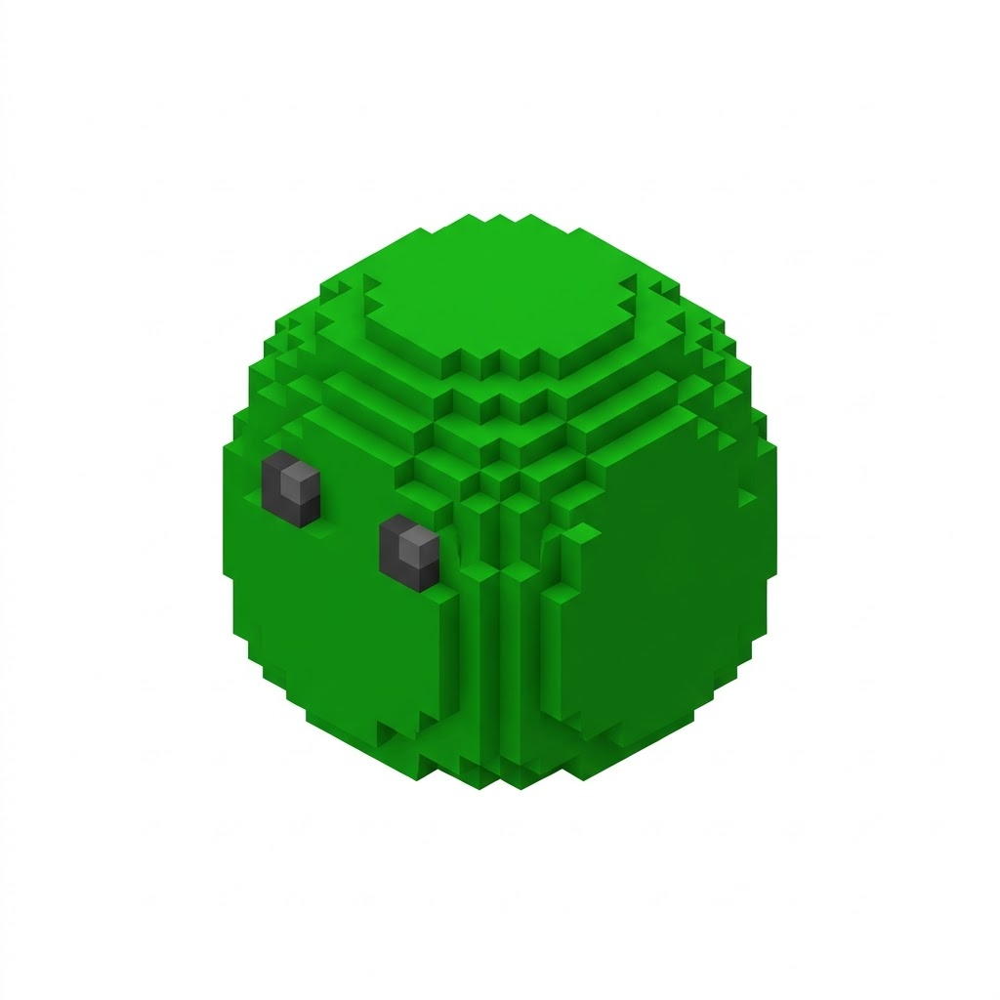

<br />

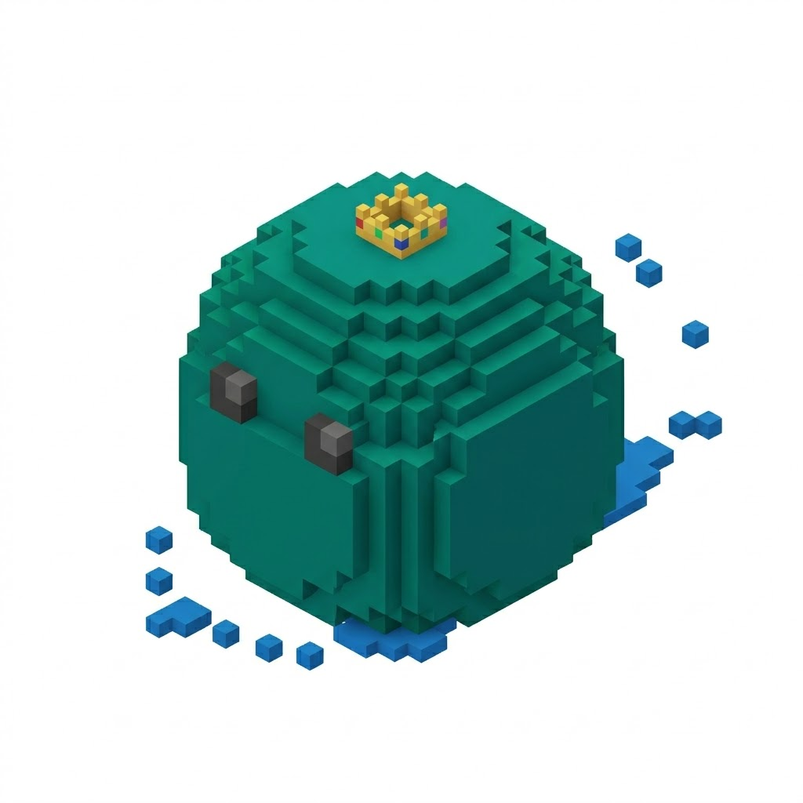

<br />

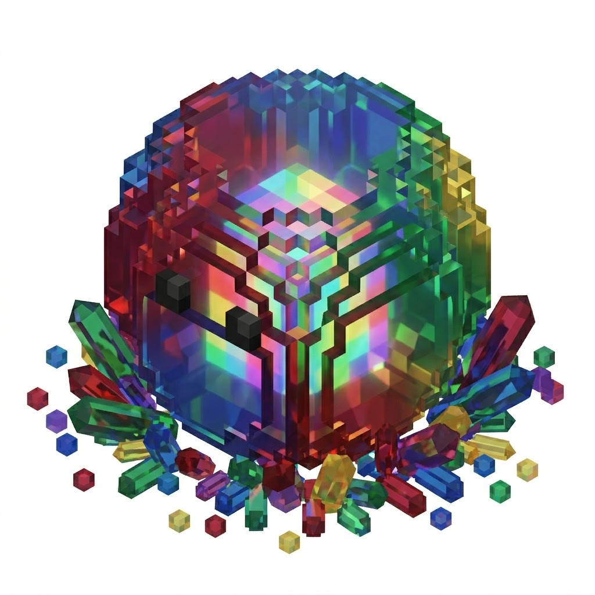

---

## 009 · Octopus `Uncommon`

**Natural Affinity:** Water-lean
**Stat Build:** Defensive
**Habitat:** Coastal rock pools and underwater cave openings — `zone_forest` (rivers), `zone_mountain` (deep lakes)
**Behaviour:** Skittish. Retreats and inks when approached. Will only fight if cornered or if HP is above 80% (it retreats when weakened).

> *"Eight arms. Eight opinions. All of them wrong about whether you're a threat — until one of them wraps around your leg and proves you are."*

**Evolution Chain:**
```
Octopus  ──(Lv 30 + Evolution Shard)──►  Giant Octopus  ──(Lv 150 + Evolution Crystal + Deep-Sea Beak)──►  Kraken Spawn
```

| Stage | Name | Model Change | New Skill Unlocked |
|---|---|---|---|
| 1 | Octopus | Small orange-brown voxel, 8 short tentacles, suction-cup detail | — |
| 2 | Giant Octopus | Larger, deep-sea blue, longer tentacles with bioluminescent tips | Eight Arms |
| 3 | Kraken Spawn | Enormous dark-purple form, crackling water aura, tentacles leave water trail | Abyssal Wave |

**Base Stats (Lv 1):**
| HP | Stamina | ATK | DEF | SPD |
|---|---|---|---|---|
| 155 | 65 | 16 | 19 | 10 |

**Growth / Lv:** +7 HP · +3 Sta · +3 ATK · +2 DEF · +1 SPD

**Skill Pool:**
| | Skill | Type | SP | Power | Effect |
|---|---|---|---|---|---|
| ★ | Ink Blast | Debuff | 10 | — | Target accuracy −40% (50% miss chance), 2T; Blind variant |
| ★ | Tentacle Grab | Physical | 15 | ×1.2 | 40% chance: skip target's next turn (Bind) |
| | Water Jet | Water Elemental | 14 | ×1.8 | Knocks target back (cosmetic) + 25% Shock (SPD −25%, 2T) |
| | Suction Grip | Self-Buff | 18 | — | Own DEF +35%; reduces damage from Physical skills by 20%, 3T |
| | Eight Arms | Physical | 30 | — | Hits 8× at ×0.4 each; each hit independently rolls 20% Bind; unlocks at Stage 2 |
| | Abyssal Wave | Water Elemental | 42 | ×3.5 | 60% Blind + 40% Bind simultaneously; Stage 3 only |

**Lore Notes:**
- Deep-Sea Beak drops from Dark Forest boss (Elder Treant), 9% drop rate — thematic mismatch by design (Treant guards a coastal grotto)
- Eight Arms hitting 8× makes it the highest hit-count skill in the game; each hit is individually weak (×0.4) — verify damage cap isn't exploitable with Armor Break stacked
- Kraken Spawn is the visual precursor to the Kraken Legendary beast; lore connection intentional

**Illustration:**


<br />


<br />


---

## 010 · Scorpion `Uncommon`

**Natural Affinity:** Dark-lean
**Stat Build:** Balanced
**Habitat:** Arid stone flats and volcanic sand dunes — `zone_mountain`, `zone_volcano`
**Behaviour:** Aggressive in `zone_volcano`; Territorial in `zone_mountain`. Raises tail as a warning before charging — players have 2 seconds before auto-attack triggers.

> *"The Scorpion does not chase. It waits. The desert is patient, and so is everything that lives in it."*

**Evolution Chain:**
```
Scorpion  ──(Lv 30 + Evolution Shard)──►  Venom Scorpion  ──(Lv 150 + Evolution Crystal + Abyss Stinger)──►  Abyss Scorpion
```

| Stage | Name | Model Change | New Skill Unlocked |
|---|---|---|---|
| 1 | Scorpion | Sandy-brown voxel, curved tail with bright red tip | — |
| 2 | Venom Scorpion | Darker purple carapace, dripping venom particle from stinger | Death Mark |
| 3 | Abyss Scorpion | Black armored exoskeleton, glowing violet stinger, dark mist trail | Scorpion's Judgment |

**Base Stats (Lv 1):**
| HP | Stamina | ATK | DEF | SPD |
|---|---|---|---|---|
| 130 | 65 | 20 | 14 | 13 |

**Growth / Lv:** +7 HP · +3 Sta · +3 ATK · +2 DEF · +1 SPD

**Skill Pool:**
| | Skill | Type | SP | Power | Effect |
|---|---|---|---|---|---|
| ★ | Pincer Snap | Physical | 10 | ×1.2 | 35% Armor Break on target (DEF −30%, 2T) |
| ★ | Venom Sting | DOT | 14 | — | Inflicts Poison (−3% max HP/turn, 5T) + 20% Armor Break |
| | Sand Blind | Debuff | 12 | — | Target accuracy −35%, 2T; also 25% SPD −20%, 2T |
| | Death Mark | Debuff | 22 | — | Target takes +40% damage from all sources for 2T; unlocks at Stage 2 |
| | Scorpion Dance | Self-Buff | 18 | — | Own SPD +35% & dodge chance +25%, 2T |
| | Scorpion's Judgment | Dark Elemental | 40 | ×3.5 | Target current Poison DOT ticks are dealt instantly as burst damage, then Poison resets; Stage 3 only |

**Lore Notes:**
- Abyss Stinger drops from Volcano Pit boss (Orc Overlord), 11% drop rate
- `Scorpion's Judgment` has a unique mechanic: it requires the target to already have Poison active to deal bonus damage; dev must implement a target-state check at cast time
- Death Mark + Scorpion's Judgment + Venom Sting is the primary damage combo — high skill ceiling, strong PvP threat at Abyss Scorpion tier

**Illustration:**


<br />


<br />

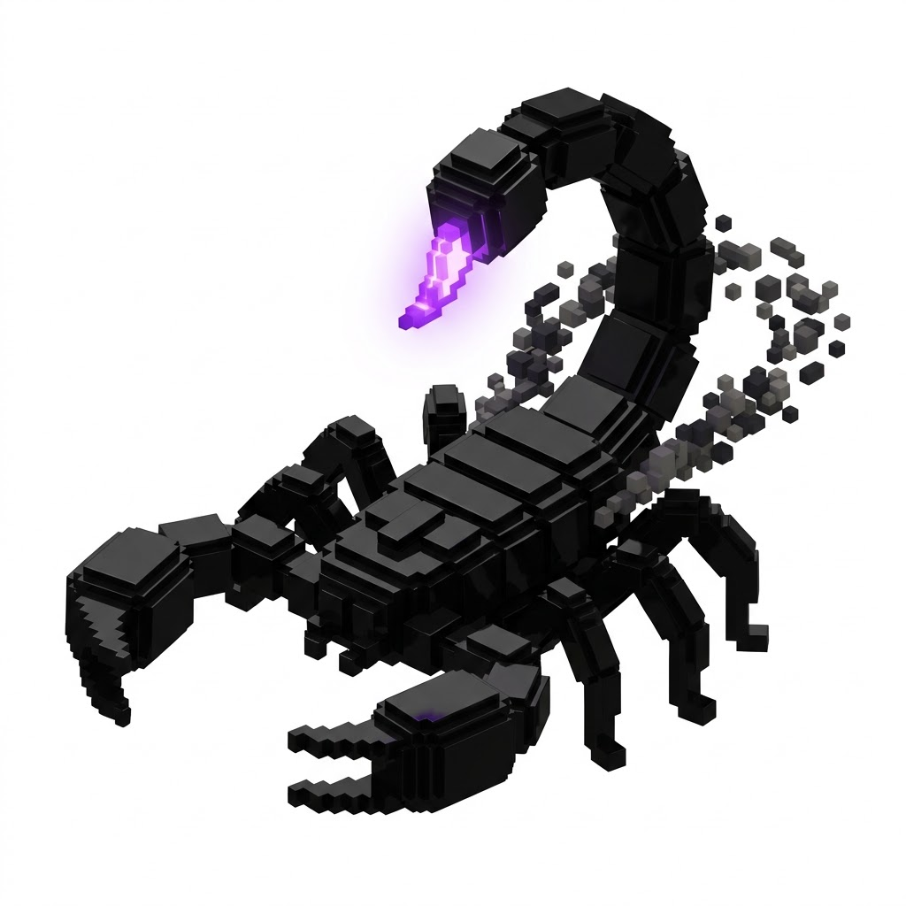

---

## 011 · Eagle `Rare`

**Natural Affinity:** Wind-lean
**Stat Build:** Speed
**Habitat:** Open mountain peaks and windswept cliffs — `zone_mountain`, `zone_volcano`
**Behaviour:** Predatory. Circles overhead at high altitude before diving on any player that stands still for 3+ seconds. Will not pursue below a certain altitude (cannot follow into caves).

> *"The Eagle does not look at the ground the way other beasts do. It looks at it the way a hunter looks at a map."*

**Evolution Chain:**
```
Eagle  ──(Lv 50 + Evolution Shard)──►  War Eagle  ──(Lv 200 + Evolution Crystal + Skystone Feather)──►  Sky Emperor
```

| Stage | Name | Model Change | New Skill Unlocked |
|---|---|---|---|
| 1 | Eagle | Brown-white voxel, sharp yellow beak, talons visible on ground stance | — |
| 2 | War Eagle | Larger wingspan, armored chest plate, battle-worn markings, wind trail on wings | Storm Ride |
| 3 | Sky Emperor | Silver-white plumage, golden crown crest, radiant wind aura, contrail particle | Sky Domination |

**Base Stats (Lv 1):**
| HP | Stamina | ATK | DEF | SPD |
|---|---|---|---|---|
| 140 | 90 | 26 | 15 | 26 |

**Growth / Lv:** +10 HP · +4 Sta · +4 ATK · +2 DEF · +3 SPD

**Skill Pool:**
| | Skill | Type | SP | Power | Effect |
|---|---|---|---|---|---|
| ★ | Talon Dive | Physical | 14 | ×1.8 | Always goes first on the turn used regardless of SPD (same rule as Tiger's Pounce) |
| ★ | Eagle Eye | Debuff | 10 | — | Target accuracy −30% & DEF −20%, 2T |
| | Wind Slash | Wind Elemental | 16 | ×1.2 | 35% Shock (SPD −25%, 2T) |
| | Storm Ride | Self-Buff | 20 | — | Own SPD +50%, 2T; next Physical skill ignores 25% DEF; unlocks at Stage 2 |
| | Aerial Assault | Physical | 26 | ×2.5 | Damage +30% for each active SPD buff on self |
| | Sky Domination | Wind Elemental | 42 | ×3.5 | Removes all buffs from target before dealing damage; Stage 3 only |

**Lore Notes:**
- Skystone Feather drops from Dark Forest boss (Elder Treant), 10% drop rate
- Highest base SPD among all Rare tier at Stage 1 — faster than most Epic beasts until mid-level
- Sky Domination's buff-strip effect resolves before damage calculation — dev must apply strip then recalculate target DEF before damage
- Both Eagle `Talon Dive` and Tiger `Pounce` use the same "always-first" mechanic; if both are used in the same turn vs. each other, resolve by raw SPD as tiebreaker

**Illustration:**


<br />

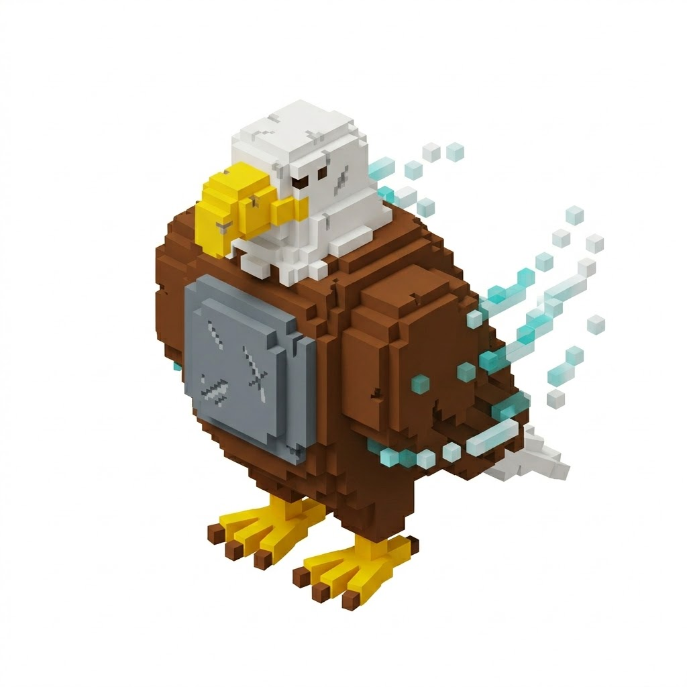

<br />

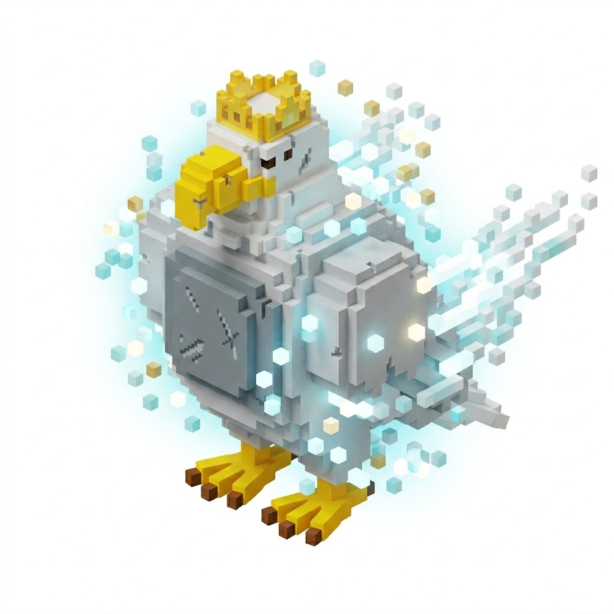

---

## 012 · Bear `Rare`

**Natural Affinity:** Earth-lean
**Stat Build:** Tank
**Habitat:** Thick mountain pine forests and highland caves — `zone_mountain`
**Behaviour:** Territorial. Leaves claw marks on trees as boundary markers. Attacks any player who crosses into its zone. Retreats to cave at 20% HP to hibernate (auto-flee with 100% success rate at that threshold).

> *"The Bear is not angry. It is simply very clear about what is, and is not, its forest."*

**Evolution Chain:**
```
Bear  ──(Lv 50 + Evolution Shard)──►  Grizzly  ──(Lv 200 + Evolution Crystal + Primal Fur Clump)──►  Ancient Bear
```

| Stage | Name | Model Change | New Skill Unlocked |
|---|---|---|---|
| 1 | Bear | Brown blocky voxel, rounded ears, lumbering idle | — |
| 2 | Grizzly | Larger, silver-tipped fur, battle scars, heavier stance | Thick Hide |
| 3 | Ancient Bear | Massive, dark-brown with stone-like fur texture, glowing amber eyes, earth particle trail | Ancient Wrath |

**Base Stats (Lv 1):**
| HP | Stamina | ATK | DEF | SPD |
|---|---|---|---|---|
| 220 | 75 | 20 | 30 | 10 |

**Growth / Lv:** +10 HP · +4 Sta · +4 ATK · +3 DEF · +1 SPD

**Skill Pool:**
| | Skill | Type | SP | Power | Effect |
|---|---|---|---|---|---|
| ★ | Maul | Physical | 15 | ×1.8 | 30% Armor Break (DEF −30%, 2T) |
| ★ | Intimidate | Debuff | 10 | — | Target ATK −35% & 20% chance to skip target's next turn (fear) |
| | Bear Hug | Physical | 22 | ×1.2 | 50% Bind (skip target's next turn); lower power compensates high CC |
| | Thick Hide | Self-Buff | 20 | — | Own DEF +50% & Regen +5% max HP/turn, 3T; unlocks at Stage 2 |
| | Ground Slam | Earth Elemental | 28 | ×2.5 | 40% Shock (SPD −25%, 2T) + minor Armor Break (DEF −15%, 1T) |
| | Ancient Wrath | Physical | 40 | ×3.5 | Damage scales with own DEF: adds 10% of own DEF as flat bonus damage; Stage 3 only |

**Lore Notes:**
- Highest base DEF among all Rare-tier beasts at Stage 1 (30 vs tier baseline of 19)
- Primal Fur Clump drops from Mountain Ruins boss (Lich King), 13% drop rate
- `Ancient Wrath` creating a DEF-scaled damage bonus makes Ancient Bear a unique off-tank attacker — the higher the DEF investment, the harder it hits; balance requires damage cap (suggest: DEF bonus capped at +200 flat)
- Bear's combat-flee at 20% HP is a **world behaviour only** — in battle it does not flee; it fights until KO

---

## 013 · Cerberus `Epic`

**Natural Affinity:** Dark-lean
**Stat Build:** Offensive
**Habitat:** The outermost ring of the Abyss, near dungeon entry gates — `zone_abyss`
**Behaviour:** Aggressive. Circles its patrol route constantly. Three heads look in different directions simultaneously — no blind spot; cannot be ambushed. Charges on sight with all three heads growling.

> *"Three heads, one grudge. No one who has met the Cerberus has been in a position to argue about which head bit them first."*

**Evolution Chain:**
```
Cerberus  ──(Lv 75 + Evolution Shard)──►  Hell Cerberus  ──(Lv 300 + Evolution Crystal + Hellgate Key)──►  Gate Guardian
```

| Stage | Name | Model Change | New Skill Unlocked |
|---|---|---|---|
| 1 | Cerberus | Large three-headed black dog, red collar on each neck, ember eyes | — |
| 2 | Hell Cerberus | Larger, flame mane on all three heads, cracked-rock skin texture, fire particle | Death Howl |
| 3 | Gate Guardian | Enormous, obsidian-armored, chains dragging behind it, infernal aura, all eyes glow white | Final Judgment |

**Base Stats (Lv 1):**
| HP | Stamina | ATK | DEF | SPD |
|---|---|---|---|---|
| 195 | 110 | 45 | 20 | 27 |

**Growth / Lv:** +14 HP · +6 Sta · +6 ATK · +4 DEF · +2 SPD

**Skill Pool:**
| | Skill | Type | SP | Power | Effect |
|---|---|---|---|---|---|
| ★ | Triple Bite | Physical | 18 | — | Hits 3× at ×0.8 each; each hit independently rolls 25% Bleed (DOT, 3T) |
| ★ | Hellfire Breath | Fire Elemental | 15 | ×1.2 | 40% Burn (−5% max HP/turn, 3T) |
| | Chain Pull | Debuff | 20 | — | Forces target to attack Cerberus next turn (Taunt); removes target SPD buffs |
| | Death Howl | Debuff | 25 | — | Target all stats −20%, 3T; also inflicts 30% fear (skip next turn); unlocks at Stage 2 |
| | Underworld Strike | Dark Elemental | 32 | ×2.5 | Damage bypasses 20% of target DEF; 35% Blind |
| | Final Judgment | Dark Elemental | 44 | ×3.5 | If target HP < 30%, deals double total damage; Stage 3 only |

**Lore Notes:**
- Hellgate Key drops from Abyss Rift boss (Abyssal Demon Lord), 8% drop rate — one of the rarest Stage 3 materials
- `Final Judgment` execute mechanic: resolve HP check before damage roll; if target is at exactly 30% HP boundary, include (i.e., use `<=`)
- Triple Bite hitting 3× with independent Bleed rolls makes Bleed management critical — a target can have overlapping Bleed DOTs; dev must decide if Bleed stacks or refreshes (recommended: refresh, not stack)
- Cerberus cannot be obtained before `zone_abyss` unlock; no Pet Shop availability at launch

---

## 014 · Unicorn `Epic`

**Natural Affinity:** Light-lean
**Stat Build:** Defensive
**Habitat:** A hidden sacred glade deep in the Volcano zone, accessible only after clearing zone_mountain — `zone_volcano` (rare static spawn, one per server)
**Behaviour:** Passive. Never initiates combat. If attacked, it does not flee — it faces the attacker and raises its horn in warning. Attacks only to protect itself, using heal skills first.

> *"The Unicorn does not need to prove it is powerful. That is, in itself, proof."*

**Evolution Chain:**
```
Unicorn  ──(Lv 75 + Evolution Shard)──►  Dark Unicorn  ──(Lv 300 + Evolution Crystal + Moonveil Horn)──►  Celestial Unicorn
```

| Stage | Name | Model Change | New Skill Unlocked |
|---|---|---|---|
| 1 | Unicorn | White voxel horse, single silver horn, soft glow particle | — |
| 2 | Dark Unicorn | Sleek black coat, purple-silver horn, crescent moon mark on flank, dark shimmer aura | Lunar Charge |
| 3 | Celestial Unicorn | Translucent white-gold body, rainbow aurora trail from horn tip, ethereal hooves | Celestial Blessing |

**Base Stats (Lv 1):**
| HP | Stamina | ATK | DEF | SPD |
|---|---|---|---|---|
| 260 | 110 | 28 | 35 | 17 |

**Growth / Lv:** +14 HP · +6 Sta · +6 ATK · +4 DEF · +2 SPD

**Skill Pool:**
| | Skill | Type | SP | Power | Effect |
|---|---|---|---|---|---|
| ★ | Horn Strike | Physical | 15 | ×1.8 | Precise pierce; 20% chance to remove one active buff from target |
| ★ | Holy Light | Heal | 12 | — | Restores 20% of own max HP; also cures one random active debuff |
| | Purify | Self-Buff | 18 | — | Removes ALL active debuffs on self; own DEF +20%, 2T |
| | Divine Shield | Self-Buff | 25 | — | Own DEF +60% & immune to all status effects, 2T; unlocks at Stage 2 — wait: actually the second unlock is Lunar Charge |
| | Lunar Charge | Light Elemental | 28 | ×2.5 | Damage heals self for 30% of damage dealt (lifesteal); unlocks at Stage 2 |
| | Celestial Blessing | Light Elemental | 42 | ×3.5 | Heals self for 40% max HP AND deals damage simultaneously; Stage 3 only |

**Lore Notes:**
- One Unicorn spawns per server in a fixed location in `zone_volcano`; respawns 30 minutes after capture or defeat
- Moonveil Horn drops from Abyss Rift boss (Abyssal Demon Lord), 10% drop rate
- `Celestial Blessing` dealing damage and healing simultaneously requires two separate resolution passes in `BattleService` — damage first, then heal (heal cannot exceed max HP)
- Unicorn's passive buff-strip on `Horn Strike` is the only skill in Epic tier with this property outside of Eagle's `Sky Domination`
- Social value: Celestial Unicorn's rainbow aurora trail is one of the most visually distinct effects in the game

---

## 015 · Phoenix `Legendary`

**Natural Affinity:** Fire-lean
**Stat Build:** Offensive
**Habitat:** Volcanic calderas and lava-crested summits — `zone_abyss` (rare spawn); also obtainable via seasonal events
**Behaviour:** Aggressive. Circles in high-altitude thermals invisibly until the player enters its caldera. Descends in a flaming dive with no warning. Cannot be fled from once engaged.

> *"The Phoenix has died more times than any creature alive. This has not made it cautious. If anything, it has made it bored."*

**Evolution Chain:**
```
Phoenix Chick  ──(Lv 100 + Evolution Shard)──►  Phoenix  ──(Lv 500 + Evolution Crystal + Eternal Ember)──►  Inferno Phoenix
```

| Stage | Name | Model Change | New Skill Unlocked |
|---|---|---|---|
| 1 | Phoenix Chick | Small, fluffy orange-red voxel chick, tiny flame sparks at wing tips | — |
| 2 | Phoenix | Full-size fiery bird, flame wings, glowing tail feathers, heat-shimmer aura | Ash Storm |
| 3 | Inferno Phoenix | Enormous, solar-gold and deep-crimson, wings leave fire trails, rebirth glow effect on low HP | Phoenix Rebirth |

**Passive — Rebirth:** Once per battle, when this pet is reduced to 0 HP, it automatically revives with 30% of its max HP. The revive triggers before KO is confirmed. Cooldown resets between battles. Visual: burst of golden flame on the turn it triggers.

**Base Stats (Lv 1):**
| HP | Stamina | ATK | DEF | SPD |
|---|---|---|---|---|
| 265 | 150 | 65 | 28 | 37 |

**Growth / Lv:** +20 HP · +9 Sta · +9 ATK · +6 DEF · +3 SPD

**Skill Pool:**
| | Skill | Type | SP | Power | Effect |
|---|---|---|---|---|---|
| ★ | Fire Talon | Physical | 15 | ×1.8 | 35% Burn (−5% max HP/turn, 3T) |
| ★ | Rising Flame | Fire Elemental | 12 | ×1.2 | Damage +20% for each Burn DOT currently active on the target |
| | Rebirth Pulse | Heal | 20 | — | Restores 25% own max HP + removes all debuffs on self |
| | Ash Storm | Fire Elemental | 28 | ×2.5 | 60% Burn on target; also reduces target SPD −20%, 2T; unlocks at Stage 2 |
| | Solar Flare | Fire Elemental | 35 | ×3.0 | Ignores elemental resistance (similar to Dragon's Ancient Fury but at ×3.0, not ×3.5) |
| | Phoenix Rebirth | Fire Elemental | 45 | ×3.5 | If Rebirth passive has already triggered this battle, this skill deals +100% bonus damage; Stage 3 only |

**Lore Notes:**
- Eternal Ember drops from Abyss Rift boss (Abyssal Demon Lord), 5% drop rate — second rarest Stage 3 material after Dragon Heart
- Rebirth passive is implemented as a battle flag `PhoenixRebirthUsed` on the PetBattleState object; reset on battle end; check in `CHECK_END` state before confirming KO
- `Phoenix Rebirth` damage bonus requires checking `PhoenixRebirthUsed == true` at cast time — if Rebirth hasn't triggered yet, skill deals normal ×3.5 with no bonus
- `Rising Flame` scaling with active Burn stacks requires reading the target's active status effect list at cast time; dev must sum all Burn instances (refreshed or new) as one count — recommend treating any active Burn as +20% regardless of stack count
- Highest base ATK and SPD of all Legendary beasts at Stage 1 — trades HP and DEF for pure offense; Rebirth compensates for fragility

---

## 016 · Cat `Common`

**Natural Affinity:** Neutral
**Stat Build:** Speed
**Habitat:** Tall grass, shadowed alleyways near settlements — `zone_starter`, `zone_forest`
**Behaviour:** Skittish. Escape chance 70%. Flees on approach but turns aggressive the moment it is cornered — a captured Cat fights harder than most beasts twice its size.

> *"The Cat has spent its entire life pretending it does not care what you think. This pretence is flawless and completely sincere."*

**Evolution Chain:**
```
Cat  ──(Lv 20 + Evolution Shard)──►  Panther  ──(Lv 100 + Evolution Crystal + Shadow Claw)──►  Shadow Panther
```

| Stage | Name | Model Change | New Skill Unlocked |
|---|---|---|---|
| 1 | Cat | Small orange or grey voxel, alert ears, flicking tail idle | — |
| 2 | Panther | Sleek jet-black coat, amber eyes, crouching low-profile stance | Shadow Stalk |
| 3 | Shadow Panther | Translucent dark body, violet eye glow, shadow-smoke trail at paws | Phantom Slash |

**Base Stats (Lv 1):**
| HP | Stamina | ATK | DEF | SPD |
|---|---|---|---|---|
| 85 | 55 | 14 | 8 | 15 |

**Growth / Lv:** +5 HP · +2 Sta · +2 ATK · +1 DEF · +1 SPD

**Skill Pool:**
| | Skill | Type | SP | Power | Effect |
|---|---|---|---|---|---|
| ★ | Scratch | Physical | 8 | ×1.2 | Fast claw strike; 25% Armor Break (DEF −30%, 1T) |
| ★ | Dodge Roll | Self-Buff | 10 | — | 40% dodge chance, 1T; if dodge succeeds, auto-counters with ×0.8 Physical |
| | Pounce | Physical | 15 | ×1.8 | +50% bonus damage if target HP is above 75% (ambush bonus) |
| | Hiss | Debuff | 12 | — | Target ATK −30% & 25% fear (skip turn chance), 2T |
| | Shadow Stalk | Self-Buff | 18 | — | Own SPD +40% & crit rate +30%, 2T; unlocks at Stage 2 |
| | Phantom Slash | Physical | 28 | ×2.5 | Auto-hits ignoring accuracy if Dodge Roll was used last turn; Stage 3 only |

**Lore Notes:**
- Shadow Claw drops from Forest Cave boss (Goblin Warchief), 9% drop rate
- Dodge Roll counter-attack is not a separate turn — it resolves within the same turn as the incoming attack
- Phantom Slash's auto-hit check reads the previous-turn action flag; dev must track `LastActionUsed` per pet per turn in battle state
- Highest base SPD among all Common-tier beasts; ties with Rabbit

---

## 017 · Rabbit `Common`

**Natural Affinity:** Nature-lean
**Stat Build:** Speed
**Habitat:** Open meadows and flower fields — `zone_starter`
**Behaviour:** Skittish. Highest escape chance of all Common beasts (80%). Requires Iron Trap or higher for reliable capture. Bolts in a zigzag pattern when fleeing (cosmetic).

> *"The Rabbit does not survive by being strong. It survives by being somewhere else — ideally somewhere you haven't looked yet."*

**Evolution Chain:**
```
Rabbit  ──(Lv 20 + Evolution Shard)──►  Swift Rabbit  ──(Lv 100 + Evolution Crystal + Storm Ear)──►  Thunder Hare
```

| Stage | Name | Model Change | New Skill Unlocked |
|---|---|---|---|
| 1 | Rabbit | Small white or brown voxel, oversized ears, twitching nose idle | — |
| 2 | Swift Rabbit | Longer legs, blue-tipped ears, faint speed-line particles when running | Double Jump |
| 3 | Thunder Hare | Electric-blue fur, crackling ear tips, lightning trail on movement, enlarged hind legs | Last Stand |

**Base Stats (Lv 1):**
| HP | Stamina | ATK | DEF | SPD |
|---|---|---|---|---|
| 85 | 55 | 14 | 8 | 15 |

**Growth / Lv:** +5 HP · +2 Sta · +2 ATK · +1 DEF · +1 SPD

**Skill Pool:**
| | Skill | Type | SP | Power | Effect |
|---|---|---|---|---|---|
| ★ | Quick Kick | Physical | 8 | ×1.2 | Back-leg strike; high priority — acts before most Normal-speed moves |
| ★ | Hop Away | Self-Buff | 10 | — | 50% dodge chance, 1T; also adds +40% flee success bonus if used during Wild Hunt |
| | Lucky Clover | Self-Buff | 14 | — | Own dodge +25% & target accuracy −15%, 2T |
| | Double Jump | Physical | 20 | ×1.8 | Hits twice at ×0.9 each; second hit always connects if first hit lands; unlocks at Stage 2 |
| | Thunder Burst | Electric Elemental | 26 | ×2.5 | 35% Shock (SPD −25%, 2T); accessed after imbuing Electric at Lv 50 or via Skill Shop |
| | Last Stand | Self-Buff | 35 | — | If own HP < 25%, own ATK +80% & SPD +50%, 3T; Stage 3 only |

**Lore Notes:**
- Storm Ear drops from Mountain Ruins boss (Lich King), 7% drop rate
- `Hop Away`'s flee bonus interacts with the capture formula: adds a flat +40% to the standard 70% flee base — dev must apply this additively before the random roll, not multiplicatively
- Cat and Rabbit share identical base stats; differentiation is entirely through skill pool — Cat is dodge-counter, Rabbit is evasion-burst; ensure this distinction is clear in the in-game Codex descriptions

---

## 018 · Frog `Common`

**Natural Affinity:** Water-lean
**Stat Build:** Defensive
**Habitat:** Riverbanks, lily pads, and boggy clearings — `zone_starter`, `zone_forest`
**Behaviour:** Passive. Sits motionless. Only reacts when approached within 5 studs. Puffs its throat sac (visual DEF buff indicator) before engaging.

> *"The Frog has been sitting in this exact spot since before you arrived and will be sitting here long after you leave. You were the anomaly."*

**Evolution Chain:**
```
Frog  ──(Lv 20 + Evolution Shard)──►  Toad  ──(Lv 100 + Evolution Crystal + Toxic Gland)──►  Poison Toad King
```

| Stage | Name | Model Change | New Skill Unlocked |
|---|---|---|---|
| 1 | Frog | Small green voxel, bulging eyes, throat sac visible | — |
| 2 | Toad | Larger, warty brown-green texture, slow lumbering stance, dripping mucus | Swamp Gas |
| 3 | Poison Toad King | Enormous, deep-purple with toxic-yellow spots, crown of bone spurs, poison-mist aura | Toxic Flood |

**Base Stats (Lv 1):**
| HP | Stamina | ATK | DEF | SPD |
|---|---|---|---|---|
| 120 | 50 | 12 | 14 | 8 |

**Growth / Lv:** +5 HP · +2 Sta · +2 ATK · +1 DEF · +1 SPD

**Skill Pool:**
| | Skill | Type | SP | Power | Effect |
|---|---|---|---|---|---|
| ★ | Tongue Lash | Physical | 10 | ×1.2 | 20% Poison (−3% max HP/turn, 5T) |
| ★ | Toxic Spit | DOT | 14 | — | Inflicts Poison (−3% max HP/turn, 5T); no direct damage |
| | Puff Up | Self-Buff | 12 | — | Own DEF +40%, 2T; 25% chance to reflect Physical damage back to attacker |
| | Mud Splash | Water Elemental | 10 | ×0.8 | Target SPD −30%, 3T (longer duration than standard Shock) |
| | Swamp Gas | Debuff | 18 | — | 50% Blind on target, 2T; 20% Poison if target not already poisoned; unlocks at Stage 2 |
| | Toxic Flood | Water Elemental | 35 | ×2.5 | Active Poison on target deals double tick damage this turn, then resets timer to 5T; Stage 3 only |

**Lore Notes:**
- Toxic Gland drops from Forest Cave boss (Goblin Warchief), 11% drop rate
- `Puff Up` reflect damage is not elemental — it deals Physical regardless of what hit the Frog; resolve after incoming damage, before start of next turn
- `Toxic Flood` doubling the Poison tick is applied once as a one-time multiplier (×2 damage that turn only) then the Poison continues at normal rate with a fresh 5T countdown — dev must split the one-time burst and the reset into two separate operations
- Frog and Slime (008) are both Common Defensive beasts; Frog is Poison-centric, Slime is absorption-centric — distinct enough for Codex but worth noting in balance pass

---

## 019 · Sheep `Common`

**Natural Affinity:** Neutral
**Stat Build:** Balanced
**Behaviour:** Passive. Grazes and ignores everything including active combat nearby. 10% chance each turn to simply idle (skip action, cosmetic animation). After evolving, this behaviour vanishes — the Ram knows exactly what it is doing.
**Habitat:** Highland meadows and grassy plateaus — `zone_starter`

> *"Underestimated by every beast it has ever defeated. The Sheep keeps no record of this. That is the most terrifying part."*

**Evolution Chain:**
```
Sheep  ──(Lv 20 + Evolution Shard)──►  Ram  ──(Lv 100 + Evolution Crystal + Golden Fleece)──►  Iron Ram
```

| Stage | Name | Model Change | New Skill Unlocked |
|---|---|---|---|
| 1 | Sheep | Fluffy white voxel body, black face, wobbly gait | — |
| 2 | Ram | Stocky, brown-grey, large curved horns, focused stance | Stampede |
| 3 | Iron Ram | Metal-plated wool, iron-tipped horns, sparks on hoof strike, earth tremor particle | Golden Fleece |

**Base Stats (Lv 1):**
| HP | Stamina | ATK | DEF | SPD |
|---|---|---|---|---|
| 100 | 50 | 15 | 10 | 10 |

**Growth / Lv:** +5 HP · +2 Sta · +2 ATK · +1 DEF · +1 SPD

**Skill Pool:**
| | Skill | Type | SP | Power | Effect |
|---|---|---|---|---|---|
| ★ | Wool Cushion | Self-Buff | 10 | — | Own DEF +25%, 2T; absorbs next hit damage up to 20% own max HP |
| ★ | Headbutt | Physical | 14 | ×1.8 | 30% Armor Break (DEF −30%, 2T); +15% bonus damage if Wool Cushion is active |
| | Baa Buff | Self-Buff | 15 | — | Own ATK +20% & Regen +4% max HP/turn, 2T |
| | Stampede | Physical | 25 | ×2.5 | Damage +10% for each full turn elapsed since battle start (max +50%); unlocks at Stage 2 |
| | Iron Charge | Physical | 30 | ×3.0 | Ignores all DEF buffs on target (Withdraw, Stone Skin, etc.) — deals damage as if target DEF buffs don't exist |
| | Golden Fleece | Self-Buff | 38 | — | Own DEF +60%, immune to Physical damage, 2T; Stage 3 only |

**Lore Notes:**
- Golden Fleece (evolution material) drops from Mountain Ruins boss (Lich King), 8% drop rate — same name as the Stage 3 skill by design (the material and the skill share lore)
- The Stage 1 idle skip (10% per turn) is a **world and battle behaviour**; in battle, if the skip triggers, it counts as the pet's turn being used (no refund of SP or action)
- `Iron Charge` ignoring DEF buffs does not reduce the target's actual DEF stat — it bypasses buff modifiers only; base DEF still applies; dev must separate `base_DEF` from `buff_DEF_modifier` in the damage formula
- Stampede turn-count scaling uses `battle_turn_counter` in BattleState — ensure counter increments after both sides have acted (not per individual action)

---

## 020 · Penguin `Common`

**Natural Affinity:** Ice-lean
**Stat Build:** Balanced
**Habitat:** Snow-covered forest hills and ice cave entrances — `zone_forest` (northern areas), `zone_mountain`
**Behaviour:** Passive. Spawns in groups of 2–4. Waddles toward the player out of curiosity. Slides on ice terrain (cosmetic only). Does not retreat even at low HP — it simply keeps waddling forward.

> *"The Penguin is deeply unbothered by the cold, by danger, and by the idea that it should be afraid of you."*

**Evolution Chain:**
```
Penguin  ──(Lv 20 + Evolution Shard)──►  Emperor Penguin  ──(Lv 100 + Evolution Crystal + Glacial Core)──►  Frost Emperor
```

| Stage | Name | Model Change | New Skill Unlocked |
|---|---|---|---|
| 1 | Penguin | Small black-white voxel, orange beak and feet, belly-slide idle | — |
| 2 | Emperor Penguin | Taller, golden-yellow ear patches, regal upright posture, frost breath puff idle | Blizzard Step |
| 3 | Frost Emperor | Icy-blue and silver armored feathers, frozen crown, snowflake particle aura | Glacial Roar |

**Base Stats (Lv 1):**
| HP | Stamina | ATK | DEF | SPD |
|---|---|---|---|---|
| 100 | 50 | 15 | 10 | 10 |

**Growth / Lv:** +5 HP · +2 Sta · +2 ATK · +1 DEF · +1 SPD

**Skill Pool:**
| | Skill | Type | SP | Power | Effect |
|---|---|---|---|---|---|
| ★ | Ice Peck | Physical | 10 | ×1.2 | 30% Freeze on target (skip 1 turn) |
| ★ | Belly Slide | Self-Buff | 12 | — | Own SPD +30%, 2T; in `zone_mountain` ice terrain, bonus +20% additional SPD |
| | Snowball | Ice Elemental | 16 | ×1.8 | 40% Freeze; power lowered to compensate high Freeze rate |
| | Ice Shield | Self-Buff | 20 | — | Own DEF +40% & 25% reflect Ice Elemental damage, 3T |
| | Blizzard Step | Debuff | 15 | — | Target SPD −35%, 3T; 20% miss chance per turn while debuff is active; unlocks at Stage 2 |
| | Glacial Roar | Ice Elemental | 40 | ×3.5 | 100% Freeze (guaranteed); Stage 3 only |

**Lore Notes:**
- Glacial Core drops from Mountain Ruins boss (Lich King), 10% drop rate
- Group spawn (2–4) means a single zone_forest encounter may produce 2–4 separate Penguin battle instances — player engages one at a time; the others remain as non-combat idle NPCs until their partner is defeated or captured
- `Belly Slide` zone bonus requires `BattleService` to receive the current zone ID at battle initialisation and pass it to skill resolution — flag for BattleService/ZoneService integration
- `Glacial Roar` guaranteed Freeze makes Frost Emperor a strong turn-denial pick in PvP; flag for balance review alongside Cerberus `Final Judgment`

---

## 021 · Owl `Uncommon`

**Natural Affinity:** Neutral
**Stat Build:** Balanced
**Habitat:** Ancient hollow trees and moonlit forest clearings — `zone_forest`, `zone_mountain`
**Behaviour:** Passive. Stationary; perches on elevated objects. Silent approach — no pre-aggro warning sound. Only attacks if the player interacts directly or attacks first.

> *"The Owl asked one question its entire life. It never received an answer. It has not stopped asking."*

**Evolution Chain:**
```
Owl  ──(Lv 30 + Evolution Shard)──►  Great Owl  ──(Lv 150 + Evolution Crystal + Ancient Tome)──►  Sage Owl
```

| Stage | Name | Model Change | New Skill Unlocked |
|---|---|---|---|
| 1 | Owl | Round brown voxel, large disc eyes, head-rotation idle animation | — |
| 2 | Great Owl | Larger wingspan, silver-white plumage, glowing yellow eyes, silent feather particles | Wisdom Strike |
| 3 | Sage Owl | White and gold robe-like feathers, floating tome orbiting body, arcane glyph aura | Sage's Judgment |

**Base Stats (Lv 1):**
| HP | Stamina | ATK | DEF | SPD |
|---|---|---|---|---|
| 130 | 65 | 20 | 14 | 13 |

**Growth / Lv:** +7 HP · +3 Sta · +3 ATK · +2 DEF · +1 SPD

**Skill Pool:**
| | Skill | Type | SP | Power | Effect |
|---|---|---|---|---|---|
| ★ | Talon Grip | Physical | 10 | ×1.2 | 40% Armor Break (DEF −30%, 2T) |
| ★ | Night Gaze | Debuff | 12 | — | Target accuracy −40% (50% miss chance), 2T |
| | Feather Storm | Physical | 14 | ×0.8 | Hits 3× at ×0.5 each; each hit has 25% Blind chance independently |
| | Silent Hunt | Self-Buff | 18 | — | Own accuracy immune to debuffs for 2T; own ATK +25% same duration |
| | Wisdom Strike | Physical | 20 | ×1.8 | Base ×1.8; +×0.2 bonus for each full turn elapsed in battle (cap: ×2.8 at turn 5+); unlocks at Stage 2 |
| | Sage's Judgment | Physical | 40 | ×3.5 | If battle has lasted 5+ turns, deals an additional ×0.5 bonus on top; Stage 3 only |

**Lore Notes:**
- Ancient Tome drops from Dark Forest boss (Elder Treant), 9% drop rate
- `Wisdom Strike` and `Sage's Judgment` both reference `battle_turn_counter` from BattleState — same counter as Sheep's Stampede; confirm shared implementation
- `Wisdom Strike` power increases per turn make Owl a slow-start but high-ceiling attacker — particularly dangerous in long PvP matches; cap at ×2.8 is a hard limit, not soft
- Owl is the only Uncommon Balanced beast with a scaling-damage mechanic, distinguishing it from Scorpion (Balanced, flat damage) and Platypus (Balanced, shock-focus)

---

## 022 · Platypus `Uncommon`

**Natural Affinity:** Electric-lean
**Stat Build:** Balanced
**Habitat:** Slow-moving rivers and muddy stream banks — `zone_forest`, `zone_mountain`
**Behaviour:** Passive. Semi-aquatic patrol between water and shore. Appears entirely harmless. Responds to physical contact with a sudden electrical discharge — this is the only warning it gives.

> *"Scientists spent years arguing about whether the Platypus was real. The Platypus spent those same years being electric."*

**Evolution Chain:**
```
Platypus  ──(Lv 30 + Evolution Shard)──►  Shock Platypus  ──(Lv 150 + Evolution Crystal + Charged Spur)──►  Thunder Bill
```

| Stage | Name | Model Change | New Skill Unlocked |
|---|---|---|---|
| 1 | Platypus | Brown flat voxel, duck-bill, beaver tail, stubby legs | — |
| 2 | Shock Platypus | Yellow-tipped fur, visible electric spur on hind foot, faint static aura | Thunder Dive |
| 3 | Thunder Bill | Sleek black and gold body, crackling spur, full lightning aura, spark particles on movement | Lightning Beak |

**Passive — Discharge:** Whenever this pet is hit by a Physical attack, 20% chance to Shock the attacker (SPD −25%, 2T). Passive; does not cost a turn or SP.

**Base Stats (Lv 1):**
| HP | Stamina | ATK | DEF | SPD |
|---|---|---|---|---|
| 130 | 65 | 20 | 14 | 13 |

**Growth / Lv:** +7 HP · +3 Sta · +3 ATK · +2 DEF · +1 SPD

**Skill Pool:**
| | Skill | Type | SP | Power | Effect |
|---|---|---|---|---|---|
| ★ | Bill Smack | Physical | 10 | ×1.2 | 40% Shock (SPD −25%, 2T); looks comedic, hits consistently |
| ★ | Volt Spur | Electric Elemental | 12 | ×1.2 | 35% Shock; stacks with Bill Smack's Shock to double SPD reduction |
| | River Dash | Self-Buff | 14 | — | Own SPD +30%, 2T; also restores 10 flat Stamina immediately |
| | Conductive Body | Self-Buff | 18 | — | Discharge passive proc chance raised from 20% → 50%, 3T |
| | Thunder Dive | Electric Elemental | 28 | ×2.5 | 50% Shock; resets any active SPD buffs on target before applying damage; unlocks at Stage 2 |
| | Lightning Beak | Electric Elemental | 40 | ×3.5 | Guaranteed Shock + ignores 30% of target DEF; Stage 3 only |

**Lore Notes:**
- Charged Spur drops from Volcano Pit boss (Orc Overlord), 10% drop rate
- Discharge passive is implemented as a post-damage-resolution hook in `BattleService` — check Physical attack type tag before rolling; Elemental attacks do not trigger it
- Double Shock SPD reduction note: Shock applied twice does not halve SPD twice — the second application refreshes the timer only; net SPD reduction remains −25%; dev must treat Shock as a refresh-not-stack effect
- `Thunder Dive` resetting SPD buffs resolves before damage calculation — strip buffs, recalculate SPD order, then apply damage

---

## 023 · Bat `Uncommon`

**Natural Affinity:** Dark-lean
**Stat Build:** Speed
**Habitat:** Cave ceilings and hollow trees in dark areas — `zone_forest` (cave areas), `zone_mountain` (caverns)
**Behaviour:** Skittish in open areas. Aggressive inside caves and designated dark zones. Hangs upside down as idle state; only drops down when player approaches within 6 studs.

> *"The Bat doesn't see the world the way you do. It hears it. Whether this is less impressive depends entirely on where you were planning to hide."*

**Evolution Chain:**
```
Bat  ──(Lv 30 + Evolution Shard)──►  Vampire Bat  ──(Lv 150 + Evolution Crystal + Shadow Fang Fragment)──►  Dark Wing
```

| Stage | Name | Model Change | New Skill Unlocked |
|---|---|---|---|
| 1 | Bat | Small grey-brown voxel, folded wings when idle, beady red eyes | — |
| 2 | Vampire Bat | Larger, deep crimson membranes, fangs visible, blood-drop particles at mouth | Blood Drain |
| 3 | Dark Wing | Enormous black wings with violet veins, shadow-smoke body, glowing hollow eyes | Dark Veil |

**Passive — Echolocation:** This pet is immune to Blind. Accuracy debuffs from any source have no effect on it.

**Base Stats (Lv 1):**
| HP | Stamina | ATK | DEF | SPD |
|---|---|---|---|---|
| 110 | 70 | 19 | 11 | 20 |

**Growth / Lv:** +7 HP · +3 Sta · +3 ATK · +2 DEF · +1 SPD

**Skill Pool:**
| | Skill | Type | SP | Power | Effect |
|---|---|---|---|---|---|
| ★ | Sonar Pulse | Debuff | 10 | — | Target accuracy −30% & 25% Blind, 2T; Bat's Echolocation makes it the only beast that can inflict Blind without risking the same |
| ★ | Wing Slash | Physical | 10 | ×1.2 | Fast dark strike; 20% Blind on target |
| | Echolocation Burst | Self-Buff | 14 | — | Own SPD +25%, 2T; own accuracy locked at 100% regardless of further debuffs (redundant with passive, but refreshes SPD) |
| | Screech | Debuff | 18 | — | Target ATK −25% & SPD −20%, 2T; 30% Blind |
| | Blood Drain | Dark Elemental | 20 | ×1.8 | Heals self for 30% of damage dealt (lifesteal); unlocks at Stage 2 |
| | Dark Veil | Dark Elemental | 40 | ×3.5 | 100% Blind on target; Bat takes 0 damage from target this turn (dark shielding); Stage 3 only |

**Lore Notes:**
- Shadow Fang Fragment drops from Forest Cave boss (Goblin Warchief), 10% drop rate
- Echolocation passive immunity is stored as a pet flag `ImmuneToBlind = true` in PetData; accuracy debuffs must check this flag before applying — if true, skip accuracy modification entirely
- `Dark Veil` zero-damage shield applies only to the turn it is cast; it is not a persistent buff — implement as a one-turn damage intercept flag, not a DEF modifier
- Bat is the only Uncommon Speed beast that focuses on CC (Blind) rather than raw SPD scaling, differentiating it from Fox (SPD burst) and later Speed builds

---

## 024 · Lion `Rare`

**Natural Affinity:** Neutral
**Stat Build:** Offensive
**Habitat:** Open savannah highlands and rocky outcrops — `zone_mountain`, `zone_volcano`
**Behaviour:** Territorial. Other wild beasts within the Lion's patrol range actively flee from it (world behaviour — not triggered in battle). Charges the player immediately upon entering its territory with no warning period.

> *"The Lion rules not because it is the strongest in the jungle. It rules because everything else in the jungle has already decided that it does."*

**Evolution Chain:**
```
Lion  ──(Lv 50 + Evolution Shard)──►  White Lion  ──(Lv 200 + Evolution Crystal + Mane of Pride)──►  Celestial Lion
```

| Stage | Name | Model Change | New Skill Unlocked |
|---|---|---|---|
| 1 | Lion | Golden-brown voxel, blocky mane, proud upright stance | — |
| 2 | White Lion | Silver-white fur, glowing blue mane, imposing size increase | Golden Mane |
| 3 | Celestial Lion | Semi-translucent golden body, celestial mane of light rays, roar causes visible shockwave particle | King's Judgment |

**Passive — Pride:** If this pet's ATK stat is higher than the opponent's ATK at the start of any turn, gain +15% bonus ATK that turn. Recalculated every turn.

**Base Stats (Lv 1):**
| HP | Stamina | ATK | DEF | SPD |
|---|---|---|---|---|
| 150 | 85 | 34 | 14 | 21 |

**Growth / Lv:** +10 HP · +4 Sta · +4 ATK · +3 DEF · +2 SPD

**Skill Pool:**
| | Skill | Type | SP | Power | Effect |
|---|---|---|---|---|---|
| ★ | Mauling Paw | Physical | 15 | ×1.8 | 35% Armor Break (DEF −30%, 2T) |
| ★ | Pride Roar | Self-Buff | 12 | — | Own ATK +30%, 3T; if Pride passive is active this turn, additionally gain SPD +20% |
| | Apex Predator | Self-Buff | 20 | — | Own ATK +15% for each active Armor Break stack on target (max ×3 stacks = +45%) |
| | Golden Mane | Self-Buff | 22 | — | Own DEF +35% & reflects 20% incoming Physical damage, 2T; unlocks at Stage 2 |
| | Celestial Pounce | Physical | 30 | ×2.5 | Always-first this turn; removes target's active ATK buffs before damage resolves |
| | King's Judgment | Physical | 42 | ×3.5 | Ignores Taunt effects; forces target to target Lion for 1 turn after hit; Stage 3 only |

**Lore Notes:**
- Mane of Pride drops from Volcano Pit boss (Orc Overlord), 12% drop rate
- Pride passive ATK comparison uses the raw ATK stat (before buffs) — dev must compare `base_ATK` values at turn start, before buff modifiers are applied; this prevents Pride from triggering off temporary ATK buffs the opponent just used
- `Celestial Pounce` always-first mechanic uses the same implementation as Tiger `Pounce` and Eagle `Talon Dive`; when multiple always-first skills clash, resolve by raw SPD as tiebreaker (see Eagle lore note)
- `King's Judgment` ignoring Taunt is the counter to Cerberus `Chain Pull` — intentional design; Lion vs Cerberus is a designed rivalry matchup

---

## 025 · Shark `Rare`

**Natural Affinity:** Water-lean
**Stat Build:** Offensive
**Habitat:** Deep mountain lakes and underground coastal caverns — `zone_mountain`, `zone_volcano`
**Behaviour:** Predatory. Patrols underwater, invisible until it surfaces. Surfaces only when the player stands at water's edge. Does not retreat — ever. Blood Frenzy world behaviour: if the player's pet has a DOT active when the Shark surfaces, it charges immediately with +15% ATK.

> *"The Shark is older than the mountains it swims beneath. It has not changed in all that time. There was never any need to."*

**Evolution Chain:**
```
Shark  ──(Lv 50 + Evolution Shard)──►  Great White  ──(Lv 200 + Evolution Crystal + Abyssal Fin)──►  Apex Predator*
```
*Species name: Apex Predator Shark (to distinguish from the Lion skill of the same name)

| Stage | Name | Model Change | New Skill Unlocked |
|---|---|---|---|
| 1 | Shark | Grey voxel torpedo body, triangular dorsal fin, rows of teeth | — |
| 2 | Great White | Larger, white underside, scarred snout, water-spray particles on movement | Spiral Dive |
| 3 | Apex Predator Shark | Massive, deep-ocean black, bioluminescent jaw stripe, vortex water aura | Apex Strike |

**Passive — Blood Frenzy:** When this pet's HP drops below 50%, or when the target has any DOT active, this pet gains +20% ATK. Both conditions can be active simultaneously for +40% total. Recalculated each turn.

**Base Stats (Lv 1):**
| HP | Stamina | ATK | DEF | SPD |
|---|---|---|---|---|
| 150 | 85 | 34 | 14 | 21 |

**Growth / Lv:** +10 HP · +4 Sta · +4 ATK · +3 DEF · +2 SPD

**Skill Pool:**
| | Skill | Type | SP | Power | Effect |
|---|---|---|---|---|---|
| ★ | Bite Frenzy | Physical | 10 | ×1.2 | Hits 2× at ×0.8; each hit deals +20% extra if target has any active DOT |
| ★ | Blood Sense | Self-Buff | 12 | — | Own ATK +25%, 3T; if target HP < 50%, +25% additional (total +50%) |
| | Fin Slash | Physical | 18 | ×1.8 | 30% Bleed (DOT: ×1.0 damage/turn, 3T) |
| | Feeding Frenzy | Physical | 28 | ×1.8 | Hits 3× at ×0.8 each; each hit gains +10% damage per active DOT on target |
| | Spiral Dive | Water Elemental | 26 | ×2.5 | 40% Bleed + ignores 20% target DEF; unlocks at Stage 2 |
| | Apex Strike | Physical | 42 | ×3.5 | If target has any active DOT, this skill bypasses all DEF entirely; Stage 3 only |

**Lore Notes:**
- Abyssal Fin drops from Dark Forest boss (Elder Treant), 11% drop rate
- Blood Frenzy passive is evaluated at the start of each turn — read `self.HP / self.MaxHP` and scan `target.ActiveEffects` for any DOT tag; apply the +20% modifier per condition to `ATK_modifier` before damage calculation
- `Apex Strike` DEF bypass only applies when a DOT is present — dev must check `target.ActiveEffects` at cast time; if no DOT is active, skill deals normal damage with full DEF applied
- Shark and Lion share identical base stats (both Rare Offensive) — differentiation is passive type (Blood Frenzy vs Pride) and skill archetype (DOT-exploitation vs ATK-stacking); confirm both passives are distinguishable in the in-game pet info UI

---

## 026 · Horse `Common`

**Natural Affinity:** Neutral
**Stat Build:** Speed
**Habitat:** Open plains and dirt roads — `zone_starter`, `zone_forest`
**Behaviour:** Passive. Grazes freely. Flees at moderate speed when approached — not as fast as Rabbit, but covers more ground. Stops fleeing if cornered against terrain.

> *"The Horse does not ask where it is going. It asks whether it will be fast enough when it gets there."*

**Evolution Chain:**
```
Horse  ──(Lv 20 + Evolution Shard)──►  Warhorse  ──(Lv 100 + Evolution Crystal + Stardust Mane)──►  Celestial Steed
```

| Stage | Name | Model Change | New Skill Unlocked |
|---|---|---|---|
| 1 | Horse | Brown voxel body, flowing mane, four-beat idle canter | — |
| 2 | Warhorse | Darker coat, armored saddle plate, battle-scar markings, hoof-spark on stride | Iron Gallop |
| 3 | Celestial Steed | White-gold translucent body, starlight mane and tail, comet-trail particle on movement | Stellar Charge |

**Base Stats (Lv 1):**
| HP | Stamina | ATK | DEF | SPD |
|---|---|---|---|---|
| 85 | 55 | 14 | 8 | 15 |

**Growth / Lv:** +5 HP · +2 Sta · +2 ATK · +1 DEF · +1 SPD

**Skill Pool:**
| | Skill | Type | SP | Power | Effect |
|---|---|---|---|---|---|
| ★ | Hoof Kick | Physical | 10 | ×1.2 | 30% Armor Break (DEF −30%, 2T) |
| ★ | Gallop | Self-Buff | 12 | — | Own SPD +45%, 2T; next Physical skill this buff period gets +15% bonus damage |
| | Trample | Physical | 18 | ×1.8 | If Gallop is active, hits 2× at ×1.0 each instead of single hit |
| | Iron Gallop | Self-Buff | 20 | — | Own SPD +30% & DEF +20%, 2T; also restores 8 flat Stamina; unlocks at Stage 2 |
| | Cavalry Charge | Physical | 26 | ×2.5 | Always-first this turn; damage +20% per active SPD buff on self |
| | Stellar Charge | Physical | 40 | ×3.5 | Hits all enemies simultaneously in co-op dungeon context; single-target in PvP; Stage 3 only |

**Lore Notes:**
- Stardust Mane drops from Mountain Ruins boss (Lich King), 9% drop rate
- `Trample` conditional hit-count requires `BattleService` to check `Gallop` buff presence at cast time before resolving attack — if Gallop is not active, treat as single-hit ×1.8
- `Stellar Charge` multi-target in dungeon co-op is the only Common-tier skill with area effect; in PvP it falls back to single-target — zone/mode flag required at resolution
- Horse and Cat share Speed build and same base SPD (15); Horse leans physical burst via Gallop combos, Cat leans dodge-counter — distinct playstyles

---

## 027 · Monkey `Common`

**Natural Affinity:** Fire-lean
**Stat Build:** Offensive
**Habitat:** Forest canopies and vine-draped ruins — `zone_forest`
**Behaviour:** Aggressive. Throws debris (cosmetic projectile) at the player from trees before descending to fight. Cannot be fled from once aggro starts — it chases relentlessly.

> *"The Monkey has no plan. It has momentum, and in its experience, that has always been enough."*

**Evolution Chain:**
```
Monkey  ──(Lv 20 + Evolution Shard)──►  Ape  ──(Lv 100 + Evolution Crystal + Ancient Knuckle)──►  Silverback
```

| Stage | Name | Model Change | New Skill Unlocked |
|---|---|---|---|
| 1 | Monkey | Small brown voxel, long arms, cheeky grin idle | — |
| 2 | Ape | Larger, dark-grey, knuckle-walking stance, red-tipped fur | Knuckle Slam |
| 3 | Silverback | Massive, silver-streaked black fur, chest-beating idle animation, volcanic smoke aura | King's Roar |

**Base Stats (Lv 1):**
| HP | Stamina | ATK | DEF | SPD |
|---|---|---|---|---|
| 90 | 50 | 18 | 8 | 12 |

**Growth / Lv:** +5 HP · +2 Sta · +2 ATK · +1 DEF · +1 SPD

**Skill Pool:**
| | Skill | Type | SP | Power | Effect |
|---|---|---|---|---|---|
| ★ | Rock Throw | Physical | 10 | ×1.2 | Ranged strike; 25% Armor Break (DEF −30%, 2T) |
| ★ | Acrobatics | Self-Buff | 12 | — | 35% dodge chance, 2T; if dodge triggers, next attack gains +20% damage |
| | Taunt Grab | Debuff | 15 | — | Forces target to attack Monkey next turn (Taunt); steals 10 SP from target on proc |
| | Knuckle Slam | Physical | 22 | ×2.5 | 30% Armor Break; ignores DEF buffs on target; unlocks at Stage 2 |
| | Jungle Frenzy | Physical | 25 | ×1.8 | Hits 3× at ×0.7 each; each hit has independent 20% chance to steal 5 SP from target |
| | King's Roar | Self-Buff | 38 | — | Own ATK +50% & immune to Taunt for 3T; Stage 3 only |

**Lore Notes:**
- Ancient Knuckle drops from Forest Cave boss (Goblin Warchief), 8% drop rate
- SP steal in `Jungle Frenzy` and `Taunt Grab` reduces target's current Stamina directly — cap stolen SP at target's current Stamina (cannot go negative); add stolen amount to Monkey's Stamina (cap at max)
- `King's Roar` immunity to Taunt means Cerberus `Chain Pull` and Lion `King's Judgment` post-hit Taunt both fail against Silverback — flag as intentional rivalry counter
- Monkey is the only Common beast with SP drain mechanics; confirm Stamina tracking is per-pet-per-battle in BattleState

---

## 028 · Deer `Common`

**Natural Affinity:** Nature-lean
**Stat Build:** Speed
**Habitat:** Forest glades and sunlit clearings — `zone_starter`, `zone_forest`
**Behaviour:** Skittish. Escape chance 65%. Grazes peacefully but bolts at any loud action nearby. If the player approaches slowly (no sprinting), aggro radius halves — flavour mechanic, does not affect battle.

> *"The Deer does not run from danger. It simply prefers to be somewhere more pleasant, and it is very fast at deciding what that somewhere is."*

**Evolution Chain:**
```
Deer  ──(Lv 20 + Evolution Shard)──►  Stag  ──(Lv 100 + Evolution Crystal + Sacred Antler)──►  Antler King
```

| Stage | Name | Model Change | New Skill Unlocked |
|---|---|---|---|
| 1 | Deer | Slender tan voxel, small nub antlers, alert ear-swivel idle | — |
| 2 | Stag | Taller, full branching antlers, golden-brown coat, nature-petal particles | Forest Leap |
| 3 | Antler King | Enormous antlers wreathed in vines and glowing leaves, emerald body shimmer, nature-aura trail | Ancient Grove |

**Base Stats (Lv 1):**
| HP | Stamina | ATK | DEF | SPD |
|---|---|---|---|---|
| 85 | 55 | 14 | 8 | 15 |

**Growth / Lv:** +5 HP · +2 Sta · +2 ATK · +1 DEF · +1 SPD

**Skill Pool:**
| | Skill | Type | SP | Power | Effect |
|---|---|---|---|---|---|
| ★ | Antler Charge | Physical | 12 | ×1.8 | 25% Armor Break (DEF −30%, 2T); deals extra ×0.3 if own SPD > target SPD |
| ★ | Nature's Touch | Heal | 10 | — | Restores 15% own max HP; also removes one active Poison or Bleed |
| | Serene Step | Self-Buff | 14 | — | Own SPD +25% & dodge +20%, 2T; triggers Regen +3% max HP/turn same duration |
| | Forest Leap | Self-Buff | 16 | — | Own SPD +40%, 1T; next skill this turn costs 5 less SP; unlocks at Stage 2 |
| | Regal Thrust | Physical | 24 | ×2.5 | 35% chance to Bind target (skip next turn); damage bonus +15% if Regen is active on self |
| | Ancient Grove | Nature Elemental | 38 | — | Restores 35% own max HP + cures all debuffs + own ATK & SPD +25%, 3T; Stage 3 only |

**Lore Notes:**
- Sacred Antler drops from Dark Forest boss (Elder Treant), 10% drop rate — thematically fitting
- `Antler Charge` SPD-comparison bonus reads raw SPD at turn start (before buffs); dev must cache `raw_SPD` at TURN_START before buff modifiers apply
- `Ancient Grove` is the strongest single-target self-heal skill in Common tier; no direct damage component — Antler King is a sustain-SPD hybrid, not a healer; confirm this is the intended role
- Deer, Cat, Horse, Rabbit all share Speed build in Common — each has a distinct identity: Deer = sustain-speed, Cat = dodge-counter, Horse = burst-charge, Rabbit = evasion-last-stand

---

## 029 · Panda `Common`

**Natural Affinity:** Neutral
**Stat Build:** Tank
**Habitat:** Bamboo groves and misty highland forests — `zone_forest`, `zone_mountain`
**Behaviour:** Passive. Sits eating bamboo (idle). Ignores the player even when approached within 3 studs. Once attacked, it slowly rises and retaliates with disproportionate force. Never retreats.

> *"The Panda is not lazy. It is conserving energy for the exact moment it decides you are worth the effort."*

**Evolution Chain:**
```
Panda  ──(Lv 20 + Evolution Shard)──►  Giant Panda  ──(Lv 100 + Evolution Crystal + Iron Bamboo)──►  War Panda
```

| Stage | Name | Model Change | New Skill Unlocked |
|---|---|---|---|
| 1 | Panda | Round black-white voxel, sitting idle with bamboo prop | — |
| 2 | Panda | Giant build, thicker limbs, determined expression, bamboo staff carried | Bamboo Barrage |
| 3 | War Panda | Armored black-and-red war paint, iron bamboo pauldrons, battle-ready stance, ember-eye glow | Iron Discipline |

**Base Stats (Lv 1):**
| HP | Stamina | ATK | DEF | SPD |
|---|---|---|---|---|
| 130 | 45 | 11 | 15 | 6 |

**Growth / Lv:** +5 HP · +2 Sta · +2 ATK · +1 DEF · +1 SPD

**Skill Pool:**
| | Skill | Type | SP | Power | Effect |
|---|---|---|---|---|---|
| ★ | Bamboo Swipe | Physical | 10 | ×1.2 | 30% Armor Break (DEF −30%, 2T) |
| ★ | Bear Sit | Self-Buff | 8 | — | Own DEF +60%, 1T; own SPD −30% same turn; cannot act offensively while active (action locked to Buff/Heal only) |
| | Lazy Roll | Self-Buff | 14 | — | 40% dodge chance, 2T; if dodge triggers, Panda recovers 8% max HP (it rolled away from damage into comfort) |
| | Bamboo Barrage | Physical | 22 | ×1.8 | Hits 4× at ×0.5 each; each hit has 20% Armor Break proc; unlocks at Stage 2 |
| | Panda Slam | Physical | 28 | ×2.5 | Damage scales with own DEF: +8% of own DEF as flat bonus (similar to Bear's Ancient Wrath but at Common scale) |
| | Iron Discipline | Self-Buff | 36 | — | Own DEF +50% & ATK +40%, 3T; SPD penalty removed; Stage 3 only |

**Lore Notes:**
- Iron Bamboo drops from Forest Cave boss (Goblin Warchief), 12% drop rate
- `Bear Sit` action-lock means the pet cannot use Attack, Skill (offensive), or Swap while the buff is active — only Buff/Heal skills and Use Item remain; dev must implement action filter on PLAYER_ACTION state
- `Bear Sit` action-lock applies for 1T only — after the turn ends, all actions restore normally; the DEF bonus also expires at turn end
- `Panda Slam` DEF-scaling capped at +100 flat for Common tier (vs Bear's +200 cap at Rare tier) — prevents cross-tier value scaling exploits

---

## 030 · Hamster `Common`

**Natural Affinity:** Electric-lean
**Stat Build:** Balanced
**Habitat:** Underground burrow networks and hay-filled storage areas — `zone_starter`
**Behaviour:** Skittish. Darts into burrow holes when startled. Respawns at burrow exit 5 seconds after fleeing. If the player waits at the exit, it re-engages with +10% ATK (annoyed).

> *"The Hamster stores everything: food, energy, grievances. It will use all three against you at exactly the wrong moment."*

**Evolution Chain:**
```
Hamster  ──(Lv 20 + Evolution Shard)──►  Robo Hamster  ──(Lv 100 + Evolution Crystal + Circuit Core)──►  Mech Hamster
```

| Stage | Name | Model Change | New Skill Unlocked |
|---|---|---|---|
| 1 | Hamster | Tiny round voxel, chubby cheeks, wheel-spinning idle | — |
| 2 | Robo Hamster | Small mechanical suit, glowing visor, gear-tick particle, tiny rocket boosters on back | Power Surge |
| 3 | Mech Hamster | Full bipedal mech frame, cannon arm, electric core visible in chest, arc-lightning aura | Mech Blast |

**Base Stats (Lv 1):**
| HP | Stamina | ATK | DEF | SPD |
|---|---|---|---|---|
| 100 | 50 | 15 | 10 | 10 |

**Growth / Lv:** +5 HP · +2 Sta · +2 ATK · +1 DEF · +1 SPD

**Skill Pool:**
| | Skill | Type | SP | Power | Effect |
|---|---|---|---|---|---|
| ★ | Nibble | Physical | 8 | ×1.2 | Fast strike; 25% Shock (SPD −25%, 2T) |
| ★ | Wheel Dash | Self-Buff | 12 | — | Own SPD +20% & stores 1 Charge token (max 3 tokens) |
| | Static Shock | Electric Elemental | 14 | ×1.2 | 40% Shock; consumes 1 Charge token for +×0.4 bonus damage per token consumed |
| | Overclock | Self-Buff | 18 | — | Spends all Charge tokens; own ATK +15% per token spent, 2T; unlocks at Stage 2 |
| | Power Surge | Electric Elemental | 26 | ×2.5 | Guaranteed Shock; also consumes all Charge tokens for +10% extra damage per token; unlocks at Stage 2 |
| | Mech Blast | Electric Elemental | 40 | ×3.5 | Resets Charge tokens to 3 after use; Stage 3 only |

**Lore Notes:**
- Circuit Core drops from Mountain Ruins boss (Lich King), 9% drop rate
- Charge token system requires a `ChargeTokens` field (int, 0–3) on PetBattleState; `Wheel Dash` increments it, `Static Shock`/`Overclock`/`Power Surge` consume it; `Mech Blast` sets it to 3 post-resolution
- Token count must persist across turns within the same battle and reset to 0 at battle end
- Hamster is the only Common beast with a build-and-spend resource mechanic; skill value is intentionally front-loaded toward late-battle use via `Overclock` or `Power Surge`

---

## 031 · Crab `Common`

**Natural Affinity:** Water-lean
**Stat Build:** Defensive
**Habitat:** Rocky coastal tide pools and shallow river beds — `zone_starter`, `zone_forest`
**Behaviour:** Territorial. Raises claws in warning stance when approached. Does not pursue if the player retreats beyond 10 studs — it returns to its spot and resets.

> *"The Crab has lived on this exact rock for eleven years. You are welcome to try and move it."*

**Evolution Chain:**
```
Crab  ──(Lv 20 + Evolution Shard)──►  Rock Crab  ──(Lv 100 + Evolution Crystal + Hardened Shell)──►  Titan Crab
```

| Stage | Name | Model Change | New Skill Unlocked |
|---|---|---|---|
| 1 | Crab | Small orange voxel, sideways walk, prominent claws | — |
| 2 | Rock Crab | Larger, grey-stone shell texture, barnacle detail, heavier step | Claw Lock |
| 3 | Titan Crab | Enormous, deep-sea red-black, glowing bioluminescent shell veins, water-jet particle on claw swing | Titan Crush |

**Base Stats (Lv 1):**
| HP | Stamina | ATK | DEF | SPD |
|---|---|---|---|---|
| 120 | 50 | 12 | 14 | 8 |

**Growth / Lv:** +5 HP · +2 Sta · +2 ATK · +1 DEF · +1 SPD

**Skill Pool:**
| | Skill | Type | SP | Power | Effect |
|---|---|---|---|---|---|
| ★ | Pincer Snap | Physical | 10 | ×1.2 | 35% Bind (skip target's next turn) |
| ★ | Shell Guard | Self-Buff | 10 | — | Own DEF +45%, 2T; also 20% chance to reflect Physical damage |
| | Bubble Blow | Water Elemental | 12 | ×0.8 | Target SPD −30%, 2T; 20% Shock |
| | Counter Spike | Self-Buff | 16 | — | For 2T, any Physical hit on Crab deals ×0.5 Physical damage back to attacker (not elemental) |
| | Claw Lock | Physical | 22 | ×1.8 | 50% Bind + Armor Break simultaneously; unlocks at Stage 2 |
| | Titan Crush | Physical | 38 | ×3.5 | Damage +10% per active DEF buff on self; Stage 3 only |

**Lore Notes:**
- Hardened Shell drops from Forest Cave boss (Goblin Warchief), 8% drop rate
- `Counter Spike` reflect is Physical type regardless of attacker element; resolves after incoming damage lands, before start of next turn; does not trigger on Elemental attacks
- `Titan Crush` DEF-buff count reads number of active buff entries tagged `DEF` in `self.ActiveEffects` at cast time — each stacked DEF buff (e.g., Shell Guard + Counter Spike DEF component) counts separately; cap at +50% total bonus
- Crab vs Frog: both Common Defensive; Crab is CC-lock and counter-spike, Frog is Poison DOT and absorb — different defensive identities

---

## 032 · Flamingo `Uncommon`

**Natural Affinity:** Fire-lean
**Stat Build:** Speed
**Habitat:** Shallow volcanic salt flats and warm thermal pools — `zone_mountain`, `zone_volcano`
**Behaviour:** Passive. Stands elegantly on one leg. Does not react to the player until physically engaged. When battle starts, performs a brief dance animation before the first turn — purely cosmetic but gives it a distinctive identity.

> *"The Flamingo does not fight gracefully. It fights, and everything it does is graceful. There is a difference."*

**Evolution Chain:**
```
Flamingo  ──(Lv 30 + Evolution Shard)──►  Crimson Flamingo  ──(Lv 150 + Evolution Crystal + Ember Feather)──►  Fire Dancer
```

| Stage | Name | Model Change | New Skill Unlocked |
|---|---|---|---|
| 1 | Flamingo | Pink voxel, long neck, one-leg idle, rounded beak | — |
| 2 | Crimson Flamingo | Deep crimson feathers, ember sparks at wingtips, graceful head-bob animation | Crimson Waltz |
| 3 | Fire Dancer | Blazing orange-gold plumage, fire-ribbon trail on movement, heat-shimmer aura around feet | Inferno Pirouette |

**Base Stats (Lv 1):**
| HP | Stamina | ATK | DEF | SPD |
|---|---|---|---|---|
| 110 | 70 | 19 | 11 | 20 |

**Growth / Lv:** +7 HP · +3 Sta · +3 ATK · +2 DEF · +1 SPD

**Skill Pool:**
| | Skill | Type | SP | Power | Effect |
|---|---|---|---|---|---|
| ★ | Elegant Kick | Physical | 10 | ×1.2 | 30% Armor Break (DEF −30%, 2T); animation: spinning leg sweep |
| ★ | Flamingo Stance | Self-Buff | 12 | — | 40% dodge chance, 2T; if dodge triggers, auto-counters with Fire Elemental hit at ×0.8 |
| | Wing Whip | Physical | 15 | ×1.8 | 25% Burn (−5% max HP/turn, 3T) |
| | Crimson Waltz | Self-Buff | 18 | — | Own SPD +35% & ATK +20%, 2T; also 20% Burn on any hit made during this buff window; unlocks at Stage 2 |
| | Fire Pirouette | Fire Elemental | 28 | ×2.5 | Hits 3× at ×0.9 each; each hit has 30% Burn chance independently |
| | Inferno Pirouette | Fire Elemental | 42 | ×3.5 | 60% Burn + own SPD doubled for 1T after cast; Stage 3 only |

**Lore Notes:**
- Ember Feather drops from Volcano Pit boss (Orc Overlord), 9% drop rate
- `Flamingo Stance` fire counter-attack is not a separate turn — resolves within the same turn as the incoming hit, identical to Cat's `Dodge Roll` counter mechanic; share implementation
- `Crimson Waltz` Burn-on-hit applies to all Physical and Elemental hits made during the buff duration at 20% proc rate — dev must tag active buff and add proc check in all damage resolution paths during those turns
- Flamingo is the only Uncommon Speed beast with Fire affinity; Bat (Dark) and Fox (Dark) are the other Speed Uncommons — all three have a debuff/control identity but different elements

---

## 033 · Armadillo `Uncommon`

**Natural Affinity:** Earth-lean
**Stat Build:** Tank
**Habitat:** Arid scrubland and rocky desert ravines — `zone_mountain`
**Behaviour:** Passive. Rolls into a ball if the player runs directly toward it (cosmetic). Only unrolls and fights if actually attacked. Cannot flee — when threatened, it curls tighter.

> *"The Armadillo decided long ago that the best response to most problems was to become briefly spherical. This has worked more often than it has any right to."*

**Evolution Chain:**
```
Armadillo  ──(Lv 30 + Evolution Shard)──►  Iron Armadillo  ──(Lv 150 + Evolution Crystal + Fortress Plate)──►  Fortress Beast
```

| Stage | Name | Model Change | New Skill Unlocked |
|---|---|---|---|
| 1 | Armadillo | Small grey-brown voxel, plated segments, tucked curl idle | — |
| 2 | Iron Armadillo | Larger, darker iron-grey plating, visible bolt-head details, heavy thud on each step | Rolling Charge |
| 3 | Fortress Beast | Massive, obsidian-plated, spikes protruding from shell, seismic tremor on footfall, stone-dust particle | Fortress Mode |

**Base Stats (Lv 1):**
| HP | Stamina | ATK | DEF | SPD |
|---|---|---|---|---|
| 165 | 55 | 15 | 22 | 8 |

**Growth / Lv:** +7 HP · +3 Sta · +3 ATK · +2 DEF · +1 SPD

**Skill Pool:**
| | Skill | Type | SP | Power | Effect |
|---|---|---|---|---|---|
| ★ | Spike Slam | Physical | 12 | ×1.2 | 35% Armor Break (DEF −30%, 2T); spikes make contact before body |
| ★ | Defensive Roll | Self-Buff | 10 | — | Own DEF +55%, 1T; own SPD −20% same turn; reflects 15% Physical damage |
| | Counter Plate | Self-Buff | 16 | — | For 2T, any hit on Armadillo triggers Earth Elemental counter at ×0.5 (not Physical — elemental variant of Crab's Counter Spike) |
| | Iron Body | Self-Buff | 20 | — | Own DEF +40% & immune to Armor Break for 3T; also Regen +4% max HP/turn |
| | Rolling Charge | Physical | 26 | ×2.5 | Always-first this turn; damage uses DEF as ATK supplement: +5% DEF as flat bonus; unlocks at Stage 2 |
| | Fortress Mode | Self-Buff | 40 | — | Own DEF +80%, immune to all status effects, 3T; ATK halved during buff; Stage 3 only |

**Lore Notes:**
- Fortress Plate drops from Dark Forest boss (Elder Treant), 10% drop rate
- `Counter Plate` Earth Elemental counter distinguishes it from Crab's `Counter Spike` (Physical) — both reflect, but Armadillo's counter respects elemental matchups; implement as a tagged Elemental hit, not a raw damage value
- `Rolling Charge` always-first mechanic joins Tiger Pounce / Eagle Talon Dive / Horse Cavalry Charge family — same tiebreaker rule (raw SPD) when multiple always-first skills clash in PvP
- `Fortress Mode` ATK halving is not a debuff — it is a self-imposed modifier that cannot be removed by Purify or similar debuff-clear skills; store as a separate `self_modifier` flag distinct from `ActiveEffects`

---

## 034 · Crocodile `Rare`

**Natural Affinity:** Water-lean
**Stat Build:** Tank
**Habitat:** Murky river deltas and submerged cave banks — `zone_mountain`, `zone_volcano`
**Behaviour:** Predatory. Lies motionless on riverbanks — visually indistinguishable from a log until the player steps within 4 studs. Then lunges instantly with no warning animation. Cannot be fled from.

> *"The Crocodile has not needed to evolve in two hundred million years. It would like you to know this before you decide to fight it."*

**Evolution Chain:**
```
Crocodile  ──(Lv 50 + Evolution Shard)──►  Nile Croc  ──(Lv 200 + Evolution Crystal + Primordial Scale)──►  Ancient Croc
```

| Stage | Name | Model Change | New Skill Unlocked |
|---|---|---|---|
| 1 | Crocodile | Long dark-green voxel, ridged back, low-to-ground stance | — |
| 2 | Nile Croc | Larger, scarred armored hide, yellow slit-pupil eyes, water-drip particle | Death Roll |
| 3 | Ancient Croc | Massive, fossil-grey with orange mineral veins in hide, ambient stone-crack particle, jaw emits steam | Primordial Wrath |

**Base Stats (Lv 1):**
| HP | Stamina | ATK | DEF | SPD |
|---|---|---|---|---|
| 220 | 75 | 20 | 30 | 10 |

**Growth / Lv:** +10 HP · +4 Sta · +4 ATK · +3 DEF · +2 SPD

**Skill Pool:**
| | Skill | Type | SP | Power | Effect |
|---|---|---|---|---|---|
| ★ | Ambush Lunge | Physical | 14 | ×2.5 | On turn 1 of battle only, deals ×2.5; on all subsequent turns, deals ×1.2 (ambush bonus expires) |
| ★ | Armored Scales | Self-Buff | 10 | — | Own DEF +50%, 2T; also reduces Bleed and Burn tick damage by 50% while active |
| | Tail Sweep | Physical | 18 | ×1.8 | 40% Shock (SPD −25%, 2T); wide arc hits cosmetically |
| | Swamp Drag | Debuff | 20 | — | Target SPD −40% & 30% Bind, 2T; flavour: drags target into swamp |
| | Death Roll | Physical | 30 | ×2.5 | 50% Bind (skip next turn) + 30% Bleed DOT; unlocks at Stage 2 |
| | Primordial Wrath | Physical | 42 | ×3.5 | Ignores 40% of target DEF; damage +20% if own HP > 70% (punishes early aggression); Stage 3 only |

**Lore Notes:**
- Primordial Scale drops from Volcano Pit boss (Orc Overlord), 13% drop rate
- `Ambush Lunge` turn-check reads `battle_turn_counter == 1` at cast time; after turn 1, power permanently falls to ×1.2 for that battle — dev must track this per-pet-per-battle, not globally
- `Armored Scales` DOT damage reduction is a multiplicative modifier on Burn and Bleed tick calculations — apply as `tick_damage × 0.5` during Armored Scales active turns
- Crocodile and Bear (012) share identical base stats (both Rare Tank); Crocodile is ambush-and-lock, Bear is ATK-scaling-with-DEF — distinct combat roles; flag in balance review

---

## 035 · Manticore `Epic`

**Natural Affinity:** Dark-lean
**Stat Build:** Offensive
**Habitat:** Cursed cliffside ruins and dark volcanic canyons — `zone_abyss`
**Behaviour:** Aggressive. Patrols elevated terrain. Launches ranged spine volley (cosmetic) before descending into melee range. Does not stop attacking until the battle ends — no retreat, no hesitation.

> *"Lion's body. Scorpion's tail. Bat's wings. The Manticore did not ask to be three things. It simply became the most efficient version of all of them."*

**Evolution Chain:**
```
Manticore  ──(Lv 75 + Evolution Shard)──►  Blood Manticore  ──(Lv 300 + Evolution Crystal + Chaos Heart)──►  Celestial Manticore
```

| Stage | Name | Model Change | New Skill Unlocked |
|---|---|---|---|
| 1 | Manticore | Large lion-voxel body, scorpion tail, bat wings folded at rest, mane of spines | — |
| 2 | Blood Manticore | Crimson-stained mane, dripping scorpion tail, wings spread wider, blood-drop particle | Manic Frenzy |
| 3 | Celestial Manticore | Dark-gold plating over lion form, radiant scorpion tail, ethereal dark-light wings, chaos-energy aura | Chaos Manifestation |

**Base Stats (Lv 1):**
| HP | Stamina | ATK | DEF | SPD |
|---|---|---|---|---|
| 195 | 110 | 45 | 20 | 27 |

**Growth / Lv:** +14 HP · +6 Sta · +6 ATK · +4 DEF · +2 SPD

**Skill Pool:**
| | Skill | Type | SP | Power | Effect |
|---|---|---|---|---|---|
| ★ | Lion Mauling | Physical | 15 | ×1.8 | 35% Armor Break (DEF −30%, 2T); lion-body strike |
| ★ | Scorpion Tail | DOT | 16 | — | Inflicts Poison (−3% max HP/turn, 5T) + 25% Armor Break; scorpion element |
| | Bat Screech | Debuff | 14 | — | 50% Blind, 2T; target ATK −20%, 2T; bat-wing vocal |
| | Spine Volley | Physical | 22 | ×1.8 | Hits 3× at ×0.7 each; each hit independently rolls 25% Poison |
| | Manic Frenzy | Physical | 32 | ×2.5 | Damage +15% for each active debuff currently on target (Poison, Blind, Armor Break each count separately); unlocks at Stage 2 |
| | Chaos Manifestation | Dark Elemental | 44 | ×3.5 | Inflicts all three: Poison (5T) + Blind (2T) + Armor Break (2T) simultaneously; Stage 3 only |

**Lore Notes:**
- Chaos Heart drops from Abyss Rift boss (Abyssal Demon Lord), 7% drop rate
- `Manic Frenzy` debuff count scans `target.ActiveEffects` at cast time and counts distinct debuff entries — Poison, Blind, and Armor Break are 3 separate entries; if all three are active, bonus is +45%; cap at +60% (4 debuffs) to prevent extreme stacking
- `Chaos Manifestation` applies all three debuffs sequentially before damage resolves — dev must apply effects array first, then calculate damage (so Armor Break's DEF reduction is factored into the same hit)
- Manticore is the only Epic beast that combines three distinct debuff types (Poison/DOT, Blind/accuracy, Armor Break/DEF) in a single kit; designed as the universal debuffer at Epic tier

---

## 036 · Sparrow `Common`

**Natural Affinity:** Wind-lean
**Stat Build:** Speed
**Habitat:** Treetops and open clearings near the starter village — `zone_starter`, `zone_forest`
**Behaviour:** Passive. Perches on branches and idle hops along the ground. Flies off instantly when the player approaches within 5 studs — fastest flee animation of any Common beast, but short flee distance. Easy to re-engage.

> *"The Sparrow does not fight to win. It fights to still be flying when everything else has stopped."*

**Evolution Chain:**
```
Sparrow  ──(Lv 20 + Evolution Shard)──►  Swift Wing  ──(Lv 100 + Evolution Crystal + Wind Pinion)──►  Storm Swallow
```

| Stage | Name | Model Change | New Skill Unlocked |
|---|---|---|---|
| 1 | Sparrow | Tiny brown-voxel bird, rounded body, short wings, fast idle flutter | — |
| 2 | Swift Wing | Sleeker build, blue-grey gradient, elongated wing voxels, wind-streak particle on movement | Tailwind |
| 3 | Storm Swallow | White and storm-blue, twin forked tail feathers, crackling wind aura, leaves a visible air trail | Storm Screech |

**Base Stats (Lv 1):**
| HP | Stamina | ATK | DEF | SPD |
|---|---|---|---|---|
| 65 | 45 | 12 | 6 | 17 |

**Growth / Lv:** +4 HP · +2 Sta · +2 ATK · +1 DEF · +1 SPD

**Skill Pool:**
| | Skill | Type | SP | Power | Effect |
|---|---|---|---|---|---|
| ★ | Wing Gust | Wind Elemental | 8 | ×1.2 | 30% Blind (accuracy −50%, 2T) |
| ★ | Quick Wing | Self-Buff | 10 | — | Own SPD +35%, 2T; next Physical skill during this buff deals +10% bonus damage |
| | Dive Peck | Physical | 14 | ×1.8 | Damage +20% if own SPD exceeds target SPD at cast time |
| | Feather Veil | Self-Buff | 16 | — | 35% dodge chance for 2T; incoming Blind effects are reflected back to attacker at 50% duration |
| | Tailwind | Self-Buff | 22 | — | Own SPD +50%, 3T; also applies SPD +10% to the next beast swapped in (party-support flavour); unlocks at Stage 2 |
| | Storm Screech | Wind Elemental | 34 | ×3.5 | 45% Blind + target SPD −25%, 2T; Stage 3 only |

**Lore Notes:**
- Wind Pinion drops from Stone Titan (Mountain Peak boss), 14% drop rate
- `Feather Veil` Blind reflection is a one-time proc per cast — if multiple Blind sources hit during the buff window, only the first triggers the reflect; store as a `reflect_blind_pending` flag that clears after one proc
- `Tailwind` SPD aura for the next swapped beast is cosmetic flavour; only implement if a party/swap system exists — if not, the buff is Sparrow-only for the 3T window
- Sparrow is the lowest-HP beast in the entire roster (HP 65 base) — intentional; compensated by highest Common SPD (17) and strong dodge tools; pair with a healer or tanky frontline in dungeon runs

---

## 037 · Hedgehog `Common`

**Natural Affinity:** Earth-lean
**Stat Build:** Defensive
**Habitat:** Mossy forest undergrowth and stone-bordered paths — `zone_starter`, `zone_forest`
**Behaviour:** Passive. Wanders slowly along the ground. When the player approaches within 3 studs, curls into a spike ball for 2 seconds (immune to world interaction), then uncurls and slowly waddles away. Does not flee far — easy to re-engage.

> *"It asks nothing of the world. It simply ensures the world regrets asking anything of it."*

**Evolution Chain:**
```
Hedgehog  ──(Lv 20 + Evolution Shard)──►  Spike Hog  ──(Lv 100 + Evolution Crystal + Iron Quill)──►  Iron Porcupine
```

| Stage | Name | Model Change | New Skill Unlocked |
|---|---|---|---|
| 1 | Hedgehog | Tiny round voxel body, stubby quills in rows, slow rolling idle | — |
| 2 | Spike Hog | Larger, visible layered quill segments, brownish-iron gradient, stone-dust particle on curl | Quill Storm |
| 3 | Iron Porcupine | Tall sleek body, metallic black quills, orange glow tips, crack-earth particle on stomp | Iron Quill Strike |

**Base Stats (Lv 1):**
| HP | Stamina | ATK | DEF | SPD |
|---|---|---|---|---|
| 80 | 50 | 10 | 14 | 7 |

**Growth / Lv:** +5 HP · +2 Sta · +2 ATK · +2 DEF · +1 SPD

**Skill Pool:**
| | Skill | Type | SP | Power | Effect |
|---|---|---|---|---|---|
| ★ | Poke | Physical | 8 | ×1.2 | 25% Poison (DOT: ×0.5 dmg/turn, 3T); quill-tip venom |
| ★ | Spike Curl | Self-Buff | 10 | — | Own DEF +40%, 2T; reflects 15% incoming Physical damage back to attacker |
| | Needle Barrage | Physical | 16 | ×1.8 | Hits 2× at ×0.8 each; each hit independently rolls 20% Poison |
| | Spine Shield | Self-Buff | 18 | — | Own DEF +30% & immune to Physical damage entirely for 1T (full block); loses SPD −15% same turn |
| | Quill Storm | Physical | 22 | ×2.5 | 35% Armor Break (DEF −30%, 2T); unlocks at Stage 2 |
| | Iron Quill Strike | Physical | 34 | ×3.5 | Damage calculation uses own DEF as an ATK supplement: +10% of DEF value added as flat ATK bonus; Stage 3 only |

**Lore Notes:**
- Iron Quill drops from Elder Treant (Dark Forest boss), 13% drop rate
- `Spike Curl` reflection is a flat 15% of incoming damage dealt — not elemental; implement as `attacker.HP -= math.floor(damage × 0.15)` applied after the hit resolves, before next turn starts
- `Spine Shield` full block: store as a `block_physical_next = true` flag; Physical damage = 0 that turn; Elemental and DOT damage are unaffected by the block
- `Iron Quill Strike` DEF-as-ATK mechanic: compute `bonus_atk = math.floor(self.DEF × 0.10)` at cast time, then add to ATK before damage formula runs; same pattern as Armadillo's Rolling Charge
- Hedgehog and Slime (Common Defensive) share the same stat archetype; Hedgehog leans into spike-reflect and Poison, Slime into absorption and self-heal — differentiated in combat role

---

## 038 · Frog `Common`

**Natural Affinity:** Water-lean
**Stat Build:** Balanced
**Habitat:** Damp forest floor, pond edges, and riverside stones — `zone_starter`, `zone_forest`
**Behaviour:** Passive. Sits motionless near water. Leaps away in randomised directions when approached. Spawn rate doubles during active rain weather. Cannot be encountered away from water-adjacent tiles.

> *"The Frog does not fear the swamp. It is the swamp."*

**Evolution Chain:**
```
Frog  ──(Lv 20 + Evolution Shard)──►  Toad  ──(Lv 100 + Evolution Crystal + Toxic Dewdrop)──►  Poison King Frog
```

| Stage | Name | Model Change | New Skill Unlocked |
|---|---|---|---|
| 1 | Frog | Squat green voxel body, wide mouth, bulging idle eyes, gentle hop cycle | — |
| 2 | Toad | Larger, wartier skin texture, grey-green, heavier idle posture, slime drip particle | Acid Skin |
| 3 | Poison King Frog | Vivid purple-and-gold, glowing poison sacs on back, regal crown-shaped crest, toxic mist ambient | Toxin Nova |

**Base Stats (Lv 1):**
| HP | Stamina | ATK | DEF | SPD |
|---|---|---|---|---|
| 80 | 55 | 12 | 9 | 12 |

**Growth / Lv:** +5 HP · +2 Sta · +2 ATK · +1 DEF · +1 SPD

**Skill Pool:**
| | Skill | Type | SP | Power | Effect |
|---|---|---|---|---|---|
| ★ | Tongue Lash | Physical | 10 | ×1.2 | 30% Poison (DOT: ×0.5 dmg/turn, 3T) |
| ★ | Rain Dance | Self-Buff | 12 | — | Own HP Regen +5% max HP/turn, 3T; own Water-type skill damage +15% same duration |
| | Mud Splash | Water Elemental | 14 | ×1.2 | 35% Shock (SPD −25%, 2T) |
| | Leap Strike | Physical | 18 | ×1.8 | 25% chance to enter a dodge-ready stance after landing (next single incoming hit misses, 1T) |
| | Acid Skin | Self-Buff | 16 | — | For 3T, any Physical hit on Frog has a 20% chance to inflict Poison on the attacker (DOT: ×0.5/turn, 2T); unlocks at Stage 2 |
| | Toxin Nova | Water Elemental | 32 | ×2.5 | Inflicts Poison (5T) + removes 1 active buff from target; Stage 3 only |

**Lore Notes:**
- Toxic Dewdrop drops from Elder Treant (Dark Forest boss), 12% drop rate
- `Acid Skin` Poison proc on attacker: evaluate each time Frog takes a Physical hit during the buff window; roll 20% independently per hit; apply Poison to `attacker` not `self`; Elemental hits do not trigger this proc
- `Rain Dance` Regen ticks at start of Frog's turn for 3 turns; the Water-damage buff is a `skill_type_modifier` for Water-tagged skills only, not all moves
- Rain weather world condition affecting spawn rate is a spawn-table flag — dev sets `frog_spawn_multiplier = 2.0` when `weather == "rain"`; revert to 1.0 otherwise
- Frog's Balanced archetype means no dominant stat — useful as a flexible early-game pet; primarily valued for Poison stacking combo with Toad evolution's Acid Skin

---

## 039 · Goat `Common`

**Natural Affinity:** Earth-lean
**Stat Build:** Tank
**Habitat:** Rocky mountain trails and clifftop plateaus — `zone_forest`, `zone_mountain`
**Behaviour:** Semi-passive. Grazes on ledges. Does not flee. If the player walks directly at it without slowing, it lowers its head and charges first — triggers an immediate battle. Approaching from the side or crouching (if mechanic exists) avoids the charge.

> *"The mountain did not shape the Goat. The Goat simply refused to be shaped by anything else."*

**Evolution Chain:**
```
Goat  ──(Lv 20 + Evolution Shard)──►  Mountain Ram  ──(Lv 100 + Evolution Crystal + Mountain Horn)──►  Titan Ram
```

| Stage | Name | Model Change | New Skill Unlocked |
|---|---|---|---|
| 1 | Goat | Compact tan voxel body, short curved horns, cloven-hoof idle, ear flick animation | — |
| 2 | Mountain Ram | Bulkier build, fuller curled horns, stone-grey coat, hoof-crack on stomp | Horned Guard |
| 3 | Titan Ram | Massive, dark stone-textured hide, enormous twin spiral horns, seismic-dust particle on charge | Titan Slam |

**Base Stats (Lv 1):**
| HP | Stamina | ATK | DEF | SPD |
|---|---|---|---|---|
| 90 | 55 | 13 | 12 | 8 |

**Growth / Lv:** +5 HP · +3 Sta · +2 ATK · +2 DEF · +1 SPD

**Skill Pool:**
| | Skill | Type | SP | Power | Effect |
|---|---|---|---|---|---|
| ★ | Headbutt | Physical | 10 | ×1.2 | 30% Armor Break (DEF −30%, 2T) |
| ★ | Stubborn Stance | Self-Buff | 10 | — | Own DEF +30%, 2T; immune to Taunt and Knockback effects during buff |
| | Ram Charge | Physical | 18 | ×1.8 | Removes 1 active buff from target before damage resolves |
| | Mountain Graze | Self-Buff | 14 | — | Own ATK +20% & DEF +15%, 2T; flavour: drawing power from high ground |
| | Horned Guard | Self-Buff | 20 | — | Own DEF +35% & reflects 20% incoming Physical damage; 30% Armor Break on any attacker who hits during buff window; unlocks at Stage 2 |
| | Titan Slam | Physical | 34 | ×3.5 | Ignores 25% of target DEF; Stage 3 only |

**Lore Notes:**
- Mountain Horn drops from Stone Titan (Mountain Peak boss), 13% drop rate
- `Stubborn Stance` Taunt immunity means Cerberus `Chain Pull` and similar Taunt-forcing effects cannot redirect Goat's attacks while the buff is active — store as a `taunt_immune` flag during buff turns; same implementation note as King's Judgment (Lion) but defensive
- `Horned Guard` Armor Break on attackers: roll 30% per Physical hit during buff window; apply `DEF_break` to `attacker.ActiveEffects` as normal Armor Break stack
- `Ram Charge` buff removal: remove a random single active buff entry from `target.ActiveBuffs` at cast time, before damage is calculated; if no buffs present, still deals full damage (removal is a bonus, not a condition)

---

## 040 · Beaver `Common`

**Natural Affinity:** Water/Earth-lean
**Stat Build:** Defensive
**Habitat:** Forest riverbeds and dam-blocked mountain streams — `zone_forest`, `zone_mountain`
**Behaviour:** Passive. Found near water, visually interacting with a cosmetic dam structure. Tail-slaps the water surface (audio cue) when the player approaches — brief warning animation, then dives into water and surfaces at a nearby tile. Does not flee far. Slowest movement speed of any Common beast.

> *"The Beaver does not ask whether the river wants to be dammed. It simply builds until the river agrees."*

**Evolution Chain:**
```
Beaver  ──(Lv 20 + Evolution Shard)──►  Builder Beaver  ──(Lv 100 + Evolution Crystal + Builder's Timber)──►  Grand Architect
```

| Stage | Name | Model Change | New Skill Unlocked |
|---|---|---|---|
| 1 | Beaver | Squat brown voxel body, flat paddle tail, buckteeth, water-ripple idle | — |
| 2 | Builder Beaver | Larger, darker pelt, tool-belt marking voxel, wood-chip particle on actions | Dam Shield |
| 3 | Grand Architect | Broad and imposing, stone-reinforced hide, glowing amber eyes, blueprint-pattern aura, dam-structure voxel orbits | Grand Levee |

**Base Stats (Lv 1):**
| HP | Stamina | ATK | DEF | SPD |
|---|---|---|---|---|
| 88 | 55 | 10 | 15 | 5 |

**Growth / Lv:** +5 HP · +2 Sta · +2 ATK · +2 DEF · +1 SPD

**Skill Pool:**
| | Skill | Type | SP | Power | Effect |
|---|---|---|---|---|---|
| ★ | Tail Slap | Physical | 10 | ×1.2 | 30% Shock (SPD −25%, 2T); paddle-tail water smash |
| ★ | Build Dam | Self-Buff | 12 | — | Own DEF +45%, 2T; incoming Water-type damage reduced by 30% during buff |
| | Log Toss | Earth Elemental | 16 | ×1.8 | 25% Armor Break; logs hurled from dam stockpile |
| | Flood Gate | Water Elemental | 20 | ×1.8 | 35% Shock + 20% additional SPD reduction (stacks with Shock's own SPD penalty for −45% total) |
| | Dam Shield | Self-Buff | 20 | — | Own DEF +50%, immune to SPD debuffs for 3T; unlocks at Stage 2 |
| | Grand Levee | Self-Buff | 38 | — | Own DEF +80% & all incoming damage reduced 20%, 3T; ATK −25% during buff (construction focus); Stage 3 only |

**Lore Notes:**
- Builder's Timber drops from Elder Treant (Dark Forest boss), 11% drop rate
- `Flood Gate` SPD stacking: Shock applies −25% SPD as its base; Flood Gate's additional −20% stacks multiplicatively — compute as `SPD × 0.75 × 0.80` = effective −40% SPD; round down
- `Grand Levee` ATK reduction is a self-imposed modifier (same implementation pattern as Armadillo `Fortress Mode`) — not a debuff, cannot be cleansed; store as `self_modifier_atk_penalty = 0.25`
- Beaver and Hedgehog are both Common Defensive; Beaver has higher HP and SPD debuff tools (control), Hedgehog has higher DEF and spike-reflect (punishment); distinct roles in dungeon compositions
- `Build Dam` Water damage reduction: applies only to Water-tagged incoming hits; compute as `incoming_damage × 0.70` when `skill.Type == "Water"` and buff is active

---

## 041 · Wolverine `Uncommon`

**Natural Affinity:** Nature-lean
**Stat Build:** Offensive
**Habitat:** Dense old-growth forests and rocky ravines — `zone_forest`, `zone_mountain`
**Behaviour:** Aggressive. Does not flee under any circumstance. Charges the player on sight with no warning animation. Encounter cannot be abandoned once triggered — the Wolverine pursues until either side wins.

> *"It has been bitten by things ten times its size. It bit back harder. It always bites back harder."*

**Evolution Chain:**
```
Wolverine  ──(Lv 30 + Evolution Shard)──►  Savage Wolverine  ──(Lv 150 + Evolution Crystal + Berserker Claw)──►  Apex Wolverine
```

| Stage | Name | Model Change | New Skill Unlocked |
|---|---|---|---|
| 1 | Wolverine | Stocky dark-brown voxel body, white face stripe, low-slung stance, snarling idle | — |
| 2 | Savage Wolverine | Larger, battle-scarred fur voxels, visible claw extensions, blood-spatter particle on attacks | Blood Frenzy Claw |
| 3 | Apex Wolverine | Deep black pelt, iron-claw gauntlets, glowing red claw tips, rage-aura particle, cracked-ground on each step | Apex Rage |

**Passive — Undying Grit:** Once per battle, when this pet would be reduced to 0 HP, it survives with exactly 1 HP instead. Immediately upon triggering, own ATK +30% for the remainder of the battle. This bonus is permanent for that battle and cannot be removed.

**Base Stats (Lv 1):**
| HP | Stamina | ATK | DEF | SPD |
|---|---|---|---|---|
| 110 | 75 | 22 | 12 | 14 |

**Growth / Lv:** +7 HP · +3 Sta · +3 ATK · +2 DEF · +1 SPD

**Skill Pool:**
| | Skill | Type | SP | Power | Effect |
|---|---|---|---|---|---|
| ★ | Slash Frenzy | Physical | 14 | ×1.8 | Hits 2× at ×0.8 each; each hit ignores 10% of target DEF |
| ★ | Feral Roar | Self-Buff | 12 | — | Own ATK +25%, 2T; immune to Freeze this turn |
| | Reckless Strike | Physical | 18 | ×2.0 | Own DEF −20% for 1T after use; damage ignores 15% of target DEF regardless |
| | Iron Claws | Self-Buff | 16 | — | Own ATK +15% & Physical skill critical hits deal +25% bonus damage, 3T |
| | Blood Frenzy Claw | Physical | 28 | ×2.5 | Damage +20% if own HP < 50%; heals self for 10% own max HP on hit; unlocks at Stage 2 |
| | Apex Rage | Physical | 42 | ×3.5 | Damage +40% if Undying Grit has triggered this battle; Stage 3 only |

**Lore Notes:**
- Berserker Claw drops from Elder Treant (Dark Forest boss), 10% drop rate
- `Undying Grit` survive-at-1-HP: set a `undying_grit_used = false` flag per battle; when `incoming_damage >= self.HP`, if flag is false, set `self.HP = 1`, set flag to true, apply ATK +30% as a permanent `battle_passive_modifier`; if flag is already true, normal death occurs
- `Undying Grit` ATK bonus is stored separately from `ActiveEffects` and cannot be removed by Purify or similar cleanse skills — same pattern as Fortress Mode and Grand Levee self-modifiers
- `Apex Rage` checks `undying_grit_used == true` at cast time regardless of current HP; damage +40% stored as a `conditional_power_bonus` applied before elemental multiplier
- Wolverine is the only beast with a guaranteed survive-at-1-HP passive — counterplay: multi-hit skills (Spine Volley, Bite Frenzy) do not chain-kill through the passive since the passive fires at the point HP would hit 0, not per-hit

---

## 042 · Koi `Uncommon`

**Natural Affinity:** Water-lean
**Stat Build:** Balanced
**Habitat:** Ornamental ponds in forest clearings and mountain shrine pools — `zone_forest`, `zone_mountain`
**Behaviour:** Passive. Swims only on water-tile surfaces. Cannot be encountered on land. Player must stand at the water's edge for the encounter to trigger. Koi circles lazily before surfacing — brief shimmer effect precedes the battle start.

> *"Every legend says the Koi swam upstream until it became something greater. No legend says what happens to the river."*

**Evolution Chain:**
```
Koi  ──(Lv 30 + Evolution Shard)──►  Dragon Koi  ──(Lv 150 + Evolution Crystal + Fortune Scale)──►  Imperial Koi
```

| Stage | Name | Model Change | New Skill Unlocked |
|---|---|---|---|
| 1 | Koi | Sleek orange-and-white voxel fish, long flowing fins, shimmering water-surface idle | — |
| 2 | Dragon Koi | Larger, gold-scaled body, elongated serpentine tail fin, water-spiral particle on movement | Dragon Ascent |
| 3 | Imperial Koi | Dragon-fish hybrid, full golden-jade scales, cloud-walk particle replaces water-surface restriction cosmetically, radiant fin-veil | Imperial Wave |

**Passive — Fortune Scales:** At the start of each turn, roll once: 20% chance to trigger one of three effects at random — (a) Heal self 8% max HP, (b) Deal a bonus Water Elemental hit at ×0.5 to the target, or (c) Cleanse 1 debuff from self. Only one effect triggers per roll; if 20% does not hit, nothing happens.

**Base Stats (Lv 1):**
| HP | Stamina | ATK | DEF | SPD |
|---|---|---|---|---|
| 100 | 65 | 16 | 14 | 13 |

**Growth / Lv:** +6 HP · +3 Sta · +3 ATK · +2 DEF · +2 SPD

**Skill Pool:**
| | Skill | Type | SP | Power | Effect |
|---|---|---|---|---|---|
| ★ | Water Dance | Water Elemental | 14 | ×1.2 | 30% chance to trigger Regen (heal +4% max HP/turn, 2T) on self |
| ★ | Scale Flash | Self-Buff | 12 | — | Own SPD +25% & ATK +15%, 2T; iridescent-scale cosmetic flash |
| | Fortune Strike | Physical | 18 | ×1.8 | Always hits twice; second hit is ×0.5 power but triggers an additional Fortune Scales roll immediately |
| | Mystic Current | Water Elemental | 16 | ×1.8 | 35% Shock (SPD −25%, 2T); 25% chance to double the Fortune Scales roll at turn start (triggers two rolls that turn) |
| | Dragon Ascent | Water Elemental | 28 | ×2.5 | Damage +25% bonus if Fortune Scales triggered a Heal effect this turn; unlocks at Stage 2 |
| | Imperial Wave | Water Elemental | 40 | ×3.5 | Forces Fortune Scales to fire all three effects simultaneously this turn before damage resolves; Stage 3 only |

**Lore Notes:**
- Fortune Scale drops from Stone Titan (Mountain Peak boss), 11% drop rate
- Fortune Scales roll sequence: evaluate at turn start before any action — `roll = math.random(1, 100); if roll <= 20 then trigger_random_effect() end`; `trigger_random_effect` picks uniformly from {heal, bonus_hit, cleanse}
- `Fortune Strike` second-hit Fortune roll fires inline, not at next turn start — call `trigger_fortune_scales_roll()` immediately after the second hit resolves; this is the only way to get two Fortune procs in one turn without `Imperial Wave` or `Mystic Current`
- `Imperial Wave` forced triple-effect: apply heal → bonus_hit → cleanse in order before damage calc; the bonus_hit from Fortune counts as a separate Water hit and can itself trigger `Dragon Ascent`'s condition if the heal also fired — dev must order operations carefully
- Koi is designed as the "luck" beast; variance is intentional; avoid buffing or nerfing Fortune Scales roll % without full combat simulation pass

---

## 043 · Hawk `Uncommon`

**Natural Affinity:** Wind-lean
**Stat Build:** Speed / Offensive
**Habitat:** High cliff faces and open mountain thermals — `zone_mountain`, `zone_volcano`
**Behaviour:** Aggressive. Spotted first as a fast-moving shadow on the ground below. Circles overhead for 2 seconds, then dives — encounter triggers at dive impact. Cannot be fled from on the first turn (dive locks the player in for at least 1 full round).

> *"It does not search for prey. It simply picks the moment when prey forgets to look up."*

**Evolution Chain:**
```
Hawk  ──(Lv 30 + Evolution Shard)──►  War Hawk  ──(Lv 150 + Evolution Crystal + Storm Talon)──►  Storm Raptor
```

| Stage | Name | Model Change | New Skill Unlocked |
|---|---|---|---|
| 1 | Hawk | Lean brown-voxel bird, sharp beak, folded wings at rest, head-pivot idle | — |
| 2 | War Hawk | Larger, slate-grey armoured feathers, talons visibly sharpened, wind-blade particle on dive | Feather Blade |
| 3 | Storm Raptor | Massive wingspan, storm-cloud grey with lightning-edge feathers, crackling air aura, thunder-clap on landing | Storm Raptor Strike |

**Passive — Aerial Predator:** On turn 1 of battle only, Hawk always acts first regardless of SPD comparison. This is a priority override, not a SPD buff — it fires before all other actions including other always-first mechanics; if two Aerial Predator passives clash (mirror match), resolve by raw SPD as tiebreaker.

**Base Stats (Lv 1):**
| HP | Stamina | ATK | DEF | SPD |
|---|---|---|---|---|
| 95 | 70 | 20 | 9 | 18 |

**Growth / Lv:** +6 HP · +3 Sta · +3 ATK · +2 DEF · +2 SPD

**Skill Pool:**
| | Skill | Type | SP | Power | Effect |
|---|---|---|---|---|---|
| ★ | Talon Strike | Physical | 12 | ×1.2 | 35% Blind (accuracy −50%, 2T); precise aerial rake |
| ★ | Wind Dive | Physical | 14 | ×1.8 | Damage +25% if own SPD exceeds target SPD at cast time |
| | Piercing Screech | Debuff | 14 | — | 50% Blind, 2T; target ATK −15%, 2T |
| | Aerial Slam | Physical | 20 | ×1.8 | On turn 1 only, deals ×2.5 instead of ×1.8 (Aerial Predator synergy); normal power on all subsequent turns |
| | Feather Blade | Physical | 24 | ×1.2 | Hits 3× at ×0.6; each hit independently rolls 25% Blind; unlocks at Stage 2 |
| | Storm Raptor Strike | Wind Elemental | 38 | ×3.5 | 40% Blind; if target is already Blind, also removes all active ATK buffs from target; Stage 3 only |

**Lore Notes:**
- Storm Talon drops from Stone Titan (Mountain Peak boss), 10% drop rate
- `Aerial Predator` priority implementation: at turn resolution start, check `beast.passive == "aerial_predator"` and `battle_turn == 1`; if true, insert Hawk's action at position 0 in the action queue before SPD ordering; only applies on turn 1
- `Aerial Predator` mirror match (two Hawks): standard raw-SPD tiebreaker applies — same rule as always-first skill clashes (Tiger Pounce family); dev must document this edge case in balance notes
- `Aerial Slam` turn-1 power boost is separate from `Aerial Predator` — Aerial Predator guarantees going first; Aerial Slam rewards using Aerial Slam on that same turn 1 (combo design); check `battle_turn_counter == 1` at cast time for the power switch
- Hawk (Uncommon Speed/Offensive) and Eagle (Rare Offensive) share aerial aesthetic — differentiate in model size, SPD vs power archetype, and passive type (Aerial Predator vs Eagle's established passive); confirm in UI pet info

---

## 044 · Wolf `Uncommon`

**Natural Affinity:** Dark/Nature-lean
**Stat Build:** Offensive
**Habitat:** Old-growth forest interiors and moonlit highland meadows — `zone_forest`, `zone_mountain`
**Behaviour:** Aggressive. Howls once before charging — the howl is audible from 10 studs out, giving the player a brief warning. A cosmetic second wolf appears at the forest edge during the howl but does not join the battle. Cannot be fled from once the howl animation completes.

> *"The howl is not a warning. It is a declaration that the hunt has already ended — you simply do not know it yet."*

**Evolution Chain:**
```
Wolf  ──(Lv 30 + Evolution Shard)──►  Alpha Wolf  ──(Lv 150 + Evolution Crystal + Lunar Fang)──►  Dire Wolf
```

| Stage | Name | Model Change | New Skill Unlocked |
|---|---|---|---|
| 1 | Wolf | Lean grey-voxel canine, pointed ears, slitted amber eyes, crouched-prowl idle | — |
| 2 | Alpha Wolf | Larger, darker grey with white underbelly, battle-scar markings, moonlight sheen at night | Moon Fang |
| 3 | Dire Wolf | Massive, obsidian-black pelt, glowing silver eye-slit, dark-mist aura, cracked-shadow on each stride | Dire Howl |

**Passive — Pack Leader:** When this pet's attack deals the killing blow that reduces the target to 0 HP, own ATK +15% for the rest of the battle. This bonus stacks up to 3 times (+45% total). Most relevant in Dungeon multi-wave scenarios where multiple enemies are defeated sequentially.

**Base Stats (Lv 1):**
| HP | Stamina | ATK | DEF | SPD |
|---|---|---|---|---|
| 105 | 70 | 21 | 11 | 15 |

**Growth / Lv:** +6 HP · +3 Sta · +3 ATK · +2 DEF · +1 SPD

**Skill Pool:**
| | Skill | Type | SP | Power | Effect |
|---|---|---|---|---|---|
| ★ | Fang Strike | Physical | 12 | ×1.2 | 30% Poison (DOT: ×0.8 dmg/turn, 3T); infected bite |
| ★ | Howl | Self-Buff | 14 | — | Own ATK +30%, 2T; if Pack Leader stacks ≥ 2, bonus becomes +40% instead |
| | Shadow Pounce | Physical | 18 | ×1.8 | 30% Blind (2T); strikes from shadow flank |
| | Alpha Mark | Debuff | 16 | — | Target DEF −25% & marked as prey: Wolf deals +10% bonus damage to marked target, 3T |
| | Moon Fang | Dark Elemental | 26 | ×2.5 | 35% Poison + removes 1 active buff from target; unlocks at Stage 2 |
| | Dire Howl | Dark Elemental | 38 | ×3.5 | Triggers Pack Leader as if a kill occurred (grants +15% ATK stack, up to cap), then deals damage; Stage 3 only |

**Lore Notes:**
- Lunar Fang drops from Elder Treant (Dark Forest boss), 9% drop rate
- `Pack Leader` kill-check: evaluate at the moment target HP would reach 0 from Wolf's attack; increment `pack_leader_stacks` (max 3); apply cumulative +15% per stack to `battle_passive_modifier_atk`; this modifier persists across dungeon waves (does not reset between waves)
- `Dire Howl` forced Pack Leader stack: call `apply_pack_leader_stack()` before damage calculation regardless of whether the target is killed; this can push stacks past 3 if already at 3 — dev must clamp at max 3 stacks even with Dire Howl
- `Alpha Mark` prey bonus and `Alpha Mark` DEF reduction are two separate modifiers stored in `target.ActiveDebuffs`; the +10% Wolf damage bonus reads from `target.HasAlphaMark` flag — apply it as a `source_bonus` in the damage formula when `attacker.SpeciesId == "wolf"`
- Wolf and Fox (002, Uncommon Speed) share similar combat archetype; Wolf is Offensive with execute bonus and Poison, Fox is Speed with evasion and counter — distinct niches; confirm differentiation is visible in auto-battle AI

---

## 045 · Gorilla `Rare`

**Natural Affinity:** Earth-lean
**Stat Build:** Tank / Offensive
**Habitat:** Thick jungle canopy in old-growth forest depths — `zone_forest`
**Behaviour:** Territorial. Stands upright and beats its chest as a warning when the player enters its territory radius (8 studs). If the player does not retreat within 3 seconds, it charges. If the player walks backward slowly, it returns to idle. Most patient aggro reset of any Rare beast.

> *"It does not hate you. It simply has a very precise definition of what belongs in its forest."*

**Evolution Chain:**
```
Gorilla  ──(Lv 50 + Evolution Shard)──►  Silverback  ──(Lv 200 + Evolution Crystal + Primal Knuckle)──►  Primal King
```

| Stage | Name | Model Change | New Skill Unlocked |
|---|---|---|---|
| 1 | Gorilla | Large dark-grey voxel primate, knuckle-walk idle, visible brow ridge, chest-thud idle animation | — |
| 2 | Silverback | Larger, silver-back marking, heavier jaw, earth-crack on each knuckle-step | Silverback Charge |
| 3 | Primal King | Enormous, obsidian-and-copper colour, crown of stone-shard voxels, primal-energy aura, ground-shatter on stomp | Primal King Strike |

**Passive — Knuckle Guard:** When Gorilla takes a Physical hit, 25% chance to automatically counter with a basic Physical strike at ×0.8 power (non-elemental, no skill effects or passives apply to the counter). Counter does not consume Stamina or skip Gorilla's next turn.

**Base Stats (Lv 1):**
| HP | Stamina | ATK | DEF | SPD |
|---|---|---|---|---|
| 210 | 90 | 32 | 24 | 12 |

**Growth / Lv:** +10 HP · +4 Sta · +4 ATK · +3 DEF · +2 SPD

**Skill Pool:**
| | Skill | Type | SP | Power | Effect |
|---|---|---|---|---|---|
| ★ | Ground Pound | Physical | 14 | ×1.8 | 40% Armor Break (DEF −30%, 2T); seismic-shockwave |
| ★ | Primal Roar | Self-Buff | 12 | — | Own ATK +35%, 2T; target ATK −15%, 2T (dual effect — intimidation) |
| | Knuckle Slam | Physical | 20 | ×2.0 | Damage +15% per active Armor Break stack on target (max 3 stacks = +45%) |
| | Chest Pound | Self-Buff | 18 | — | Own ATK +20% & DEF +20%, 3T; 50% chance to inflict Taunt on target (forces target to attack Gorilla) |
| | Silverback Charge | Physical | 28 | ×2.5 | Always-first this turn; removes all active SPD buffs from target before damage; unlocks at Stage 2 |
| | Primal King Strike | Earth Elemental | 44 | ×3.5 | Ignores 30% of target DEF; if Armor Break is active on target, ignores 50% DEF instead; Stage 3 only |

**Lore Notes:**
- Primal Knuckle drops from Elder Treant (Dark Forest boss), 8% drop rate
- `Knuckle Guard` counter proc: roll 25% each time Gorilla takes a Physical hit; counter is resolved as a standalone Physical action at ×0.8 power using Gorilla's current ATK stat (including active buffs); does not trigger Knuckle Guard recursively
- `Silverback Charge` always-first joins the established family: Tiger Pounce / Eagle Talon Dive / Horse Cavalry Charge / Armadillo Rolling Charge / Gorilla Silverback Charge — same raw-SPD tiebreaker rule applies when multiple always-first skills clash in PvP
- `Primal King Strike` DEF-ignore switch: at cast time, check `target.ActiveEffects` for any Armor Break entry; if present, use 50% ignore; if absent, use 30%; the check is binary — partial stacks still trigger the 50% tier
- Gorilla, Bear (012 Rare Tank), and Crocodile (034 Rare Tank) all occupy the Rare Tank slot; Gorilla is the only one with a counter passive and Armor Break synergy — design intent is Gorilla as the "punisher" tank, Bear as the "scaling" tank, Crocodile as the "lockdown" tank

---

## 046 · Anaconda `Rare`

**Natural Affinity:** Water/Dark-lean
**Stat Build:** Defensive
**Habitat:** Murky jungle wetlands and volcanic swamp channels — `zone_forest`, `zone_volcano`
**Behaviour:** Ambush. Lies motionless coiled in undergrowth or shallow water — visually blends with surrounding terrain. Encounter triggers when the player steps within 3 studs. No warning animation. Cannot be fled from once triggered. Slowest-moving Rare beast but highest DEF at base level.

> *"It does not chase. It has never needed to. Everything comes to the swamp eventually."*

**Evolution Chain:**
```
Anaconda  ──(Lv 50 + Evolution Shard)──►  Jungle Python  ──(Lv 200 + Evolution Crystal + Serpent Heart)──►  World Serpent
```

| Stage | Name | Model Change | New Skill Unlocked |
|---|---|---|---|
| 1 | Anaconda | Long segmented dark-green voxel serpent, blunt head, coil-idle animation | — |
| 2 | Jungle Python | Thicker segments, patterned scales, golden eye slit, swamp-mist particle | Swallow Whole |
| 3 | World Serpent | Massive, deep oceanic grey-black with bioluminescent scale pattern, ancient rune voxels on body, world-tremor on movement | World Serpent Coil |

**Passive — Constrictor:** At the start of each turn after turn 1, the target's SPD is reduced by a cumulative 5% per elapsed turn (turn 2: −5%, turn 3: −10%, turn 4: −15%, up to a maximum of −30% at turn 6+). This is a passive aura, not a status effect — it cannot be cleansed, reflected, or removed by Purify or any buff-clear skill.

**Base Stats (Lv 1):**
| HP | Stamina | ATK | DEF | SPD |
|---|---|---|---|---|
| 190 | 85 | 25 | 28 | 13 |

**Growth / Lv:** +10 HP · +4 Sta · +3 ATK · +4 DEF · +1 SPD

**Skill Pool:**
| | Skill | Type | SP | Power | Effect |
|---|---|---|---|---|---|
| ★ | Squeeze | Physical | 14 | ×1.2 | 40% Bind (target skips next turn) |
| ★ | Venom Spit | Dark Elemental | 12 | ×1.0 | Inflicts Poison (DOT: ×1.0 dmg/turn, 4T) |
| | Crushing Coil | Physical | 20 | ×1.8 | 50% Bind; damage ignores 15% of target DEF |
| | Shed Skin | Self-Buff | 18 | — | Cleanses all active debuffs from self; own Regen +5% max HP/turn, 3T |
| | Swallow Whole | Physical | 28 | ×2.5 | If target is currently Bound, power becomes ×3.5 instead; unlocks at Stage 2 |
| | World Serpent Coil | Dark Elemental | 42 | ×3.5 | Inflicts Poison (5T) + Bind (1T) + Armor Break (2T) simultaneously; Stage 3 only |

**Lore Notes:**
- Serpent Heart drops from Orc Overlord (Volcano Pit boss), 9% drop rate
- `Constrictor` aura implementation: store as `anaconda_constrictor_stacks` on the target; increment by 1 at the start of each of Anaconda's turns (starting turn 2); cap at 6; apply as `target.SPD_modifier -= 0.05 × stacks`; this modifier is NOT added to `target.ActiveEffects` — store separately as `target.aura_spd_penalty` to prevent cleanse interactions
- `Swallow Whole` Bind condition: check `target.ActiveEffects` for Bind at cast time; if present, use ×3.5; if not, use ×2.5; the Bind is consumed normally (it still ends on schedule) — Swallow Whole is capitalising on an existing Bind, not extending it
- `World Serpent Coil` sequential application: apply Poison → Bind → Armor Break in order before damage; Armor Break's DEF reduction factors into the damage calculation (same as Chaos Manifestation pattern)
- Anaconda has the highest base DEF of any Rare (28 vs Bear's 26 and Croc's 30 — note Croc edges it); the Constrictor aura makes prolonged fights heavily favour Anaconda; counterplay is burst damage or Bind immunity items

---

## 047 · Basilisk `Rare`

**Natural Affinity:** Dark/Earth-lean
**Stat Build:** Offensive
**Habitat:** Subterranean cavern ruins and volcanic stone labyrinths — `zone_volcano`, `zone_abyss`
**Behaviour:** Aggressive. Has a unique encounter trigger: the player's screen briefly dims and a gaze-shimmer effect plays before the battle starts — a one-second warning the Basilisk is nearby. Cannot be fled from. Low encounter rate — one of the rarer Rare-tier field spawns.

> *"Legends say its gaze turns flesh to stone. The legends are only slightly exaggerating."*

**Evolution Chain:**
```
Basilisk  ──(Lv 50 + Evolution Shard)──►  Stone Basilisk  ──(Lv 200 + Evolution Crystal + Petrified Eye)──►  Petrifier King
```

| Stage | Name | Model Change | New Skill Unlocked |
|---|---|---|---|
| 1 | Basilisk | Mid-sized lizard-voxel, elongated neck, slit-eye crown crest, stone-dust idle | — |
| 2 | Stone Basilisk | Larger, partially stone-encrusted limbs, glowing amber eye, slow stone-crack particle on each step | Gorgon Gaze |
| 3 | Petrifier King | Massive, full obsidian-and-amber stone plating, crown of four eye-gems, petrification-dust ambient aura | Petrifier Breath |

**Passive — Petrifying Gaze:** At the start of the first turn of battle, there is a 20% chance the opponent's pet skips its very first action (Petrified, 1T). This effect triggers only once per battle and cannot stack.

**Base Stats (Lv 1):**
| HP | Stamina | ATK | DEF | SPD |
|---|---|---|---|---|
| 160 | 90 | 35 | 15 | 18 |

**Growth / Lv:** +9 HP · +4 Sta · +4 ATK · +3 DEF · +2 SPD

**Skill Pool:**
| | Skill | Type | SP | Power | Effect |
|---|---|---|---|---|---|
| ★ | Stone Stare | Debuff | 14 | — | Target DEF −30% & SPD −20%, 2T; partial petrification effect |
| ★ | Venom Fang | Physical | 12 | ×1.2 | 40% Poison (DOT: ×1.0 dmg/turn, 4T) |
| | Tail Crush | Physical | 18 | ×1.8 | 35% Armor Break + 20% Shock (SPD −25%, 2T) |
| | Basilisk Scale | Self-Buff | 16 | — | Own DEF +40% & immune to Poison and Shock, 3T |
| | Gorgon Gaze | Debuff | 26 | — | 35% chance to fully Petrify target (Bind 2T) + target DEF −40%, 2T; unlocks at Stage 2 |
| | Petrifier Breath | Dark Elemental | 40 | ×3.5 | 50% chance full Petrify (Bind 2T); if Petrify triggers, also inflicts Armor Break (2T) + Poison (4T) simultaneously; Stage 3 only |

**Lore Notes:**
- Petrified Eye drops from Abyssal Demon Lord (Abyss Rift boss), 8% drop rate
- `Petrifying Gaze` passive: resolve at `battle_turn_counter == 1`, before either side acts; roll 20%; if hit, set `opponent_pet.skip_first_action = true` for turn 1; this flag is not stored in `ActiveEffects` (it is a pre-battle passive resolution, not a status effect)
- `Gorgon Gaze` Bind is a full Bind (same as Anaconda Squeeze) — stores in `ActiveEffects` as "Bind 2T"; the DEF debuff is a separate `ActiveDebuffs` entry; both apply simultaneously at cast resolution
- `Petrifier Breath` conditional chain: roll 50% for Petrify first; if Petrify triggers, then apply Armor Break and Poison (no additional rolls needed — they are guaranteed if Petrify lands); if Petrify does not trigger, Armor Break and Poison are NOT applied — the skill deals damage only
- Basilisk (Rare Offensive) and Shark (Rare Offensive) share similar stat archetype; Basilisk leans into petrification control and DEF-shred, Shark into DOT exploitation and raw burst — distinct archetypes confirmed

---

## 048 · Kitsune `Epic`

**Natural Affinity:** Fire/Dark-lean
**Stat Build:** Speed
**Habitat:** Mystic forest groves with fox-fire wisp phenomena — `zone_forest`, `zone_abyss`
**Behaviour:** Elusive. Appears as a cluster of floating fox-fire wisps. Vanishes and reappears up to three times before a stable encounter can be triggered. Each vanish adds 2 seconds to the encounter timer. Fastest flee speed of any Epic beast. Can only be captured with a capture rate penalty (−15% base capture chance) due to illusion resistance.

> *"Nine tails. Nine lives. Nine ways to disappear before you realise you never really saw it."*

**Evolution Chain:**
```
Kitsune  ──(Lv 75 + Evolution Shard)──►  Nine-Tail Fox  ──(Lv 300 + Evolution Crystal + Spirit Orb)──►  Celestial Kitsune
```

| Stage | Name | Model Change | New Skill Unlocked |
|---|---|---|---|
| 1 | Kitsune | Sleek orange-voxel fox, two visible tails with flame tips, wisp-orbit idle | — |
| 2 | Nine-Tail Fox | Larger, silver-white coat, nine tails fanned and burning, fox-fire particle trail on movement | Phantom Step |
| 3 | Celestial Kitsune | Ethereal white-gold form, all nine tails emit aurora-flame, divine-seal voxel on forehead, reality-distortion ambient | Celestial Fox Flame |

**Passive — Fox Fire:** Each offensive skill used by this pet has a 20% chance to place a Fox Fire mark on the target. When 3 marks have accumulated on the target, they explode automatically for Fire Elemental damage equal to ×1.5 total power (no SP cost, not a skill action). Marks are cleared after explosion. Unexploded marks persist until the end of battle.

**Base Stats (Lv 1):**
| HP | Stamina | ATK | DEF | SPD |
|---|---|---|---|---|
| 185 | 105 | 40 | 18 | 32 |

**Growth / Lv:** +13 HP · +6 Sta · +5 ATK · +3 DEF · +3 SPD

**Skill Pool:**
| | Skill | Type | SP | Power | Effect |
|---|---|---|---|---|---|
| ★ | Spirit Flame | Fire Elemental | 16 | ×1.2 | 30% Burn (DOT: ×0.8 dmg/turn, 3T); places Fox Fire mark (20% chance) |
| ★ | Illusion Strike | Physical | 14 | ×1.8 | 35% Blind (2T); opponent cannot determine which tail struck |
| | Foxfire Burst | Fire Elemental | 20 | ×1.8 | Guaranteed Fox Fire mark placement + 30% Burn; no chance roll for the mark |
| | Nine-Tail Whip | Physical | 24 | ×1.2 | Hits 4× at ×0.5 each; each hit independently rolls 20% Fox Fire mark |
| | Phantom Step | Self-Buff | 18 | — | Own SPD +40% & 30% dodge chance for 2T; unlocks at Stage 2 |
| | Celestial Fox Flame | Fire Elemental | 44 | ×3.5 | Instantly detonates all Fox Fire marks currently on the target (regardless of count) before damage resolves, then deals main damage; Stage 3 only |

**Lore Notes:**
- Spirit Orb drops from Abyssal Demon Lord (Abyss Rift boss), 7% drop rate
- `Fox Fire` mark tracking: store `target.fox_fire_marks` as an integer counter (0–3); increment on 20% roll per offensive skill; when counter reaches 3, immediately trigger `fox_fire_explosion(target, power=1.5, type="Fire")` and reset counter to 0; explosion fires as an interrupt between the current skill resolution and the next turn
- `Foxfire Burst` guaranteed mark: skip the 20% roll; call `target.fox_fire_marks += 1` unconditionally after skill resolves
- `Nine-Tail Whip` mark rolls: four independent 20% rolls; each increments `target.fox_fire_marks` and checks for explosion after each increment — it is possible for a single Nine-Tail Whip to trigger the explosion mid-sequence (e.g., 3rd hit pushes marks to 3); resolve explosion immediately when threshold is hit, then continue remaining hits with counter reset to 0
- `Celestial Fox Flame` forces explosion: call `fox_fire_explosion(power = marks × 0.5)` (scales with current marks, max ×1.5 for 3 marks) before damage; if marks = 0, no explosion (skill still deals main damage); do not force explosion if no marks are present

---

## 049 · Werewolf `Epic`

**Natural Affinity:** Dark/Nature-lean
**Stat Build:** Offensive
**Habitat:** Moonlit highland ruins and abyss-border dark forests — `zone_abyss`, `zone_forest`
**Behaviour:** Aggressive. Only spawns at night (if a day/night system exists) or in permanently dark zones. Spotted by glowing yellow eyes before the model renders. Lunges on sight with a distinctive howl. Cannot be fled from. One of the most dangerous non-Legendary field encounters.

> *"It remembers what it was before the moon. It simply chooses not to go back."*

**Evolution Chain:**
```
Werewolf  ──(Lv 75 + Evolution Shard)──►  Blood Wolf  ──(Lv 300 + Evolution Crystal + Blood Moon Stone)──►  Lunar Werewolf
```

| Stage | Name | Model Change | New Skill Unlocked |
|---|---|---|---|
| 1 | Werewolf | Towering dark-grey voxel werewolf, clawed hands, hunched stance, glowing amber eyes, ragged fur | — |
| 2 | Blood Wolf | Darker pelt, red-stained claws, crescent-moon scar on chest, blood-mist particle on attacks | Full Moon Rampage |
| 3 | Lunar Werewolf | Black and silver-white split pelt, one eye silver/one eye gold, moon-disc voxel orbits, reality-bend aura at night | Lycan Transformation |

**Passive — Lunar Rage:** On odd-numbered turns (1, 3, 5, 7...) own ATK +25%. On even-numbered turns (2, 4, 6, 8...) own SPD +25%. These bonuses alternate — they do not stack across turns; only the current turn's applicable bonus is active.

**Base Stats (Lv 1):**
| HP | Stamina | ATK | DEF | SPD |
|---|---|---|---|---|
| 200 | 115 | 48 | 18 | 25 |

**Growth / Lv:** +14 HP · +6 Sta · +6 ATK · +3 DEF · +2 SPD

**Skill Pool:**
| | Skill | Type | SP | Power | Effect |
|---|---|---|---|---|---|
| ★ | Claw Rend | Physical | 16 | ×1.8 | 35% Armor Break (DEF −30%, 2T) + 25% Bleed (DOT: ×0.8 dmg/turn, 3T) |
| ★ | Moon Howl | Self-Buff | 14 | — | Own ATK +30%, 2T; if currently on an odd turn, buff extends 1 additional turn (total 3T) |
| | Shadow Maul | Dark Elemental | 20 | ×1.8 | 30% Blind (2T) + 30% Armor Break (2T) |
| | Lunar Frenzy | Self-Buff | 18 | — | Own ATK +20% per active DOT on target (max +60% for 3 DOTs), 2T |
| | Full Moon Rampage | Physical | 32 | ×2.5 | If currently on an odd turn (Lunar Rage ATK phase), power becomes ×3.5 instead; unlocks at Stage 2 |
| | Lycan Transformation | Dark Elemental | 44 | ×3.5 | For the next 3T after use, Lunar Rage bonuses double (+50% ATK on odd / +50% SPD on even); Stage 3 only |

**Lore Notes:**
- Blood Moon Stone drops from Abyssal Demon Lord (Abyss Rift boss), 6% drop rate
- `Lunar Rage` implementation: at turn start, check `battle_turn_counter % 2 == 1` (odd) → apply `atk_modifier = 1.25`; else → apply `spd_modifier = 1.25`; clear the previous turn's modifier before applying the new one — they never coexist
- `Lycan Transformation` doubling: set `lunar_rage_multiplier = 2.0` for 3T; the base +25% becomes +50% per phase while this flag is active; reset to 1.0 after 3T
- `Full Moon Rampage` odd-turn check: evaluate `battle_turn_counter % 2 == 1` at cast time; if true use ×3.5; if false use ×2.5; this is independent of `Lycan Transformation` — if Lycan is active, Lunar Rage is still read from `battle_turn_counter`, not from a modified source
- Night-only spawn: if day/night system is not yet implemented, Werewolf spawns in `zone_abyss` unconditionally; flag for update when time system ships
- Werewolf has the highest base ATK of any non-Legendary beast (48) — balanced by lowest base DEF at Epic tier (18); glass-cannon archetype; confirm with balance team before shipping

---

## 050 · Thunderbird `Legendary`

**Natural Affinity:** Wind/Electric-lean
**Stat Build:** Offensive / Speed
**Habitat:** Stormcloud-wreathed mountain summits during active storm weather events — `zone_mountain`, `zone_abyss`
**Behaviour:** World-event beast. Only spawns when the server-wide Storm Weather event is active. Circles the highest mountain peak in enormous slow arcs, visible from across the map. Approaching requires climbing to the summit while the storm is active. Disappears if the weather event ends before encounter is triggered. Cannot be fled from.

> *"The storm does not follow the Thunderbird. The Thunderbird is the reason the storm knows where to go."*

**Evolution Chain:**
```
Thunderbird  ──(Lv 100 + Evolution Shard)──►  Storm Lord  ──(Lv 500 + Evolution Crystal + Storm Feather)──►  Sky Sovereign
```

| Stage | Name | Model Change | New Skill Unlocked |
|---|---|---|---|
| 1 | Thunderbird | Enormous voxel raptor, storm-grey feathers, crackling electric edges on wing tips, lightning-flash idle | — |
| 2 | Storm Lord | Larger, deep violet-black plumage, continuous lightning arc on each wing, thunder-crack on each wingbeat | Storm Surge |
| 3 | Sky Sovereign | Godlike wingspan, white-gold body, prismatic lightning crown, storm-vortex ambient, shockwave on landing | Divine Thunder |

**Passive — Storm Conductor:** Each time this pet uses an Electric-typed skill, gain 1 Storm Stack (+10% ATK per stack, max 6 stacks = +60% ATK total). Storm Stacks reset to 0 if a non-Electric, non-Wind skill is used. Wind-typed skills do not grant stacks but also do not reset them.

**Base Stats (Lv 1):**
| HP | Stamina | ATK | DEF | SPD |
|---|---|---|---|---|
| 290 | 140 | 58 | 28 | 35 |

**Growth / Lv:** +18 HP · +8 Sta · +8 ATK · +5 DEF · +4 SPD

**Skill Pool:**
| | Skill | Type | SP | Power | Effect |
|---|---|---|---|---|---|
| ★ | Thunder Talons | Electric Elemental | 18 | ×1.8 | 40% Shock (SPD −25%, 2T); grants 1 Storm Stack |
| ★ | Gale Wing | Wind Elemental | 16 | ×1.2 | Always-first this turn; does not grant a Storm Stack but does not reset existing stacks |
| | Chain Lightning | Electric Elemental | 22 | ×1.8 | Grants 1 Storm Stack; 30% Shock; if target is already Shocked, deal ×0.6 bonus Electric hit |
| | Tempest Cry | Debuff | 20 | — | 50% Blind (2T) + target SPD −30%, 3T; does not interact with Storm Stacks |
| | Storm Surge | Electric Elemental | 32 | ×2.5 | Grants 2 Storm Stacks; damage +5% per active Storm Stack at cast time (evaluated before the 2 new stacks are added); unlocks at Stage 2 |
| | Divine Thunder | Electric Elemental | 50 | ×3.5 | Grants 3 Storm Stacks; ignores 30% of target DEF; if at max stacks (6) when cast, ignores 60% DEF instead; Stage 3 only |

**Lore Notes:**
- Storm Feather drops from Sky Sovereign herself at a 5% drop rate on re-encounter post-Stage-3 (mirror-match challenge encounter); alternatively available from Storm Weather event chest at 3% rate
- `Storm Conductor` stack management: maintain `storm_stacks` (0–6) per battle; on Electric skill use, `storm_stacks = math.min(6, storm_stacks + 1)`; on Wind skill use, no change; on any other skill or action type, `storm_stacks = 0`; apply `atk_modifier = 1.0 + storm_stacks × 0.10` to ATK before damage calculation each turn
- `Storm Surge` damage bonus: evaluate `current_stacks` before incrementing by 2; bonus is `1.0 + current_stacks × 0.05`; then add 2 stacks after; avoids self-referential stack inflation
- `Divine Thunder` DEF-ignore check: at cast time, if `storm_stacks >= 6`, set `def_ignore = 0.60`; else `def_ignore = 0.30`; the 3 new stacks from Divine Thunder itself are added after the check (so a player with 5 stacks uses Divine Thunder at 30% ignore and reaches 6 stacks — requires pre-positioning to reach 6 before casting for the 60% tier)
- `Gale Wing` always-first joins the established family: Tiger Pounce / Eagle Talon Dive / Horse Cavalry Charge / Armadillo Rolling Charge / Gorilla Silverback Charge / Thunderbird Gale Wing — same raw-SPD tiebreaker rule
- Storm Weather world event: dev should implement as a timed server event (e.g., 30-minute cycle, 10-minute storm window); set `weather_event = "storm"` server-wide; Thunderbird spawn table is gated behind this flag; if no event system exists at ship, Thunderbird spawns in `zone_abyss` at a very low static rate (0.1%) as fallback
- Thunderbird has the highest base SPD of any beast in the entire roster (35) — confirm no other Legendary surpasses this without deliberate design intent; also confirm Storm Stacks at max cap (+60% ATK) do not push Thunderbird into one-shot territory against tankiest beasts at equivalent level via playtesting
