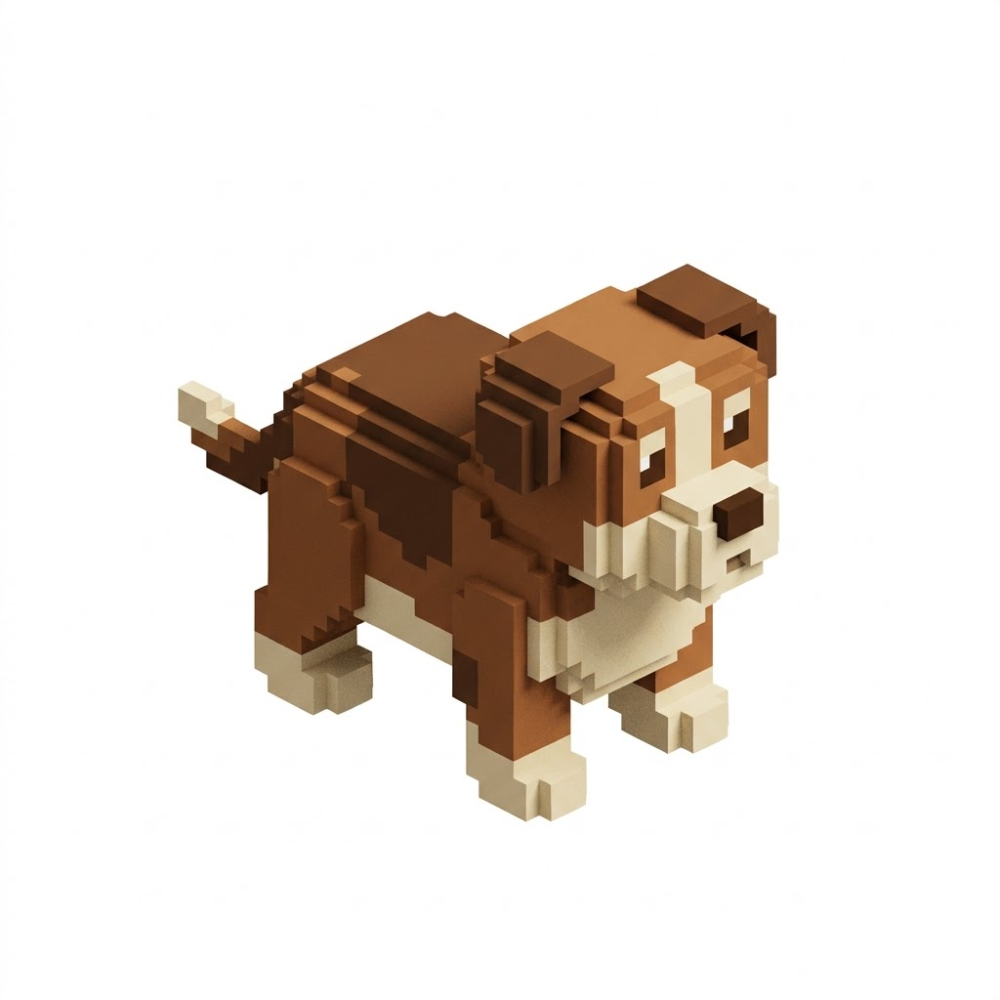
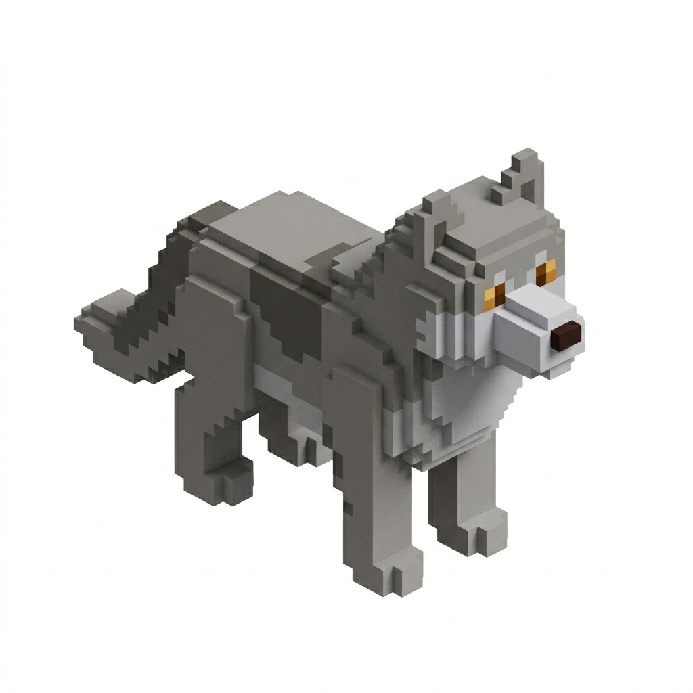
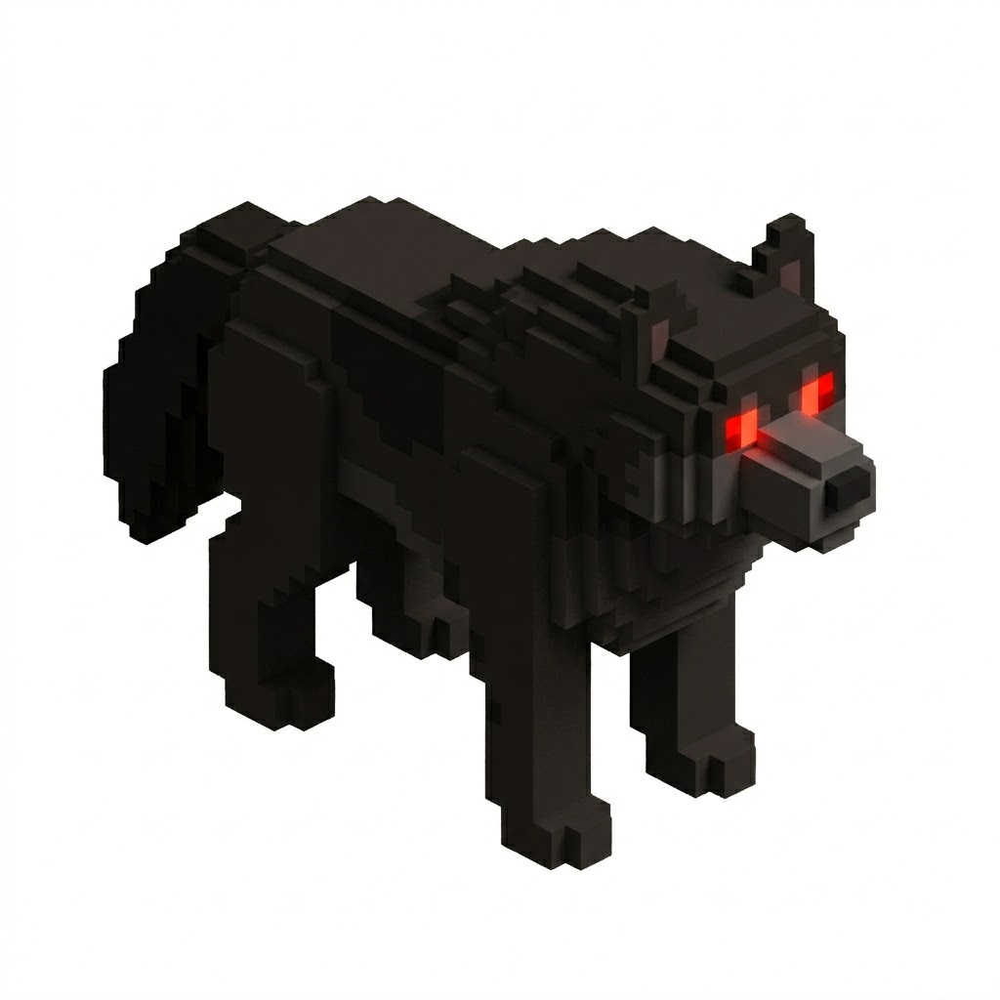
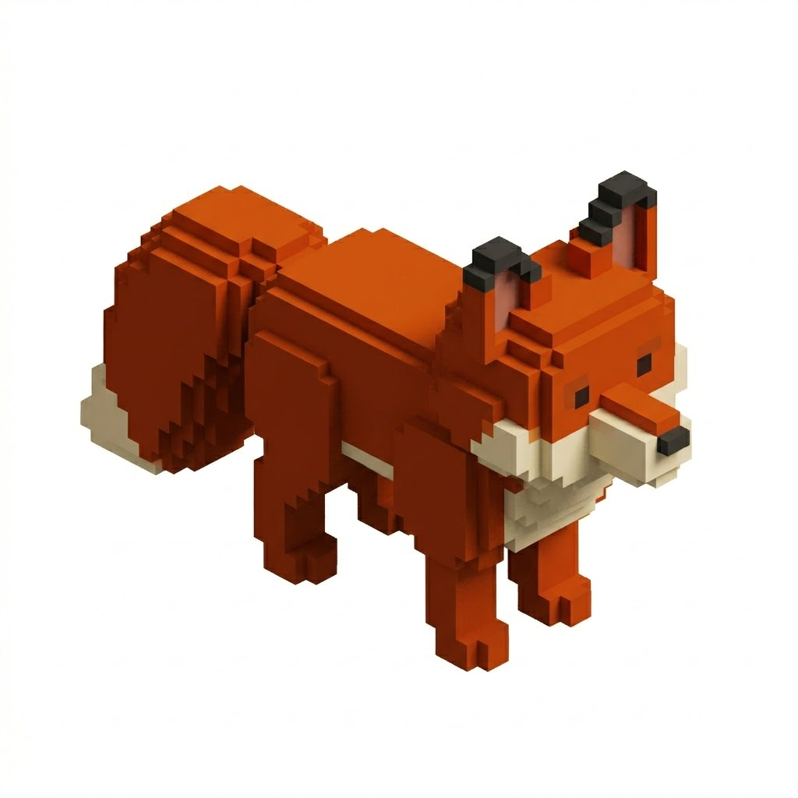
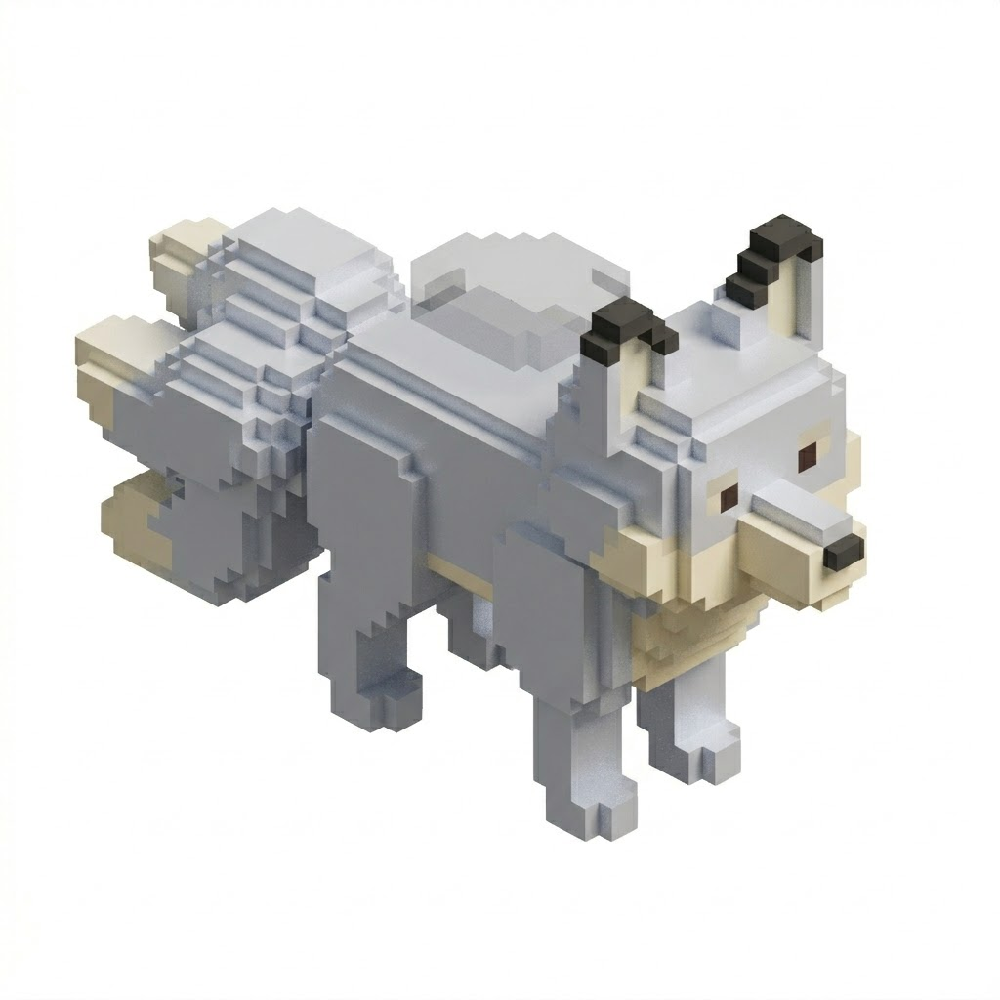
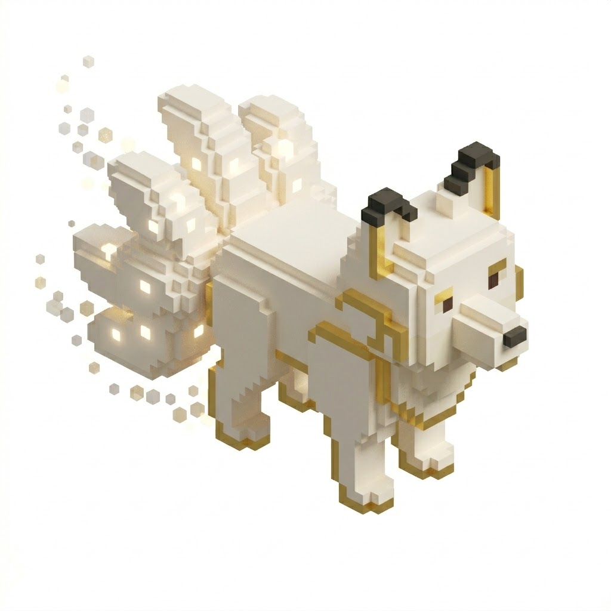
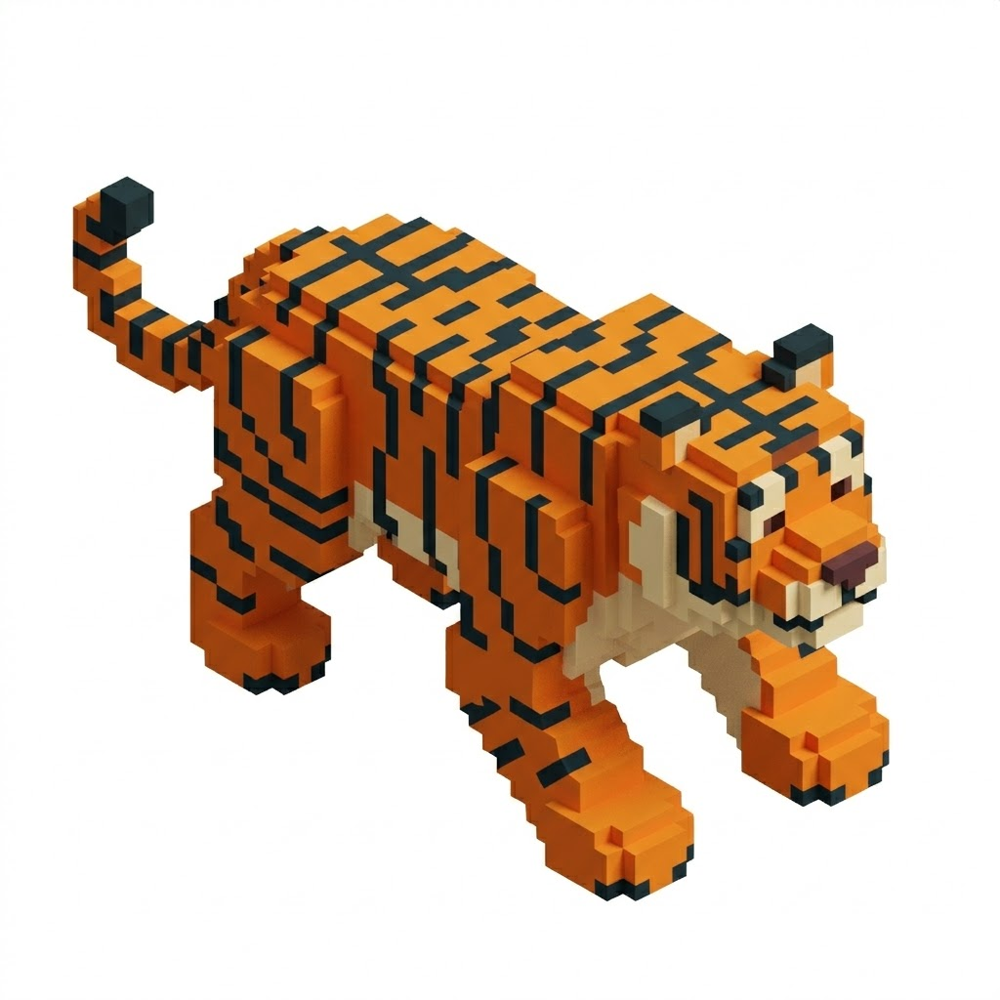
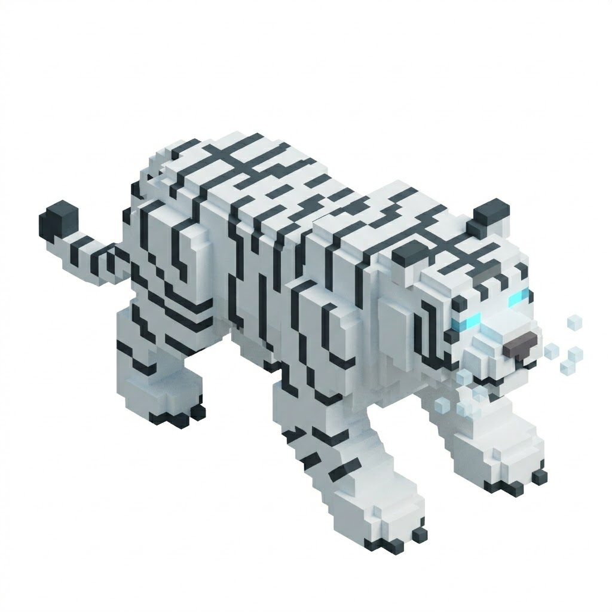
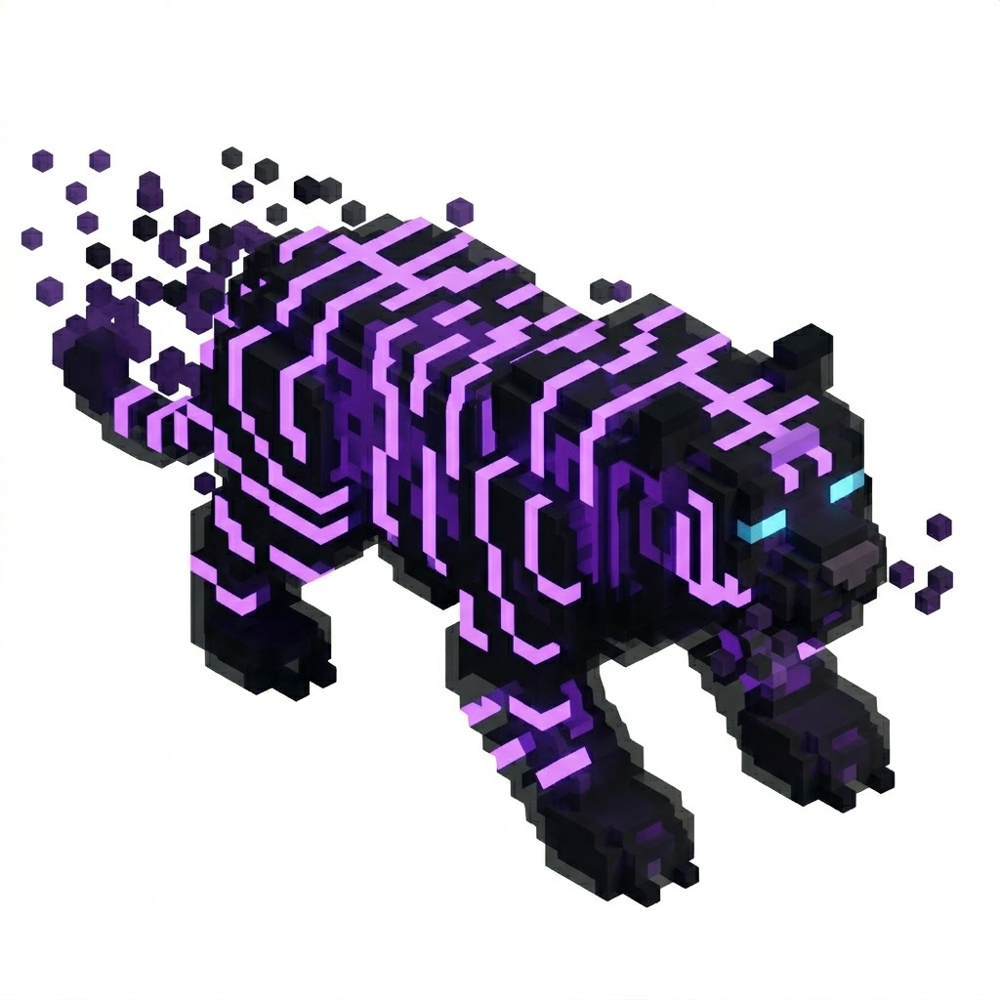

# Beast Encyclopedia — Anjay Hunter

> Capturable species that can become pets. Each entry is a complete design reference for that species.
> Stats follow GDD §6.3 tier base values. Evolution thresholds follow GDD §6.6.

## Symbol Guide

| Symbol | Meaning |
|---|---|
| ★ | Default skill — pre-equipped on capture |
| [D] | Dungeon-capturable only; not found in wild |
| T | Turns (duration of effect) |
| SP | Stamina cost |
| — | Not applicable (non-damage skill) |

---

## 001 · Dog `Common`

**Natural Affinity:** Neutral
**Stat Build:** Balanced
**Habitat:** Open fields and village outskirts — `zone_starter`, `zone_forest`
**Behaviour:** Passive. Non-aggressive unless cornered. After capture, follows player eagerly and responds well to commands.

> *"Found at the edge of every settlement in the voxel world, the Dog has walked beside hunters since the earliest days — loyal to a fault, fierce when it needs to be."*

**Evolution Chain:**
```
Dog  ──(Lv 20 + Evolution Shard)──►  Wolf  ──(Lv 100 + Evolution Crystal + Dire Fang)──►  Dire Wolf
```

| Stage | Name | Model Change | New Skill Unlocked |
|---|---|---|---|
| 1 | Dog | Small, blocky, wagging tail | — |
| 2 | Wolf | Larger, grey coat, amber eyes | Howl |
| 3 | Dire Wolf | Massive, dark fur, glowing red eyes | Pack Leader |

**Base Stats (Lv 1):**
| HP | Stamina | ATK | DEF | SPD |
|---|---|---|---|---|
| 100 | 50 | 15 | 10 | 10 |

**Growth / Lv:** +5 HP · +2 Sta · +2 ATK · +1 DEF · +1 SPD

**Skill Pool:**
| | Skill | Type | SP | Power | Effect |
|---|---|---|---|---|---|
| ★ | Bite | Physical | 10 | ×1.2 | Standard fang strike |
| ★ | Bark | Debuff | 8 | — | Target SPD −25%, 2T (40% chance) |
| | Growl | Debuff | 12 | — | Target ATK −30%, 2T |
| | Howl | Self-Buff | 15 | — | Own ATK & SPD +20%, 2T; unlocks at Stage 2 |
| | Fang Rush | Physical | 20 | ×1.8 | 25% chance: Bleed DOT (×0.8 per turn, 3T) |
| | Pack Leader | Self-Buff | 35 | — | Own all stats +30%, 3T; unlocks at Stage 3 |

**Lore Notes:**
- Common starting pet; recommended for new players
- Dire Fang drop location: Forest Cave dungeon boss (Goblin Warchief), 10% drop rate
- Strong PvP utility via SPD debuff chain (Bark → Fang Rush)

**Illustration:**



<br />



<br />



---

## 002 · Fox `Uncommon`

**Natural Affinity:** Dark-lean
**Stat Build:** Speed
**Habitat:** Dense forest edges and shadowy undergrowth — `zone_forest`, `zone_mountain`
**Behaviour:** Skittish. Flees on first contact; escape chance 60%. Requires patience or Iron Trap to capture reliably.

> *"The Fox does not fight with strength — it fights with the idea of itself. By the time you see it clearly, it has already won."*

**Evolution Chain:**
```
Fox  ──(Lv 30 + Evolution Shard)──►  Nine-Tail Fox  ──(Lv 150 + Evolution Crystal + Spirit Orb)──►  Celestial Fox
```

| Stage | Name | Model Change | New Skill Unlocked |
|---|---|---|---|
| 1 | Fox | Small, orange-red voxel coat, bushy tail | — |
| 2 | Nine-Tail Fox | Larger, silver-white coat, 3 visible tails, faint dark aura | Spirit Flame |
| 3 | Celestial Fox | Elegant gold and white, 9 glowing tails, ethereal particle trail | Fox God's Blessing |

**Base Stats (Lv 1):**
| HP | Stamina | ATK | DEF | SPD |
|---|---|---|---|---|
| 110 | 70 | 19 | 11 | 20 |

**Growth / Lv:** +7 HP · +3 Sta · +3 ATK · +2 DEF · +1 SPD

**Skill Pool:**
| | Skill | Type | SP | Power | Effect |
|---|---|---|---|---|---|
| ★ | Quick Bite | Physical | 10 | ×1.2 | Fast strike; goes before target if SPD tied |
| ★ | Illusion Dash | Self-Buff | 12 | — | Own SPD +30% & 20% dodge chance, 2T |
| | Shadow Step | Debuff | 15 | — | Target misses next attack (50% chance) |
| | Spirit Flame | Dark Elemental | 18 | ×1.8 | 30% Blind on target, 2T; unlocks at Stage 2 |
| | Tail Whip | Physical | 22 | ×2.5 | Hits 3× at ×0.8 each; can trigger Blind on each hit |
| | Fox God's Blessing | Self-Buff | 40 | — | Own ATK & SPD +50%, immune to debuffs, 2T; Stage 3 only |

**Lore Notes:**
- Spirit Orb drops from Mountain Ruins boss (Lich King), 8% drop rate
- Highest base SPD of all Uncommon tier at Stage 1
- Celestial Fox is a social prestige pet — its 9-tail particle effect is visible from a distance

**Illustration:**



<br />



<br />



---

## 003 · Tiger `Rare`

**Natural Affinity:** Neutral (Dark-lean at Stage 3)
**Stat Build:** Offensive
**Habitat:** Dense jungle undergrowth and rocky overhangs — `zone_mountain`, `zone_volcano`
**Behaviour:** Territorial. Ignores player until within 15 studs; then charges immediately. Does not flee.

> *"Tigers do not hunt — they simply arrive. Everything before that moment is just the world pretending it was safe."*

**Evolution Chain:**
```
Tiger  ──(Lv 50 + Evolution Shard)──►  White Tiger  ──(Lv 200 + Evolution Crystal + Shadow Claw)──►  Shadow Tiger
```

| Stage | Name | Model Change | New Skill Unlocked |
|---|---|---|---|
| 1 | Tiger | Orange-black striped voxel body, crouching stance | — |
| 2 | White Tiger | White fur, ice-blue eyes, faint frost breath particle | Ambush |
| 3 | Shadow Tiger | Black translucent body, glowing violet stripes, shadow particle trail | Shadow Fang |

**Base Stats (Lv 1):**
| HP | Stamina | ATK | DEF | SPD |
|---|---|---|---|---|
| 150 | 85 | 34 | 14 | 21 |

**Growth / Lv:** +10 HP · +4 Sta · +5 ATK · +2 DEF · +3 SPD

**Skill Pool:**
| | Skill | Type | SP | Power | Effect |
|---|---|---|---|---|---|
| ★ | Pounce | Physical | 15 | ×1.8 | Always acts first on the turn it is used, regardless of SPD |
| ★ | Claw Swipe | Physical | 10 | ×1.2 | 35% Armor Break on target (DEF −30%, 2T) |
| | Ambush | Physical | 28 | ×2.5 | +50% extra damage if used on turn 1 of battle; unlocks at Stage 2 |
| | Roar | Debuff | 15 | — | Target ATK & SPD −20%, 2T |
| | Hunter's Mark | Debuff | 20 | — | Target takes +25% damage from all sources, 3T |
| | Shadow Fang | Physical | 40 | ×3.5 | Ignores 50% of target DEF; Stage 3 only |

**Lore Notes:**
- Shadow Claw drops from Volcano Pit boss (Orc Overlord), 12% drop rate
- Highest single-turn burst damage among Rare tier via Pounce + Hunter's Mark combo
- Difficult to capture (Rare rarity modifier ×2.5); recommend Gold Trap at 1 HP remaining

**Illustration:**



<br />



<br />



---

## 004 · Griffin `Epic`

**Natural Affinity:** Wind-lean
**Stat Build:** Balanced
**Habitat:** Mountain cliff peaks and storm-lashed ridges — `zone_volcano`, `zone_abyss`
**Behaviour:** Territorial. Patrols a fixed aerial circuit; dives aggressively when territory is entered. Cannot be fled from once engaged.

> *"Half lion, half eagle, and entirely uninterested in compromise. The Griffin does not share its sky."*

**Evolution Chain:**
```
Griffin  ──(Lv 75 + Evolution Shard)──►  War Griffin  ──(Lv 300 + Evolution Crystal + Feather of Heaven)──►  Celestial Griffin
```

| Stage | Name | Model Change | New Skill Unlocked |
|---|---|---|---|
| 1 | Griffin | Brown voxel eagle-head, lion-body, folded wings | — |
| 2 | War Griffin | Armored shoulder plates, battle-scarred, wings spread wider | Dive Bomb |
| 3 | Celestial Griffin | White and gold plumage, radiant wing glow, cloud particle trail | Celestial Slash |

**Base Stats (Lv 1):**
| HP | Stamina | ATK | DEF | SPD |
|---|---|---|---|---|
| 220 | 110 | 36 | 26 | 22 |

**Growth / Lv:** +14 HP · +6 Sta · +6 ATK · +4 DEF · +2 SPD

**Skill Pool:**
| | Skill | Type | SP | Power | Effect |
|---|---|---|---|---|---|
| ★ | Talon Strike | Physical | 15 | ×1.8 | Powerful claw rake |
| ★ | Wind Gust | Wind Elemental | 12 | ×1.2 | 35% Shock on target (SPD −25%, 2T) |
| | Battle Cry | Debuff | 20 | — | Target ATK −25%, 2T; also lowers target DEF −15%, 1T |
| | Dive Bomb | Physical | 25 | ×2.5 | Ignores 30% of target DEF; unlocks at Stage 2 |
| | Feather Storm | Wind Elemental | 30 | ×1.8 | Hits 2× at ×1.8 each; 20% Shock each hit |
| | Celestial Slash | Wind Elemental | 42 | ×3.5 | 40% Shock + Blind simultaneously; Stage 3 only |

**Lore Notes:**
- Feather of Heaven drops from Abyss Rift boss (Abyssal Demon Lord), 15% drop rate
- Only obtainable in `zone_volcano` (rare spawn) and `zone_abyss` (uncommon spawn)
- Celestial Griffin is a high-tier PvP and social prestige pet; Feather Storm is its core PvP tool

---

## 005 · Dragon `Legendary`

**Natural Affinity:** Fire-lean
**Stat Build:** Balanced
**Habitat:** Deep lava vents and ancient ruins in the Abyss — `zone_abyss` (rare spawn only)
**Behaviour:** Aggressive. Attacks all creatures in range on sight. Engages the player immediately and relentlessly. Cannot be fled from.

> *"The Dragon does not distinguish between hunter and prey. In its world, everything that moves is already a target — and everything that doesn't is next."*

**Evolution Chain:**
```
Whelp  ──(Lv 100 + Evolution Shard)──►  Drake  ──(Lv 500 + Evolution Crystal + Dragon Heart)──►  Elder Dragon
```

| Stage | Name | Model Change | New Skill Unlocked |
|---|---|---|---|
| 1 | Whelp | Small, clumsy voxel dragonling, tiny wings, no fire yet | — |
| 2 | Drake | Mid-size, defined scales, small flame jet from mouth, wing span doubled | Dragon Roar |
| 3 | Elder Dragon | Enormous, layered armored scales, full fire breath particle, lava glow eyes | Ancient Fury |

**Base Stats (Lv 1):**
| HP | Stamina | ATK | DEF | SPD |
|---|---|---|---|---|
| 300 | 150 | 50 | 36 | 30 |

**Growth / Lv:** +20 HP · +9 Sta · +9 ATK · +6 DEF · +3 SPD

**Skill Pool:**
| | Skill | Type | SP | Power | Effect |
|---|---|---|---|---|---|
| ★ | Dragon Bite | Physical | 15 | ×1.8 | Crushing jaw strike |
| ★ | Flame Breath | Fire Elemental | 12 | ×1.2 | 30% Burn on target (−5% max HP/turn, 3T) |
| | Scale Shield | Self-Buff | 20 | — | Own DEF +40%, 3T; also grants 15% Burn immunity |
| | Dragon Roar | Debuff | 25 | — | Target all stats −15%, 3T; unlocks at Stage 2 |
| | Inferno Dive | Fire Elemental | 32 | ×2.5 | 50% Burn; also deals 10% of target max HP as flat bonus damage |
| | Ancient Fury | Fire Elemental | 45 | ×3.5 | 100% Burn; bypasses elemental resistance; Stage 3 only |

**Lore Notes:**
- Dragon Heart drops exclusively from Elder Dragon (Stage 3 must be defeated in the wild or owned and sacrificed via a special NPC ritual — design TBD)
- Highest total stat ceiling in the game at Lv 1000 Stage 3
- Ancient Fury bypassing elemental resistance is the only skill in the game with this property — flag for balance review before ship
- Whelp spawn rate in `zone_abyss`: ~0.5% per wild encounter roll (extremely rare; most players obtain via Pet Shop during seasonal events)

---

## 006 · Turtle `Common`

**Natural Affinity:** Earth-lean
**Stat Build:** Tank
**Habitat:** Shallow riverbanks and mossy stone patches — `zone_starter`, `zone_forest`
**Behaviour:** Passive. Ignores the player entirely until attacked. Once aggro'd, retreats into shell first (triggers DEF buff), then counter-attacks steadily.

> *"The Turtle has survived every age of the voxel world not by outrunning danger, but by outlasting it."*

**Evolution Chain:**
```
Turtle  ──(Lv 20 + Evolution Shard)──►  Armored Turtle  ──(Lv 100 + Evolution Crystal + Ancient Shell Fragment)──►  Stone Tortoise
```

| Stage | Name | Model Change | New Skill Unlocked |
|---|---|---|---|
| 1 | Turtle | Small green shell, stubby legs, gentle expression | — |
| 2 | Armored Turtle | Larger hexagonal shell plates, stone-grey tones, crack patterns | Stone Skin |
| 3 | Stone Tortoise | Massive, ancient-looking shell covered in moss and runes, earth particles | Seismic Shell |

**Base Stats (Lv 1):**
| HP | Stamina | ATK | DEF | SPD |
|---|---|---|---|---|
| 130 | 45 | 11 | 15 | 6 |

**Growth / Lv:** +5 HP · +2 Sta · +2 ATK · +1 DEF · +1 SPD

**Skill Pool:**
| | Skill | Type | SP | Power | Effect |
|---|---|---|---|---|---|
| ★ | Shell Slam | Physical | 12 | ×1.2 | Rams target with shell; 25% Armor Break (DEF −30%, 2T) |
| ★ | Withdraw | Self-Buff | 10 | — | Own DEF +50%, 1T; also reduces SPD −20% same turn |
| | Mud Toss | Earth Elemental | 14 | ×0.8 | 50% Shock on target (SPD −25%, 2T) |
| | Stone Skin | Self-Buff | 20 | — | Own DEF +40% & Regen +5% max HP/turn, 3T; unlocks at Stage 2 |
| | Crushing Shell | Physical | 28 | ×2.5 | Deals bonus damage equal to 5% of own max DEF as flat extra |
| | Seismic Shell | Earth Elemental | 38 | ×3.5 | Armor Break + 30% chance to skip target's next turn; Stage 3 only |

**Lore Notes:**
- Best natural DEF-to-HP ratio among all Common beasts
- Ancient Shell Fragment drops from Mountain Ruins boss (Lich King), 10% drop rate
- Stone Tortoise's `Seismic Shell` is the only Common-line skill that can inflict a turn skip — balance-check at Epic/Legendary PvP tiers

---

## 007 · Bee `Common`

**Natural Affinity:** Fire-lean
**Stat Build:** Offensive
**Habitat:** Flower meadows and hollow logs — `zone_starter`, `zone_forest`
**Behaviour:** Territorial. Passive until within 8 studs of spawn point (hive zone). If player steps inside, entire hive aggros at once — single Bee encounter, but with +20% ATK modifier (swarm context).

> *"Small enough to ignore. Numerous enough to be a problem. Brave enough to sting something ten thousand times its size."*

**Evolution Chain:**
```
Bee  ──(Lv 20 + Evolution Shard)──►  Queen Bee  ──(Lv 100 + Evolution Crystal + Royal Jelly Vial)──►  Hive Lord
```

| Stage | Name | Model Change | New Skill Unlocked |
|---|---|---|---|
| 1 | Bee | Tiny yellow-black striped voxel, buzzing wing particles | — |
| 2 | Queen Bee | Larger, crown-like head crest, golden tone, trailing pollen particles | Nectar Burst |
| 3 | Hive Lord | Imposing armored thorax, glowing amber eyes, swarm particle cloud around body | Royal Decree |

**Base Stats (Lv 1):**
| HP | Stamina | ATK | DEF | SPD |
|---|---|---|---|---|
| 90 | 50 | 18 | 8 | 12 |

**Growth / Lv:** +5 HP · +2 Sta · +2 ATK · +1 DEF · +1 SPD

**Skill Pool:**
| | Skill | Type | SP | Power | Effect |
|---|---|---|---|---|---|
| ★ | Sting | Physical | 8 | ×1.2 | 40% Poison on target (−3% max HP/turn, 5T) |
| ★ | Swarm | DOT | 15 | — | Inflicts Swarm: −4% max HP/turn for 4T; does not stack with Poison |
| | Pollen Cloud | Debuff | 12 | — | Target ATK −20% & 30% Blind, 2T |
| | Nectar Burst | Heal | 18 | — | Restores 25% of own max HP; unlocks at Stage 2 |
| | Stinger Barrage | Physical | 25 | ×1.8 | Hits 4× at ×0.5 each; each hit independently rolls 25% Poison |
| | Royal Decree | Self-Buff | 38 | — | Own ATK +60%, Poison proc chance on all skills +20%, 3T; Stage 3 only |

**Lore Notes:**
- Royal Jelly Vial drops from Forest Cave boss (Goblin Warchief), 8% drop rate
- Stinger Barrage + Royal Decree is the strongest multi-Poison setup in Common tier; monitor in PvP
- Hive Lord's swarm particle cloud is a distinct visual from all other Common-tier Stage 3 models

---

## 008 · Slime `Common`

**Natural Affinity:** Neutral (adapts to imbued element — lore: Slime takes on the colour of its element)
**Stat Build:** Defensive
**Habitat:** Damp cave floors and underground pools — `zone_starter`, `zone_forest` (cave areas)
**Behaviour:** Passive. Bounces curiously toward the player. Never initiates combat. If attacked, it wobbles and splits visual but does not flee.

> *"The Slime has no ambition, no territory, and no enemies. It is simply there — and somehow, always fine."*

**Evolution Chain:**
```
Slime  ──(Lv 20 + Evolution Shard)──►  Slime King  ──(Lv 100 + Evolution Crystal + Prism Core)──►  Slime Titan
```

| Stage | Name | Model Change | New Skill Unlocked |
|---|---|---|---|
| 1 | Slime | Small translucent green blob, jiggle idle animation | — |
| 2 | Slime King | Larger, with tiny voxel crown, deeper green-blue hue, trail of droplets | Absorb |
| 3 | Slime Titan | Massive crystalline form; colour shifts to match imbued element; prismatic glow | Prism Burst |

**Base Stats (Lv 1):**
| HP | Stamina | ATK | DEF | SPD |
|---|---|---|---|---|
| 120 | 50 | 12 | 14 | 8 |

**Growth / Lv:** +5 HP · +2 Sta · +2 ATK · +1 DEF · +1 SPD

**Skill Pool:**
| | Skill | Type | SP | Power | Effect |
|---|---|---|---|---|---|
| ★ | Slime Shot | Physical | 10 | ×1.2 | Gooey projectile; 30% Shock (SPD −25%, 2T) |
| ★ | Sticky Body | Debuff | 12 | — | Target SPD −40% for 3T; also reduces flee chance by 20% |
| | Split Dodge | Self-Buff | 15 | — | 35% dodge chance for 2T; own DEF +20% same duration |
| | Absorb | Heal | 20 | — | Restores HP equal to 15% of damage taken last turn (min 5); unlocks at Stage 2 |
| | Ooze Wave | Physical | 22 | ×1.8 | Coats target; all debuffs on target last +1T extra |
| | Prism Burst | Elemental | 40 | ×3.5 | Element matches pet's imbued element; if no element, deals true neutral damage ignoring resistances; Stage 3 only |

**Lore Notes:**
- Prism Core drops from Mountain Ruins boss, 12% drop rate
- Slime Titan's `Prism Burst` is the only skill that uses the pet's imbued element dynamically — dev must resolve element at cast time, not at skill definition time
- Slime's visual colour reacting to its imbued element is a unique cosmetic behaviour; requires element-to-colour mapping in the CosmeticService

---

## 009 · Octopus `Uncommon`

**Natural Affinity:** Water-lean
**Stat Build:** Defensive
**Habitat:** Coastal rock pools and underwater cave openings — `zone_forest` (rivers), `zone_mountain` (deep lakes)
**Behaviour:** Skittish. Retreats and inks when approached. Will only fight if cornered or if HP is above 80% (it retreats when weakened).

> *"Eight arms. Eight opinions. All of them wrong about whether you're a threat — until one of them wraps around your leg and proves you are."*

**Evolution Chain:**
```
Octopus  ──(Lv 30 + Evolution Shard)──►  Giant Octopus  ──(Lv 150 + Evolution Crystal + Deep-Sea Beak)──►  Kraken Spawn
```

| Stage | Name | Model Change | New Skill Unlocked |
|---|---|---|---|
| 1 | Octopus | Small orange-brown voxel, 8 short tentacles, suction-cup detail | — |
| 2 | Giant Octopus | Larger, deep-sea blue, longer tentacles with bioluminescent tips | Eight Arms |
| 3 | Kraken Spawn | Enormous dark-purple form, crackling water aura, tentacles leave water trail | Abyssal Wave |

**Base Stats (Lv 1):**
| HP | Stamina | ATK | DEF | SPD |
|---|---|---|---|---|
| 155 | 65 | 16 | 19 | 10 |

**Growth / Lv:** +7 HP · +3 Sta · +3 ATK · +2 DEF · +1 SPD

**Skill Pool:**
| | Skill | Type | SP | Power | Effect |
|---|---|---|---|---|---|
| ★ | Ink Blast | Debuff | 10 | — | Target accuracy −40% (50% miss chance), 2T; Blind variant |
| ★ | Tentacle Grab | Physical | 15 | ×1.2 | 40% chance: skip target's next turn (Bind) |
| | Water Jet | Water Elemental | 14 | ×1.8 | Knocks target back (cosmetic) + 25% Shock (SPD −25%, 2T) |
| | Suction Grip | Self-Buff | 18 | — | Own DEF +35%; reduces damage from Physical skills by 20%, 3T |
| | Eight Arms | Physical | 30 | — | Hits 8× at ×0.4 each; each hit independently rolls 20% Bind; unlocks at Stage 2 |
| | Abyssal Wave | Water Elemental | 42 | ×3.5 | 60% Blind + 40% Bind simultaneously; Stage 3 only |

**Lore Notes:**
- Deep-Sea Beak drops from Dark Forest boss (Elder Treant), 9% drop rate — thematic mismatch by design (Treant guards a coastal grotto)
- Eight Arms hitting 8× makes it the highest hit-count skill in the game; each hit is individually weak (×0.4) — verify damage cap isn't exploitable with Armor Break stacked
- Kraken Spawn is the visual precursor to the Kraken Legendary beast; lore connection intentional

---

## 010 · Scorpion `Uncommon`

**Natural Affinity:** Dark-lean
**Stat Build:** Balanced
**Habitat:** Arid stone flats and volcanic sand dunes — `zone_mountain`, `zone_volcano`
**Behaviour:** Aggressive in `zone_volcano`; Territorial in `zone_mountain`. Raises tail as a warning before charging — players have 2 seconds before auto-attack triggers.

> *"The Scorpion does not chase. It waits. The desert is patient, and so is everything that lives in it."*

**Evolution Chain:**
```
Scorpion  ──(Lv 30 + Evolution Shard)──►  Venom Scorpion  ──(Lv 150 + Evolution Crystal + Abyss Stinger)──►  Abyss Scorpion
```

| Stage | Name | Model Change | New Skill Unlocked |
|---|---|---|---|
| 1 | Scorpion | Sandy-brown voxel, curved tail with bright red tip | — |
| 2 | Venom Scorpion | Darker purple carapace, dripping venom particle from stinger | Death Mark |
| 3 | Abyss Scorpion | Black armored exoskeleton, glowing violet stinger, dark mist trail | Scorpion's Judgment |

**Base Stats (Lv 1):**
| HP | Stamina | ATK | DEF | SPD |
|---|---|---|---|---|
| 130 | 65 | 20 | 14 | 13 |

**Growth / Lv:** +7 HP · +3 Sta · +3 ATK · +2 DEF · +1 SPD

**Skill Pool:**
| | Skill | Type | SP | Power | Effect |
|---|---|---|---|---|---|
| ★ | Pincer Snap | Physical | 10 | ×1.2 | 35% Armor Break on target (DEF −30%, 2T) |
| ★ | Venom Sting | DOT | 14 | — | Inflicts Poison (−3% max HP/turn, 5T) + 20% Armor Break |
| | Sand Blind | Debuff | 12 | — | Target accuracy −35%, 2T; also 25% SPD −20%, 2T |
| | Death Mark | Debuff | 22 | — | Target takes +40% damage from all sources for 2T; unlocks at Stage 2 |
| | Scorpion Dance | Self-Buff | 18 | — | Own SPD +35% & dodge chance +25%, 2T |
| | Scorpion's Judgment | Dark Elemental | 40 | ×3.5 | Target current Poison DOT ticks are dealt instantly as burst damage, then Poison resets; Stage 3 only |

**Lore Notes:**
- Abyss Stinger drops from Volcano Pit boss (Orc Overlord), 11% drop rate
- `Scorpion's Judgment` has a unique mechanic: it requires the target to already have Poison active to deal bonus damage; dev must implement a target-state check at cast time
- Death Mark + Scorpion's Judgment + Venom Sting is the primary damage combo — high skill ceiling, strong PvP threat at Abyss Scorpion tier

---

## 011 · Eagle `Rare`

**Natural Affinity:** Wind-lean
**Stat Build:** Speed
**Habitat:** Open mountain peaks and windswept cliffs — `zone_mountain`, `zone_volcano`
**Behaviour:** Predatory. Circles overhead at high altitude before diving on any player that stands still for 3+ seconds. Will not pursue below a certain altitude (cannot follow into caves).

> *"The Eagle does not look at the ground the way other beasts do. It looks at it the way a hunter looks at a map."*

**Evolution Chain:**
```
Eagle  ──(Lv 50 + Evolution Shard)──►  War Eagle  ──(Lv 200 + Evolution Crystal + Skystone Feather)──►  Sky Emperor
```

| Stage | Name | Model Change | New Skill Unlocked |
|---|---|---|---|
| 1 | Eagle | Brown-white voxel, sharp yellow beak, talons visible on ground stance | — |
| 2 | War Eagle | Larger wingspan, armored chest plate, battle-worn markings, wind trail on wings | Storm Ride |
| 3 | Sky Emperor | Silver-white plumage, golden crown crest, radiant wind aura, contrail particle | Sky Domination |

**Base Stats (Lv 1):**
| HP | Stamina | ATK | DEF | SPD |
|---|---|---|---|---|
| 140 | 90 | 26 | 15 | 26 |

**Growth / Lv:** +10 HP · +4 Sta · +4 ATK · +2 DEF · +3 SPD

**Skill Pool:**
| | Skill | Type | SP | Power | Effect |
|---|---|---|---|---|---|
| ★ | Talon Dive | Physical | 14 | ×1.8 | Always goes first on the turn used regardless of SPD (same rule as Tiger's Pounce) |
| ★ | Eagle Eye | Debuff | 10 | — | Target accuracy −30% & DEF −20%, 2T |
| | Wind Slash | Wind Elemental | 16 | ×1.2 | 35% Shock (SPD −25%, 2T) |
| | Storm Ride | Self-Buff | 20 | — | Own SPD +50%, 2T; next Physical skill ignores 25% DEF; unlocks at Stage 2 |
| | Aerial Assault | Physical | 26 | ×2.5 | Damage +30% for each active SPD buff on self |
| | Sky Domination | Wind Elemental | 42 | ×3.5 | Removes all buffs from target before dealing damage; Stage 3 only |

**Lore Notes:**
- Skystone Feather drops from Dark Forest boss (Elder Treant), 10% drop rate
- Highest base SPD among all Rare tier at Stage 1 — faster than most Epic beasts until mid-level
- Sky Domination's buff-strip effect resolves before damage calculation — dev must apply strip then recalculate target DEF before damage
- Both Eagle `Talon Dive` and Tiger `Pounce` use the same "always-first" mechanic; if both are used in the same turn vs. each other, resolve by raw SPD as tiebreaker

---

## 012 · Bear `Rare`

**Natural Affinity:** Earth-lean
**Stat Build:** Tank
**Habitat:** Thick mountain pine forests and highland caves — `zone_mountain`
**Behaviour:** Territorial. Leaves claw marks on trees as boundary markers. Attacks any player who crosses into its zone. Retreats to cave at 20% HP to hibernate (auto-flee with 100% success rate at that threshold).

> *"The Bear is not angry. It is simply very clear about what is, and is not, its forest."*

**Evolution Chain:**
```
Bear  ──(Lv 50 + Evolution Shard)──►  Grizzly  ──(Lv 200 + Evolution Crystal + Primal Fur Clump)──►  Ancient Bear
```

| Stage | Name | Model Change | New Skill Unlocked |
|---|---|---|---|
| 1 | Bear | Brown blocky voxel, rounded ears, lumbering idle | — |
| 2 | Grizzly | Larger, silver-tipped fur, battle scars, heavier stance | Thick Hide |
| 3 | Ancient Bear | Massive, dark-brown with stone-like fur texture, glowing amber eyes, earth particle trail | Ancient Wrath |

**Base Stats (Lv 1):**
| HP | Stamina | ATK | DEF | SPD |
|---|---|---|---|---|
| 220 | 75 | 20 | 30 | 10 |

**Growth / Lv:** +10 HP · +4 Sta · +4 ATK · +3 DEF · +1 SPD

**Skill Pool:**
| | Skill | Type | SP | Power | Effect |
|---|---|---|---|---|---|
| ★ | Maul | Physical | 15 | ×1.8 | 30% Armor Break (DEF −30%, 2T) |
| ★ | Intimidate | Debuff | 10 | — | Target ATK −35% & 20% chance to skip target's next turn (fear) |
| | Bear Hug | Physical | 22 | ×1.2 | 50% Bind (skip target's next turn); lower power compensates high CC |
| | Thick Hide | Self-Buff | 20 | — | Own DEF +50% & Regen +5% max HP/turn, 3T; unlocks at Stage 2 |
| | Ground Slam | Earth Elemental | 28 | ×2.5 | 40% Shock (SPD −25%, 2T) + minor Armor Break (DEF −15%, 1T) |
| | Ancient Wrath | Physical | 40 | ×3.5 | Damage scales with own DEF: adds 10% of own DEF as flat bonus damage; Stage 3 only |

**Lore Notes:**
- Highest base DEF among all Rare-tier beasts at Stage 1 (30 vs tier baseline of 19)
- Primal Fur Clump drops from Mountain Ruins boss (Lich King), 13% drop rate
- `Ancient Wrath` creating a DEF-scaled damage bonus makes Ancient Bear a unique off-tank attacker — the higher the DEF investment, the harder it hits; balance requires damage cap (suggest: DEF bonus capped at +200 flat)
- Bear's combat-flee at 20% HP is a **world behaviour only** — in battle it does not flee; it fights until KO

---

## 013 · Cerberus `Epic`

**Natural Affinity:** Dark-lean
**Stat Build:** Offensive
**Habitat:** The outermost ring of the Abyss, near dungeon entry gates — `zone_abyss`
**Behaviour:** Aggressive. Circles its patrol route constantly. Three heads look in different directions simultaneously — no blind spot; cannot be ambushed. Charges on sight with all three heads growling.

> *"Three heads, one grudge. No one who has met the Cerberus has been in a position to argue about which head bit them first."*

**Evolution Chain:**
```
Cerberus  ──(Lv 75 + Evolution Shard)──►  Hell Cerberus  ──(Lv 300 + Evolution Crystal + Hellgate Key)──►  Gate Guardian
```

| Stage | Name | Model Change | New Skill Unlocked |
|---|---|---|---|
| 1 | Cerberus | Large three-headed black dog, red collar on each neck, ember eyes | — |
| 2 | Hell Cerberus | Larger, flame mane on all three heads, cracked-rock skin texture, fire particle | Death Howl |
| 3 | Gate Guardian | Enormous, obsidian-armored, chains dragging behind it, infernal aura, all eyes glow white | Final Judgment |

**Base Stats (Lv 1):**
| HP | Stamina | ATK | DEF | SPD |
|---|---|---|---|---|
| 195 | 110 | 45 | 20 | 27 |

**Growth / Lv:** +14 HP · +6 Sta · +6 ATK · +4 DEF · +2 SPD

**Skill Pool:**
| | Skill | Type | SP | Power | Effect |
|---|---|---|---|---|---|
| ★ | Triple Bite | Physical | 18 | — | Hits 3× at ×0.8 each; each hit independently rolls 25% Bleed (DOT, 3T) |
| ★ | Hellfire Breath | Fire Elemental | 15 | ×1.2 | 40% Burn (−5% max HP/turn, 3T) |
| | Chain Pull | Debuff | 20 | — | Forces target to attack Cerberus next turn (Taunt); removes target SPD buffs |
| | Death Howl | Debuff | 25 | — | Target all stats −20%, 3T; also inflicts 30% fear (skip next turn); unlocks at Stage 2 |
| | Underworld Strike | Dark Elemental | 32 | ×2.5 | Damage bypasses 20% of target DEF; 35% Blind |
| | Final Judgment | Dark Elemental | 44 | ×3.5 | If target HP < 30%, deals double total damage; Stage 3 only |

**Lore Notes:**
- Hellgate Key drops from Abyss Rift boss (Abyssal Demon Lord), 8% drop rate — one of the rarest Stage 3 materials
- `Final Judgment` execute mechanic: resolve HP check before damage roll; if target is at exactly 30% HP boundary, include (i.e., use `<=`)
- Triple Bite hitting 3× with independent Bleed rolls makes Bleed management critical — a target can have overlapping Bleed DOTs; dev must decide if Bleed stacks or refreshes (recommended: refresh, not stack)
- Cerberus cannot be obtained before `zone_abyss` unlock; no Pet Shop availability at launch

---

## 014 · Unicorn `Epic`

**Natural Affinity:** Light-lean
**Stat Build:** Defensive
**Habitat:** A hidden sacred glade deep in the Volcano zone, accessible only after clearing zone_mountain — `zone_volcano` (rare static spawn, one per server)
**Behaviour:** Passive. Never initiates combat. If attacked, it does not flee — it faces the attacker and raises its horn in warning. Attacks only to protect itself, using heal skills first.

> *"The Unicorn does not need to prove it is powerful. That is, in itself, proof."*

**Evolution Chain:**
```
Unicorn  ──(Lv 75 + Evolution Shard)──►  Dark Unicorn  ──(Lv 300 + Evolution Crystal + Moonveil Horn)──►  Celestial Unicorn
```

| Stage | Name | Model Change | New Skill Unlocked |
|---|---|---|---|
| 1 | Unicorn | White voxel horse, single silver horn, soft glow particle | — |
| 2 | Dark Unicorn | Sleek black coat, purple-silver horn, crescent moon mark on flank, dark shimmer aura | Lunar Charge |
| 3 | Celestial Unicorn | Translucent white-gold body, rainbow aurora trail from horn tip, ethereal hooves | Celestial Blessing |

**Base Stats (Lv 1):**
| HP | Stamina | ATK | DEF | SPD |
|---|---|---|---|---|
| 260 | 110 | 28 | 35 | 17 |

**Growth / Lv:** +14 HP · +6 Sta · +6 ATK · +4 DEF · +2 SPD

**Skill Pool:**
| | Skill | Type | SP | Power | Effect |
|---|---|---|---|---|---|
| ★ | Horn Strike | Physical | 15 | ×1.8 | Precise pierce; 20% chance to remove one active buff from target |
| ★ | Holy Light | Heal | 12 | — | Restores 20% of own max HP; also cures one random active debuff |
| | Purify | Self-Buff | 18 | — | Removes ALL active debuffs on self; own DEF +20%, 2T |
| | Divine Shield | Self-Buff | 25 | — | Own DEF +60% & immune to all status effects, 2T; unlocks at Stage 2 — wait: actually the second unlock is Lunar Charge |
| | Lunar Charge | Light Elemental | 28 | ×2.5 | Damage heals self for 30% of damage dealt (lifesteal); unlocks at Stage 2 |
| | Celestial Blessing | Light Elemental | 42 | ×3.5 | Heals self for 40% max HP AND deals damage simultaneously; Stage 3 only |

**Lore Notes:**
- One Unicorn spawns per server in a fixed location in `zone_volcano`; respawns 30 minutes after capture or defeat
- Moonveil Horn drops from Abyss Rift boss (Abyssal Demon Lord), 10% drop rate
- `Celestial Blessing` dealing damage and healing simultaneously requires two separate resolution passes in `BattleService` — damage first, then heal (heal cannot exceed max HP)
- Unicorn's passive buff-strip on `Horn Strike` is the only skill in Epic tier with this property outside of Eagle's `Sky Domination`
- Social value: Celestial Unicorn's rainbow aurora trail is one of the most visually distinct effects in the game

---

## 015 · Phoenix `Legendary`

**Natural Affinity:** Fire-lean
**Stat Build:** Offensive
**Habitat:** Volcanic calderas and lava-crested summits — `zone_abyss` (rare spawn); also obtainable via seasonal events
**Behaviour:** Aggressive. Circles in high-altitude thermals invisibly until the player enters its caldera. Descends in a flaming dive with no warning. Cannot be fled from once engaged.

> *"The Phoenix has died more times than any creature alive. This has not made it cautious. If anything, it has made it bored."*

**Evolution Chain:**
```
Phoenix Chick  ──(Lv 100 + Evolution Shard)──►  Phoenix  ──(Lv 500 + Evolution Crystal + Eternal Ember)──►  Inferno Phoenix
```

| Stage | Name | Model Change | New Skill Unlocked |
|---|---|---|---|
| 1 | Phoenix Chick | Small, fluffy orange-red voxel chick, tiny flame sparks at wing tips | — |
| 2 | Phoenix | Full-size fiery bird, flame wings, glowing tail feathers, heat-shimmer aura | Ash Storm |
| 3 | Inferno Phoenix | Enormous, solar-gold and deep-crimson, wings leave fire trails, rebirth glow effect on low HP | Phoenix Rebirth |

**Passive — Rebirth:** Once per battle, when this pet is reduced to 0 HP, it automatically revives with 30% of its max HP. The revive triggers before KO is confirmed. Cooldown resets between battles. Visual: burst of golden flame on the turn it triggers.

**Base Stats (Lv 1):**
| HP | Stamina | ATK | DEF | SPD |
|---|---|---|---|---|
| 265 | 150 | 65 | 28 | 37 |

**Growth / Lv:** +20 HP · +9 Sta · +9 ATK · +6 DEF · +3 SPD

**Skill Pool:**
| | Skill | Type | SP | Power | Effect |
|---|---|---|---|---|---|
| ★ | Fire Talon | Physical | 15 | ×1.8 | 35% Burn (−5% max HP/turn, 3T) |
| ★ | Rising Flame | Fire Elemental | 12 | ×1.2 | Damage +20% for each Burn DOT currently active on the target |
| | Rebirth Pulse | Heal | 20 | — | Restores 25% own max HP + removes all debuffs on self |
| | Ash Storm | Fire Elemental | 28 | ×2.5 | 60% Burn on target; also reduces target SPD −20%, 2T; unlocks at Stage 2 |
| | Solar Flare | Fire Elemental | 35 | ×3.0 | Ignores elemental resistance (similar to Dragon's Ancient Fury but at ×3.0, not ×3.5) |
| | Phoenix Rebirth | Fire Elemental | 45 | ×3.5 | If Rebirth passive has already triggered this battle, this skill deals +100% bonus damage; Stage 3 only |

**Lore Notes:**
- Eternal Ember drops from Abyss Rift boss (Abyssal Demon Lord), 5% drop rate — second rarest Stage 3 material after Dragon Heart
- Rebirth passive is implemented as a battle flag `PhoenixRebirthUsed` on the PetBattleState object; reset on battle end; check in `CHECK_END` state before confirming KO
- `Phoenix Rebirth` damage bonus requires checking `PhoenixRebirthUsed == true` at cast time — if Rebirth hasn't triggered yet, skill deals normal ×3.5 with no bonus
- `Rising Flame` scaling with active Burn stacks requires reading the target's active status effect list at cast time; dev must sum all Burn instances (refreshed or new) as one count — recommend treating any active Burn as +20% regardless of stack count
- Highest base ATK and SPD of all Legendary beasts at Stage 1 — trades HP and DEF for pure offense; Rebirth compensates for fragility

---

## 016 · Cat `Common`

**Natural Affinity:** Neutral
**Stat Build:** Speed
**Habitat:** Tall grass, shadowed alleyways near settlements — `zone_starter`, `zone_forest`
**Behaviour:** Skittish. Escape chance 70%. Flees on approach but turns aggressive the moment it is cornered — a captured Cat fights harder than most beasts twice its size.

> *"The Cat has spent its entire life pretending it does not care what you think. This pretence is flawless and completely sincere."*

**Evolution Chain:**
```
Cat  ──(Lv 20 + Evolution Shard)──►  Panther  ──(Lv 100 + Evolution Crystal + Shadow Claw)──►  Shadow Panther
```

| Stage | Name | Model Change | New Skill Unlocked |
|---|---|---|---|
| 1 | Cat | Small orange or grey voxel, alert ears, flicking tail idle | — |
| 2 | Panther | Sleek jet-black coat, amber eyes, crouching low-profile stance | Shadow Stalk |
| 3 | Shadow Panther | Translucent dark body, violet eye glow, shadow-smoke trail at paws | Phantom Slash |

**Base Stats (Lv 1):**
| HP | Stamina | ATK | DEF | SPD |
|---|---|---|---|---|
| 85 | 55 | 14 | 8 | 15 |

**Growth / Lv:** +5 HP · +2 Sta · +2 ATK · +1 DEF · +1 SPD

**Skill Pool:**
| | Skill | Type | SP | Power | Effect |
|---|---|---|---|---|---|
| ★ | Scratch | Physical | 8 | ×1.2 | Fast claw strike; 25% Armor Break (DEF −30%, 1T) |
| ★ | Dodge Roll | Self-Buff | 10 | — | 40% dodge chance, 1T; if dodge succeeds, auto-counters with ×0.8 Physical |
| | Pounce | Physical | 15 | ×1.8 | +50% bonus damage if target HP is above 75% (ambush bonus) |
| | Hiss | Debuff | 12 | — | Target ATK −30% & 25% fear (skip turn chance), 2T |
| | Shadow Stalk | Self-Buff | 18 | — | Own SPD +40% & crit rate +30%, 2T; unlocks at Stage 2 |
| | Phantom Slash | Physical | 28 | ×2.5 | Auto-hits ignoring accuracy if Dodge Roll was used last turn; Stage 3 only |

**Lore Notes:**
- Shadow Claw drops from Forest Cave boss (Goblin Warchief), 9% drop rate
- Dodge Roll counter-attack is not a separate turn — it resolves within the same turn as the incoming attack
- Phantom Slash's auto-hit check reads the previous-turn action flag; dev must track `LastActionUsed` per pet per turn in battle state
- Highest base SPD among all Common-tier beasts; ties with Rabbit

---

## 017 · Rabbit `Common`

**Natural Affinity:** Nature-lean
**Stat Build:** Speed
**Habitat:** Open meadows and flower fields — `zone_starter`
**Behaviour:** Skittish. Highest escape chance of all Common beasts (80%). Requires Iron Trap or higher for reliable capture. Bolts in a zigzag pattern when fleeing (cosmetic).

> *"The Rabbit does not survive by being strong. It survives by being somewhere else — ideally somewhere you haven't looked yet."*

**Evolution Chain:**
```
Rabbit  ──(Lv 20 + Evolution Shard)──►  Swift Rabbit  ──(Lv 100 + Evolution Crystal + Storm Ear)──►  Thunder Hare
```

| Stage | Name | Model Change | New Skill Unlocked |
|---|---|---|---|
| 1 | Rabbit | Small white or brown voxel, oversized ears, twitching nose idle | — |
| 2 | Swift Rabbit | Longer legs, blue-tipped ears, faint speed-line particles when running | Double Jump |
| 3 | Thunder Hare | Electric-blue fur, crackling ear tips, lightning trail on movement, enlarged hind legs | Last Stand |

**Base Stats (Lv 1):**
| HP | Stamina | ATK | DEF | SPD |
|---|---|---|---|---|
| 85 | 55 | 14 | 8 | 15 |

**Growth / Lv:** +5 HP · +2 Sta · +2 ATK · +1 DEF · +1 SPD

**Skill Pool:**
| | Skill | Type | SP | Power | Effect |
|---|---|---|---|---|---|
| ★ | Quick Kick | Physical | 8 | ×1.2 | Back-leg strike; high priority — acts before most Normal-speed moves |
| ★ | Hop Away | Self-Buff | 10 | — | 50% dodge chance, 1T; also adds +40% flee success bonus if used during Wild Hunt |
| | Lucky Clover | Self-Buff | 14 | — | Own dodge +25% & target accuracy −15%, 2T |
| | Double Jump | Physical | 20 | ×1.8 | Hits twice at ×0.9 each; second hit always connects if first hit lands; unlocks at Stage 2 |
| | Thunder Burst | Electric Elemental | 26 | ×2.5 | 35% Shock (SPD −25%, 2T); accessed after imbuing Electric at Lv 50 or via Skill Shop |
| | Last Stand | Self-Buff | 35 | — | If own HP < 25%, own ATK +80% & SPD +50%, 3T; Stage 3 only |

**Lore Notes:**
- Storm Ear drops from Mountain Ruins boss (Lich King), 7% drop rate
- `Hop Away`'s flee bonus interacts with the capture formula: adds a flat +40% to the standard 70% flee base — dev must apply this additively before the random roll, not multiplicatively
- Cat and Rabbit share identical base stats; differentiation is entirely through skill pool — Cat is dodge-counter, Rabbit is evasion-burst; ensure this distinction is clear in the in-game Codex descriptions

---

## 018 · Frog `Common`

**Natural Affinity:** Water-lean
**Stat Build:** Defensive
**Habitat:** Riverbanks, lily pads, and boggy clearings — `zone_starter`, `zone_forest`
**Behaviour:** Passive. Sits motionless. Only reacts when approached within 5 studs. Puffs its throat sac (visual DEF buff indicator) before engaging.

> *"The Frog has been sitting in this exact spot since before you arrived and will be sitting here long after you leave. You were the anomaly."*

**Evolution Chain:**
```
Frog  ──(Lv 20 + Evolution Shard)──►  Toad  ──(Lv 100 + Evolution Crystal + Toxic Gland)──►  Poison Toad King
```

| Stage | Name | Model Change | New Skill Unlocked |
|---|---|---|---|
| 1 | Frog | Small green voxel, bulging eyes, throat sac visible | — |
| 2 | Toad | Larger, warty brown-green texture, slow lumbering stance, dripping mucus | Swamp Gas |
| 3 | Poison Toad King | Enormous, deep-purple with toxic-yellow spots, crown of bone spurs, poison-mist aura | Toxic Flood |

**Base Stats (Lv 1):**
| HP | Stamina | ATK | DEF | SPD |
|---|---|---|---|---|
| 120 | 50 | 12 | 14 | 8 |

**Growth / Lv:** +5 HP · +2 Sta · +2 ATK · +1 DEF · +1 SPD

**Skill Pool:**
| | Skill | Type | SP | Power | Effect |
|---|---|---|---|---|---|
| ★ | Tongue Lash | Physical | 10 | ×1.2 | 20% Poison (−3% max HP/turn, 5T) |
| ★ | Toxic Spit | DOT | 14 | — | Inflicts Poison (−3% max HP/turn, 5T); no direct damage |
| | Puff Up | Self-Buff | 12 | — | Own DEF +40%, 2T; 25% chance to reflect Physical damage back to attacker |
| | Mud Splash | Water Elemental | 10 | ×0.8 | Target SPD −30%, 3T (longer duration than standard Shock) |
| | Swamp Gas | Debuff | 18 | — | 50% Blind on target, 2T; 20% Poison if target not already poisoned; unlocks at Stage 2 |
| | Toxic Flood | Water Elemental | 35 | ×2.5 | Active Poison on target deals double tick damage this turn, then resets timer to 5T; Stage 3 only |

**Lore Notes:**
- Toxic Gland drops from Forest Cave boss (Goblin Warchief), 11% drop rate
- `Puff Up` reflect damage is not elemental — it deals Physical regardless of what hit the Frog; resolve after incoming damage, before start of next turn
- `Toxic Flood` doubling the Poison tick is applied once as a one-time multiplier (×2 damage that turn only) then the Poison continues at normal rate with a fresh 5T countdown — dev must split the one-time burst and the reset into two separate operations
- Frog and Slime (008) are both Common Defensive beasts; Frog is Poison-centric, Slime is absorption-centric — distinct enough for Codex but worth noting in balance pass

---

## 019 · Sheep `Common`

**Natural Affinity:** Neutral
**Stat Build:** Balanced
**Behaviour:** Passive. Grazes and ignores everything including active combat nearby. 10% chance each turn to simply idle (skip action, cosmetic animation). After evolving, this behaviour vanishes — the Ram knows exactly what it is doing.
**Habitat:** Highland meadows and grassy plateaus — `zone_starter`

> *"Underestimated by every beast it has ever defeated. The Sheep keeps no record of this. That is the most terrifying part."*

**Evolution Chain:**
```
Sheep  ──(Lv 20 + Evolution Shard)──►  Ram  ──(Lv 100 + Evolution Crystal + Golden Fleece)──►  Iron Ram
```

| Stage | Name | Model Change | New Skill Unlocked |
|---|---|---|---|
| 1 | Sheep | Fluffy white voxel body, black face, wobbly gait | — |
| 2 | Ram | Stocky, brown-grey, large curved horns, focused stance | Stampede |
| 3 | Iron Ram | Metal-plated wool, iron-tipped horns, sparks on hoof strike, earth tremor particle | Golden Fleece |

**Base Stats (Lv 1):**
| HP | Stamina | ATK | DEF | SPD |
|---|---|---|---|---|
| 100 | 50 | 15 | 10 | 10 |

**Growth / Lv:** +5 HP · +2 Sta · +2 ATK · +1 DEF · +1 SPD

**Skill Pool:**
| | Skill | Type | SP | Power | Effect |
|---|---|---|---|---|---|
| ★ | Wool Cushion | Self-Buff | 10 | — | Own DEF +25%, 2T; absorbs next hit damage up to 20% own max HP |
| ★ | Headbutt | Physical | 14 | ×1.8 | 30% Armor Break (DEF −30%, 2T); +15% bonus damage if Wool Cushion is active |
| | Baa Buff | Self-Buff | 15 | — | Own ATK +20% & Regen +4% max HP/turn, 2T |
| | Stampede | Physical | 25 | ×2.5 | Damage +10% for each full turn elapsed since battle start (max +50%); unlocks at Stage 2 |
| | Iron Charge | Physical | 30 | ×3.0 | Ignores all DEF buffs on target (Withdraw, Stone Skin, etc.) — deals damage as if target DEF buffs don't exist |
| | Golden Fleece | Self-Buff | 38 | — | Own DEF +60%, immune to Physical damage, 2T; Stage 3 only |

**Lore Notes:**
- Golden Fleece (evolution material) drops from Mountain Ruins boss (Lich King), 8% drop rate — same name as the Stage 3 skill by design (the material and the skill share lore)
- The Stage 1 idle skip (10% per turn) is a **world and battle behaviour**; in battle, if the skip triggers, it counts as the pet's turn being used (no refund of SP or action)
- `Iron Charge` ignoring DEF buffs does not reduce the target's actual DEF stat — it bypasses buff modifiers only; base DEF still applies; dev must separate `base_DEF` from `buff_DEF_modifier` in the damage formula
- Stampede turn-count scaling uses `battle_turn_counter` in BattleState — ensure counter increments after both sides have acted (not per individual action)

---

## 020 · Penguin `Common`

**Natural Affinity:** Ice-lean
**Stat Build:** Balanced
**Habitat:** Snow-covered forest hills and ice cave entrances — `zone_forest` (northern areas), `zone_mountain`
**Behaviour:** Passive. Spawns in groups of 2–4. Waddles toward the player out of curiosity. Slides on ice terrain (cosmetic only). Does not retreat even at low HP — it simply keeps waddling forward.

> *"The Penguin is deeply unbothered by the cold, by danger, and by the idea that it should be afraid of you."*

**Evolution Chain:**
```
Penguin  ──(Lv 20 + Evolution Shard)──►  Emperor Penguin  ──(Lv 100 + Evolution Crystal + Glacial Core)──►  Frost Emperor
```

| Stage | Name | Model Change | New Skill Unlocked |
|---|---|---|---|
| 1 | Penguin | Small black-white voxel, orange beak and feet, belly-slide idle | — |
| 2 | Emperor Penguin | Taller, golden-yellow ear patches, regal upright posture, frost breath puff idle | Blizzard Step |
| 3 | Frost Emperor | Icy-blue and silver armored feathers, frozen crown, snowflake particle aura | Glacial Roar |

**Base Stats (Lv 1):**
| HP | Stamina | ATK | DEF | SPD |
|---|---|---|---|---|
| 100 | 50 | 15 | 10 | 10 |

**Growth / Lv:** +5 HP · +2 Sta · +2 ATK · +1 DEF · +1 SPD

**Skill Pool:**
| | Skill | Type | SP | Power | Effect |
|---|---|---|---|---|---|
| ★ | Ice Peck | Physical | 10 | ×1.2 | 30% Freeze on target (skip 1 turn) |
| ★ | Belly Slide | Self-Buff | 12 | — | Own SPD +30%, 2T; in `zone_mountain` ice terrain, bonus +20% additional SPD |
| | Snowball | Ice Elemental | 16 | ×1.8 | 40% Freeze; power lowered to compensate high Freeze rate |
| | Ice Shield | Self-Buff | 20 | — | Own DEF +40% & 25% reflect Ice Elemental damage, 3T |
| | Blizzard Step | Debuff | 15 | — | Target SPD −35%, 3T; 20% miss chance per turn while debuff is active; unlocks at Stage 2 |
| | Glacial Roar | Ice Elemental | 40 | ×3.5 | 100% Freeze (guaranteed); Stage 3 only |

**Lore Notes:**
- Glacial Core drops from Mountain Ruins boss (Lich King), 10% drop rate
- Group spawn (2–4) means a single zone_forest encounter may produce 2–4 separate Penguin battle instances — player engages one at a time; the others remain as non-combat idle NPCs until their partner is defeated or captured
- `Belly Slide` zone bonus requires `BattleService` to receive the current zone ID at battle initialisation and pass it to skill resolution — flag for BattleService/ZoneService integration
- `Glacial Roar` guaranteed Freeze makes Frost Emperor a strong turn-denial pick in PvP; flag for balance review alongside Cerberus `Final Judgment`

---

## 021 · Owl `Uncommon`

**Natural Affinity:** Neutral
**Stat Build:** Balanced
**Habitat:** Ancient hollow trees and moonlit forest clearings — `zone_forest`, `zone_mountain`
**Behaviour:** Passive. Stationary; perches on elevated objects. Silent approach — no pre-aggro warning sound. Only attacks if the player interacts directly or attacks first.

> *"The Owl asked one question its entire life. It never received an answer. It has not stopped asking."*

**Evolution Chain:**
```
Owl  ──(Lv 30 + Evolution Shard)──►  Great Owl  ──(Lv 150 + Evolution Crystal + Ancient Tome)──►  Sage Owl
```

| Stage | Name | Model Change | New Skill Unlocked |
|---|---|---|---|
| 1 | Owl | Round brown voxel, large disc eyes, head-rotation idle animation | — |
| 2 | Great Owl | Larger wingspan, silver-white plumage, glowing yellow eyes, silent feather particles | Wisdom Strike |
| 3 | Sage Owl | White and gold robe-like feathers, floating tome orbiting body, arcane glyph aura | Sage's Judgment |

**Base Stats (Lv 1):**
| HP | Stamina | ATK | DEF | SPD |
|---|---|---|---|---|
| 130 | 65 | 20 | 14 | 13 |

**Growth / Lv:** +7 HP · +3 Sta · +3 ATK · +2 DEF · +1 SPD

**Skill Pool:**
| | Skill | Type | SP | Power | Effect |
|---|---|---|---|---|---|
| ★ | Talon Grip | Physical | 10 | ×1.2 | 40% Armor Break (DEF −30%, 2T) |
| ★ | Night Gaze | Debuff | 12 | — | Target accuracy −40% (50% miss chance), 2T |
| | Feather Storm | Physical | 14 | ×0.8 | Hits 3× at ×0.5 each; each hit has 25% Blind chance independently |
| | Silent Hunt | Self-Buff | 18 | — | Own accuracy immune to debuffs for 2T; own ATK +25% same duration |
| | Wisdom Strike | Physical | 20 | ×1.8 | Base ×1.8; +×0.2 bonus for each full turn elapsed in battle (cap: ×2.8 at turn 5+); unlocks at Stage 2 |
| | Sage's Judgment | Physical | 40 | ×3.5 | If battle has lasted 5+ turns, deals an additional ×0.5 bonus on top; Stage 3 only |

**Lore Notes:**
- Ancient Tome drops from Dark Forest boss (Elder Treant), 9% drop rate
- `Wisdom Strike` and `Sage's Judgment` both reference `battle_turn_counter` from BattleState — same counter as Sheep's Stampede; confirm shared implementation
- `Wisdom Strike` power increases per turn make Owl a slow-start but high-ceiling attacker — particularly dangerous in long PvP matches; cap at ×2.8 is a hard limit, not soft
- Owl is the only Uncommon Balanced beast with a scaling-damage mechanic, distinguishing it from Scorpion (Balanced, flat damage) and Platypus (Balanced, shock-focus)

---

## 022 · Platypus `Uncommon`

**Natural Affinity:** Electric-lean
**Stat Build:** Balanced
**Habitat:** Slow-moving rivers and muddy stream banks — `zone_forest`, `zone_mountain`
**Behaviour:** Passive. Semi-aquatic patrol between water and shore. Appears entirely harmless. Responds to physical contact with a sudden electrical discharge — this is the only warning it gives.

> *"Scientists spent years arguing about whether the Platypus was real. The Platypus spent those same years being electric."*

**Evolution Chain:**
```
Platypus  ──(Lv 30 + Evolution Shard)──►  Shock Platypus  ──(Lv 150 + Evolution Crystal + Charged Spur)──►  Thunder Bill
```

| Stage | Name | Model Change | New Skill Unlocked |
|---|---|---|---|
| 1 | Platypus | Brown flat voxel, duck-bill, beaver tail, stubby legs | — |
| 2 | Shock Platypus | Yellow-tipped fur, visible electric spur on hind foot, faint static aura | Thunder Dive |
| 3 | Thunder Bill | Sleek black and gold body, crackling spur, full lightning aura, spark particles on movement | Lightning Beak |

**Passive — Discharge:** Whenever this pet is hit by a Physical attack, 20% chance to Shock the attacker (SPD −25%, 2T). Passive; does not cost a turn or SP.

**Base Stats (Lv 1):**
| HP | Stamina | ATK | DEF | SPD |
|---|---|---|---|---|
| 130 | 65 | 20 | 14 | 13 |

**Growth / Lv:** +7 HP · +3 Sta · +3 ATK · +2 DEF · +1 SPD

**Skill Pool:**
| | Skill | Type | SP | Power | Effect |
|---|---|---|---|---|---|
| ★ | Bill Smack | Physical | 10 | ×1.2 | 40% Shock (SPD −25%, 2T); looks comedic, hits consistently |
| ★ | Volt Spur | Electric Elemental | 12 | ×1.2 | 35% Shock; stacks with Bill Smack's Shock to double SPD reduction |
| | River Dash | Self-Buff | 14 | — | Own SPD +30%, 2T; also restores 10 flat Stamina immediately |
| | Conductive Body | Self-Buff | 18 | — | Discharge passive proc chance raised from 20% → 50%, 3T |
| | Thunder Dive | Electric Elemental | 28 | ×2.5 | 50% Shock; resets any active SPD buffs on target before applying damage; unlocks at Stage 2 |
| | Lightning Beak | Electric Elemental | 40 | ×3.5 | Guaranteed Shock + ignores 30% of target DEF; Stage 3 only |

**Lore Notes:**
- Charged Spur drops from Volcano Pit boss (Orc Overlord), 10% drop rate
- Discharge passive is implemented as a post-damage-resolution hook in `BattleService` — check Physical attack type tag before rolling; Elemental attacks do not trigger it
- Double Shock SPD reduction note: Shock applied twice does not halve SPD twice — the second application refreshes the timer only; net SPD reduction remains −25%; dev must treat Shock as a refresh-not-stack effect
- `Thunder Dive` resetting SPD buffs resolves before damage calculation — strip buffs, recalculate SPD order, then apply damage

---

## 023 · Bat `Uncommon`

**Natural Affinity:** Dark-lean
**Stat Build:** Speed
**Habitat:** Cave ceilings and hollow trees in dark areas — `zone_forest` (cave areas), `zone_mountain` (caverns)
**Behaviour:** Skittish in open areas. Aggressive inside caves and designated dark zones. Hangs upside down as idle state; only drops down when player approaches within 6 studs.

> *"The Bat doesn't see the world the way you do. It hears it. Whether this is less impressive depends entirely on where you were planning to hide."*

**Evolution Chain:**
```
Bat  ──(Lv 30 + Evolution Shard)──►  Vampire Bat  ──(Lv 150 + Evolution Crystal + Shadow Fang Fragment)──►  Dark Wing
```

| Stage | Name | Model Change | New Skill Unlocked |
|---|---|---|---|
| 1 | Bat | Small grey-brown voxel, folded wings when idle, beady red eyes | — |
| 2 | Vampire Bat | Larger, deep crimson membranes, fangs visible, blood-drop particles at mouth | Blood Drain |
| 3 | Dark Wing | Enormous black wings with violet veins, shadow-smoke body, glowing hollow eyes | Dark Veil |

**Passive — Echolocation:** This pet is immune to Blind. Accuracy debuffs from any source have no effect on it.

**Base Stats (Lv 1):**
| HP | Stamina | ATK | DEF | SPD |
|---|---|---|---|---|
| 110 | 70 | 19 | 11 | 20 |

**Growth / Lv:** +7 HP · +3 Sta · +3 ATK · +2 DEF · +1 SPD

**Skill Pool:**
| | Skill | Type | SP | Power | Effect |
|---|---|---|---|---|---|
| ★ | Sonar Pulse | Debuff | 10 | — | Target accuracy −30% & 25% Blind, 2T; Bat's Echolocation makes it the only beast that can inflict Blind without risking the same |
| ★ | Wing Slash | Physical | 10 | ×1.2 | Fast dark strike; 20% Blind on target |
| | Echolocation Burst | Self-Buff | 14 | — | Own SPD +25%, 2T; own accuracy locked at 100% regardless of further debuffs (redundant with passive, but refreshes SPD) |
| | Screech | Debuff | 18 | — | Target ATK −25% & SPD −20%, 2T; 30% Blind |
| | Blood Drain | Dark Elemental | 20 | ×1.8 | Heals self for 30% of damage dealt (lifesteal); unlocks at Stage 2 |
| | Dark Veil | Dark Elemental | 40 | ×3.5 | 100% Blind on target; Bat takes 0 damage from target this turn (dark shielding); Stage 3 only |

**Lore Notes:**
- Shadow Fang Fragment drops from Forest Cave boss (Goblin Warchief), 10% drop rate
- Echolocation passive immunity is stored as a pet flag `ImmuneToBlind = true` in PetData; accuracy debuffs must check this flag before applying — if true, skip accuracy modification entirely
- `Dark Veil` zero-damage shield applies only to the turn it is cast; it is not a persistent buff — implement as a one-turn damage intercept flag, not a DEF modifier
- Bat is the only Uncommon Speed beast that focuses on CC (Blind) rather than raw SPD scaling, differentiating it from Fox (SPD burst) and later Speed builds

---

## 024 · Lion `Rare`

**Natural Affinity:** Neutral
**Stat Build:** Offensive
**Habitat:** Open savannah highlands and rocky outcrops — `zone_mountain`, `zone_volcano`
**Behaviour:** Territorial. Other wild beasts within the Lion's patrol range actively flee from it (world behaviour — not triggered in battle). Charges the player immediately upon entering its territory with no warning period.

> *"The Lion rules not because it is the strongest in the jungle. It rules because everything else in the jungle has already decided that it does."*

**Evolution Chain:**
```
Lion  ──(Lv 50 + Evolution Shard)──►  White Lion  ──(Lv 200 + Evolution Crystal + Mane of Pride)──►  Celestial Lion
```

| Stage | Name | Model Change | New Skill Unlocked |
|---|---|---|---|
| 1 | Lion | Golden-brown voxel, blocky mane, proud upright stance | — |
| 2 | White Lion | Silver-white fur, glowing blue mane, imposing size increase | Golden Mane |
| 3 | Celestial Lion | Semi-translucent golden body, celestial mane of light rays, roar causes visible shockwave particle | King's Judgment |

**Passive — Pride:** If this pet's ATK stat is higher than the opponent's ATK at the start of any turn, gain +15% bonus ATK that turn. Recalculated every turn.

**Base Stats (Lv 1):**
| HP | Stamina | ATK | DEF | SPD |
|---|---|---|---|---|
| 150 | 85 | 34 | 14 | 21 |

**Growth / Lv:** +10 HP · +4 Sta · +4 ATK · +3 DEF · +2 SPD

**Skill Pool:**
| | Skill | Type | SP | Power | Effect |
|---|---|---|---|---|---|
| ★ | Mauling Paw | Physical | 15 | ×1.8 | 35% Armor Break (DEF −30%, 2T) |
| ★ | Pride Roar | Self-Buff | 12 | — | Own ATK +30%, 3T; if Pride passive is active this turn, additionally gain SPD +20% |
| | Apex Predator | Self-Buff | 20 | — | Own ATK +15% for each active Armor Break stack on target (max ×3 stacks = +45%) |
| | Golden Mane | Self-Buff | 22 | — | Own DEF +35% & reflects 20% incoming Physical damage, 2T; unlocks at Stage 2 |
| | Celestial Pounce | Physical | 30 | ×2.5 | Always-first this turn; removes target's active ATK buffs before damage resolves |
| | King's Judgment | Physical | 42 | ×3.5 | Ignores Taunt effects; forces target to target Lion for 1 turn after hit; Stage 3 only |

**Lore Notes:**
- Mane of Pride drops from Volcano Pit boss (Orc Overlord), 12% drop rate
- Pride passive ATK comparison uses the raw ATK stat (before buffs) — dev must compare `base_ATK` values at turn start, before buff modifiers are applied; this prevents Pride from triggering off temporary ATK buffs the opponent just used
- `Celestial Pounce` always-first mechanic uses the same implementation as Tiger `Pounce` and Eagle `Talon Dive`; when multiple always-first skills clash, resolve by raw SPD as tiebreaker (see Eagle lore note)
- `King's Judgment` ignoring Taunt is the counter to Cerberus `Chain Pull` — intentional design; Lion vs Cerberus is a designed rivalry matchup

---

## 025 · Shark `Rare`

**Natural Affinity:** Water-lean
**Stat Build:** Offensive
**Habitat:** Deep mountain lakes and underground coastal caverns — `zone_mountain`, `zone_volcano`
**Behaviour:** Predatory. Patrols underwater, invisible until it surfaces. Surfaces only when the player stands at water's edge. Does not retreat — ever. Blood Frenzy world behaviour: if the player's pet has a DOT active when the Shark surfaces, it charges immediately with +15% ATK.

> *"The Shark is older than the mountains it swims beneath. It has not changed in all that time. There was never any need to."*

**Evolution Chain:**
```
Shark  ──(Lv 50 + Evolution Shard)──►  Great White  ──(Lv 200 + Evolution Crystal + Abyssal Fin)──►  Apex Predator*
```
*Species name: Apex Predator Shark (to distinguish from the Lion skill of the same name)

| Stage | Name | Model Change | New Skill Unlocked |
|---|---|---|---|
| 1 | Shark | Grey voxel torpedo body, triangular dorsal fin, rows of teeth | — |
| 2 | Great White | Larger, white underside, scarred snout, water-spray particles on movement | Spiral Dive |
| 3 | Apex Predator Shark | Massive, deep-ocean black, bioluminescent jaw stripe, vortex water aura | Apex Strike |

**Passive — Blood Frenzy:** When this pet's HP drops below 50%, or when the target has any DOT active, this pet gains +20% ATK. Both conditions can be active simultaneously for +40% total. Recalculated each turn.

**Base Stats (Lv 1):**
| HP | Stamina | ATK | DEF | SPD |
|---|---|---|---|---|
| 150 | 85 | 34 | 14 | 21 |

**Growth / Lv:** +10 HP · +4 Sta · +4 ATK · +3 DEF · +2 SPD

**Skill Pool:**
| | Skill | Type | SP | Power | Effect |
|---|---|---|---|---|---|
| ★ | Bite Frenzy | Physical | 10 | ×1.2 | Hits 2× at ×0.8; each hit deals +20% extra if target has any active DOT |
| ★ | Blood Sense | Self-Buff | 12 | — | Own ATK +25%, 3T; if target HP < 50%, +25% additional (total +50%) |
| | Fin Slash | Physical | 18 | ×1.8 | 30% Bleed (DOT: ×1.0 damage/turn, 3T) |
| | Feeding Frenzy | Physical | 28 | ×1.8 | Hits 3× at ×0.8 each; each hit gains +10% damage per active DOT on target |
| | Spiral Dive | Water Elemental | 26 | ×2.5 | 40% Bleed + ignores 20% target DEF; unlocks at Stage 2 |
| | Apex Strike | Physical | 42 | ×3.5 | If target has any active DOT, this skill bypasses all DEF entirely; Stage 3 only |

**Lore Notes:**
- Abyssal Fin drops from Dark Forest boss (Elder Treant), 11% drop rate
- Blood Frenzy passive is evaluated at the start of each turn — read `self.HP / self.MaxHP` and scan `target.ActiveEffects` for any DOT tag; apply the +20% modifier per condition to `ATK_modifier` before damage calculation
- `Apex Strike` DEF bypass only applies when a DOT is present — dev must check `target.ActiveEffects` at cast time; if no DOT is active, skill deals normal damage with full DEF applied
- Shark and Lion share identical base stats (both Rare Offensive) — differentiation is passive type (Blood Frenzy vs Pride) and skill archetype (DOT-exploitation vs ATK-stacking); confirm both passives are distinguishable in the in-game pet info UI
